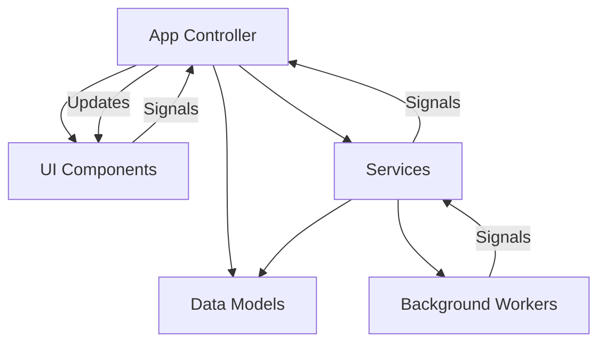
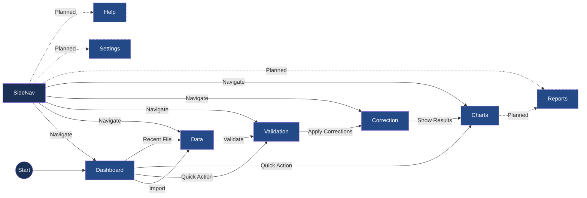

# Active Context: ChestBuddy Application

## Current State

ChestBuddy has a stable architecture with core functionality implemented. The application provides data import, validation, correction, and visualization capabilities through a modern UI with consistent styling.

## Key Components

### Recently Completed Components
- **Progress Dialog Enhancements**: Custom-styled progress dialog with improved visual feedback
- **Background Processing Improvements**: Enhanced thread management and error handling
- **UI Component Library**: Reusable UI components like ActionButton, ActionToolbar, EmptyStateWidget, and FilterBar
- **Navigation System**: Enhanced sidebar with data-dependent state handling
- **CSV Loading Improvements**: Better progress reporting and error handling during file operations

## Application Architecture

The current application architecture follows these patterns:



## Current UI Navigation 

The implemented UI navigation structure:



## Known Issues

- Minor QThread object deletion warning at shutdown (non-critical)
  - Only occurs during application shutdown and doesn't affect functionality
  - Improved with better thread management but not fully resolved
  - Warning level reduced to debug to avoid alarming users

## Column Name Standardization

The `ChestDataModel.EXPECTED_COLUMNS` have been updated to match the actual column names in standard CSV files. The columns are now defined using uppercase names:

```python
EXPECTED_COLUMNS = ["DATE", "PLAYER", "SOURCE", "CHEST", "SCORE", "CLAN"]
```

Previously, title case column names were used (e.g., "Player Name"), but CSV files actually use uppercase names like "PLAYER". This standardization ensures proper data display in the table view.

The `DataManager._map_columns` method includes a default mapping between old column names and new ones to maintain compatibility with existing code that might be using the old column names.

Tests have been updated to reflect these changes, ensuring that all references to column names use the new uppercase format.

### CSV Operations Refactoring 

### Dashboard with No Data Loaded

```
+-----------------------------------------------------+
|                     ChestBuddy                      |
+------------+----------------------------------------+
|            |                                        |
| Dashboard  |  Dashboard                             |
|            |  +---------------------------------+   |
| Data ⊗     |  |         Welcome to ChestBuddy   |   |
|            |  |                                 |   |
| Analysis ⊗ |  | No data loaded. Import data to  |   |
|            |  | start analyzing your chest data.|   |
| Reports ⊗  |  |                                 |   |
|            |  |  +-------------------------+    |   |
| Settings   |  |  |       IMPORT DATA      |    |   |
|            |  |  +-------------------------+    |   |
| Help       |  |                                 |   |
|            |  +---------------------------------+   |
|            |                                        |
|            |  Statistics                            |
|            |  +--------+ +--------+ +--------+     |
|            |  | Dataset | |Validated| |Corrections| |
|            |  |  0 rows | |   N/A   | |    0     | |
|            |  +--------+ +--------+ +--------+     |
|            |                                        |
|            |  Recent Files                          |
|            |  No recent files                       |
+------------+----------------------------------------+
```

### Dashboard with Data Loaded

```
+-----------------------------------------------------+
|                     ChestBuddy                      |
+------------+----------------------------------------+
|            |                                        |
| Dashboard  |  Dashboard                             |
|            |                                        |
| Data       |  Quick Actions                         |
|            |  +--------+ +--------+ +--------+     |
| Analysis   |  | Import  | |Validate| |Export  |     |
|  • Tables  |  |  Data   | |  Data  | |  Data  |     |
|  • Charts  |  +--------+ +--------+ +--------+     |
|            |                                        |
| Reports    |  Statistics                            |
|            |  +--------+ +--------+ +--------+     |
| Settings   |  | Dataset | |Validated| |Corrections| |
|  • Lists   |  | 125 rows| |  94%    | |    15    | |
|  • Rules   |  +--------+ +--------+ +--------+     |
|  • Prefs   |                                        |
|            |  Recent Files                          |
| Help       |  • chest_data_2023-03-11.csv          |
|            |  • older_data_2023-02-15.csv          |
|            |                                        |
|            |  [Chart visualization]                 |
+------------+----------------------------------------+
```

### Optimized Data View 

```
+-----------------------------------------------------+
|                     ChestBuddy                      |
+------------+----------------------------------------+
|            |                                        |
| Dashboard  | Data  [📥 Import] [📤 Export] | [✓ Validate] [🔄 Correct] | [🔍] [↻] [✕] |
|            |                                        |
| Data       | Search: [___________________] [Adv ▼]  |
|            | +------------------------------------+ |
| Analysis   | | Date ▼ | Player ▼ | Chest ▼| Value▼| |
|  • Tables  | |-----------------------------------| |
|  • Charts  | |                                  | |
|            | |                                  | |
| Reports    | |                                  | |
|            | |                                  | |
| Settings   | |                                  | |
|  • Lists   | |                                  | |
|  • Rules   | |                                  | |
|  • Prefs   | |                                  | |
|            | |                                  | |
| Help       | |                                  | |
|            | |                                  | |
|            | |                                  | |
|            | |                                  | |
|            | +------------------------------------+ |
+------------+ Showing 78 of 125 rows | Filter: Date>2022-01 [Clear] |
```

These mockups illustrate the key UI enhancements, including:
1. Clear visual indication when views are disabled (⊗ symbol) when no data is loaded
2. Prominent call-to-action on the dashboard when empty
3. Compact header design in the Data view to maximize table space
4. Streamlined filtering and status display
5. Logical grouping of action buttons 

## Current Tasks & Progress

### Recently Completed

- Fixed issue with unnecessary table repopulation when switching views
- Fixed issue with data view not refreshing when importing new files with the same dimensions
- Improved data hash tracking to detect actual data content changes, not just dimension changes
- Enhanced the dashboard view to properly update statistics on refresh
- Updated UI refresh mechanism to be more selective about when components need refreshing
