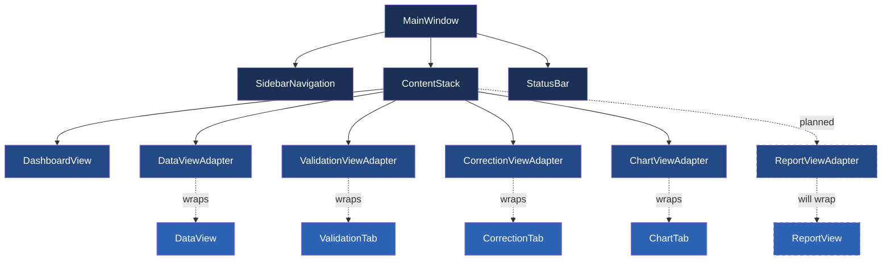
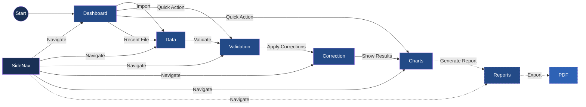

# Active Context

Updated: 2025-03-24

## Current Focus

We are implementing a comprehensive UI Enhancement to improve user experience, particularly for the data loading workflow and data visualization. We've completed several key components of our UI enhancement plan:

### Reusable UI Components (Completed)
We have implemented several reusable UI components following a test-driven development approach:

1. **ActionButton**: A customizable button with support for text, icons, tooltip, and styling options.
   - Features: Compact mode, primary styling, named buttons
   - Tests: Initialization, styling, interactions

2. **ActionToolbar**: A toolbar that organizes ActionButtons into logical groups.
   - Features: Horizontal/vertical orientation, button grouping with separators, button management
   - Tests: Layout, grouping, button interactions

3. **EmptyStateWidget**: A widget for displaying empty state information with optional action button.
   - Features: Title, message, action button, icon support
   - Tests: Initialization, content updating, action handling

4. **FilterBar**: A search and filter bar for data tables.
   - Features: Search field, expandable filter section, multiple filter categories
   - Tests: Search functionality, filter selection, expand/collapse behavior

### Next Steps
- Integrate these components into the Data view 
- Implement the Dashboard redesign with empty state handling
- Update the sidebar navigation to handle data state

The overall UI Enhancement plan addresses several key aspects:

1. **Navigation and State Management**:
   - Modify SidebarNavigation to support disabled states for views
   - Remove Import/Export from navigation sidebar (as they're actions, not views)
   - Implement data_loaded state tracking in MainWindow
   - Make Data, Analysis, and Reports views dependent on data being loaded
   - Provide clear visual feedback when views are disabled

2. **Dashboard Enhancement**:
   - Create EmptyStateWidget for prominent display when no data is loaded
   - Add clear visual guidance and call-to-action for importing data
   - Design smooth transition between empty and populated states
   - Make import action visually prominent in empty state
   - Update dashboard layout to better showcase data when available

3. **Data View Optimization**:
   - Redesign Data view with compact header to maximize table space
   - Group action buttons logically (data, processing, utility actions)
   - Implement streamlined filtering interface directly above table
   - Create compact status bar for showing filter state and row counts
   - Optimize table layout for maximum data visibility

This UI Enhancement builds upon our previous work on improving the CSV import process, creating a more intuitive and user-friendly experience throughout the application.

### Design Mockups

#### Data View Enhancement
```
┌─────────────────────────────────────────────────────────────────┐
│ [Data]  ┌─[Import]─[Export]─┐  ┌─[Validate]─[Correct]─┐  🔍Search│
├─────────────────────────────────────────────────────────────────┤
│                                                                 │
│                                                                 │
│                           Data Table                            │
│                                                                 │
│                                                                 │
│                                                                 │
├─────────────────────────────────────────────────────────────────┤
│ Items: 1250 | Selected: 0 | Filtered: 0                         │
└─────────────────────────────────────────────────────────────────┘
```

#### Empty Dashboard State
```
┌─────────────────────────────────────────────────────────────────┐
│                                                                 │
│                                                                 │
│                          No Data Loaded                         │
│                                                                 │
│             Import data to see statistics and insights          │
│                                                                 │
│                        [Import Data]                            │
│                                                                 │
│                                                                 │
└─────────────────────────────────────────────────────────────────┘
```

#### Dashboard with Data
```
┌─────────────────────────────────────────────────────────────────┐
│                                                                 │
│  ┌──────────────────┐  ┌──────────────────┐  ┌──────────────┐   │
│  │                  │  │                  │  │              │   │
│  │  Data Overview   │  │   Data Stats     │  │  Data Issues │   │
│  │  1250 Items      │  │  42 Duplicates   │  │  5 Critical  │   │
│  │                  │  │  12 Missing Data │  │  18 Warnings │   │
│  └──────────────────┘  └──────────────────┘  └──────────────┘   │
│                                                                 │
│  ┌────────────────────────────────────────────────────────────┐ │
│  │                                                            │ │
│  │                      Chart/Visualization                   │ │
│  │                                                            │ │
│  └────────────────────────────────────────────────────────────┘ │
│                                                                 │
└─────────────────────────────────────────────────────────────────┘
```

## Recent Decisions

- Implement a consistent UI enhancement approach with reusable components
- Focus on empty state handling to guide users through the data loading process
- Improve data view usability with compact header and grouped actions
- Remove import/export from navigation as they are actions, not views
- Create comprehensive test suite for all new UI components

## Implementation Strategy

We will implement the UI enhancement in phases:

1. **Phase 1**: Create reusable UI components ✅ Complete
   - Implement ActionButton, ActionToolbar, EmptyStateWidget, and FilterBar
   - Create comprehensive test suite for each component
   - Ensure consistent styling and behavior

2. **Phase 2**: Enhance navigation and state management
   - Update SidebarNavigation to support disabled states
   - Modify MainWindow to track data loaded state
   - Connect data state to navigation visibility

3. **Phase 3**: Redesign Dashboard
   - Create empty state for dashboard
   - Design data-present dashboard with statistics and visualizations
   - Implement smooth transition between states

4. **Phase 4**: Optimize Data View
   - Redesign header with grouped action buttons
   - Implement compact filter interface
   - Create status bar for data information

## Recent Improvements

### UI Component Library Enhancements
We've successfully implemented several reusable UI components:

- **ActionButton**: Customizable button with text, icon, tooltip support and styling options
- **ActionToolbar**: Organization of related action buttons into logical groups
- **EmptyStateWidget**: Standardized display for empty states with action support
- **FilterBar**: Compact search and filtering component with expandable sections

All components have comprehensive test suites with 47 total tests, all passing successfully.

### CSV Loading Improvements
We've made significant improvements to the CSV import process:

- **Progress Reporting**: Enhanced reporting with file-specific information
- **Memory Management**: Optimized for handling large files
- **Thread Safety**: Improved background worker thread handling
- **Error Handling**: Comprehensive handling of file access and parsing issues
- **UI Feedback**: Visual progress updates with state-based styling

### Previous Progress Dialog Enhancements
We've enhanced the progress dialog with:

- **ProgressBar**: Custom progress bar with state-based styling
- **ProgressDialog**: Enhanced dialog for showing file operations progress
- **State Visualization**: Normal, success, and error states with appropriate styling

## Next Steps

- Begin implementing Phase 2: Navigation and state management
- Start using the new UI components in the main application
- Update the UI layouts to use the new reusable components
- Enhance the main window with proper state tracking
- Implement the dashboard empty state handling

## Active Decisions

1. **PDF Library Selection**: We need to identify the best PDF generation library that works well with PySide6. Currently considering reportlab, WeasyPrint, and PyFPDF.

2. **Chart Integration Approach**: Determining the best way to integrate charts into PDF reports - either as embedded images or dynamically generated elements.

3. **Report Template Structure**: Deciding between a fixed set of templates or a more flexible, configurable approach.

4. **UI Design for Report Configuration**: Working on how to present report options to users in an intuitive way.

## Current Issues and Considerations

1. **PDF Library Compatibility**: Ensuring the selected PDF library works well with PySide6 and our chart generation components.

2. **Memory Management**: Addressing memory pressure during report generation with large datasets and implementing streaming approaches where appropriate. Recent improvements to CSV import handling have provided a good pattern to follow for memory-efficient processing.

3. **User Experience Flow**: Designing an intuitive and efficient user flow for report generation.

4. **Test Strategy**: Developing a testing approach to verify visual output quality of the report generation system.

5. **Resolved Startup Issues**: Several issues affecting application startup have been fixed:
   - Removal of syntax error in `progress_bar.py` due to stray backticks.
   - Correction of incorrect import path for `DataView` in `main_window.py`.
   - Update of color constant in `progress_dialog.py` to use `TEXT_LIGHT` instead of non-existent `TEXT_PRIMARY`.

6. **CSV Import Robustness**: Addressed stability issues during CSV file import:
   - Improved memory management in the `read_csv_chunked` method to avoid memory exhaustion with large files.
   - Enhanced error handling and recovery options to allow partial data loading.
   - Added progress update throttling to reduce UI overhead.
   - Improved thread safety and signal handling for cross-thread communication.
   - Added proper cleanup of resources during cancellation and application shutdown.
   - Created specialized test script to validate CSV import functionality.
   - Fixed thread cleanup on shutdown to prevent "destroyed while still running" warnings.
   - Optimized progress reporting to balance feedback with performance.

## Implementation Strategy

### Core Components
- **ReportService**: Central service for managing report generation
- **ReportTemplate**: Abstract base class with concrete implementations for different report types
- **ReportRenderer**: Component to render reports to PDF or other formats
- **ReportView**: UI component for configuring and previewing reports

### Development Approach
1. **Research Phase**:
   - Investigate PDF generation libraries (reportlab, fpdf2)
   - Evaluate chart embedding options
   - Define report template structure

2. **Backend Implementation**:
   - Implement ReportService and core classes
   - Create base templates
   - Develop PDF rendering pipeline

3. **Frontend Development**:
   - Design ReportView UI
   - Implement configuration options
   - Create report preview functionality

4. **Testing & Integration**:
   - Unit test report generation
   - End-to-end testing with real data
   - Optimize performance for large reports

## User Flow with Reports
1. User loads CSV data
2. User navigates to Reports view
3. User selects report template and configures options
4. User previews report
5. User exports report to PDF
6. User can share or print the generated report

## Known Issues
- Minor flickering in progress dialog during rapid updates
- QThread object deletion warnings during shutdown (non-critical)
- Memory usage could be optimized for very large datasets

## Next Steps
1. Begin implementation of the Report Generation system (Phase 14)
2. Enhance error handling for edge cases
3. Optimize memory usage for large datasets
4. Add more comprehensive unit and integration tests
5. Update documentation with recent architectural changes

### UI Architecture



### User Flow with Reports



### Implementation Details for Progress Dialog Enhancements

1. **State Tracking Improvements**
   - Added a `_loading_state` dictionary to MainWindow to track:
     - Total number of files being processed
     - Current file index and path
     - List of processed files
     - Total rows being processed
   - This state allows for consistent progress reporting across all phases of loading

2. **Progress Reporting Enhancements**
   - Modified `_on_load_started` to properly initialize the progress dialog
   - Enhanced `_on_load_progress` to provide consistent file count and row information
   - Improved `_on_load_finished` to show proper completion status
   - Added visibility checks and reinforcement to ensure dialog remains visible

3. **Thread Management Improvements**
   - Enhanced BackgroundWorker.__del__ with better thread cleanup
   - Improved error handling during thread termination
   - Eliminated forced thread termination during shutdown
   - Added proper reference handling to prevent C++ object deletion errors

4. **User Experience Considerations**
   - Added minimum width to the progress dialog for better readability
   - Improved window title and button text
   - Enhanced progress messages with clearer information
   - Added event processing to ensure UI responsiveness

### Current Tasks

- [x] Complete progress dialog enhancements
- [x] Fix thread cleanup issues during application shutdown
- [x] Implement consistent progress reporting for multi-file operations
- [x] Ensure smooth transition between loading states
- [ ] Begin design of report templates and structure
- [ ] Research PDF generation libraries for Python/PySide6
- [ ] Design ReportView component interface
- [ ] Define data model for report generation

## Planning for Phase 14: Report Generation

### Core Components

1. **ReportService**
   - Handle report generation logic
   - Support different report types (summary, detailed, custom)
   - Manage chart embedding
   - Provide PDF export capabilities

2. **ReportView**
   - Interface for report creation and customization
   - Report preview functionality
   - Export options and settings
   - Template selection

3. **Report Templates**
   - Standard templates for common report types
   - Customizable sections
   - Chart placement options
   - Header and footer customization

4. **PDF Generation**
   - High-quality PDF rendering
   - Support for embedded charts and images
   - Font and layout options
   - Metadata support

### Development Approach

We'll approach the report generation phase in these steps:

1. **Research and Design (Week 1)**
   - Evaluate PDF libraries for Python/PySide6
   - Design report templates
   - Define the ReportService interface
   - Plan the ReportView component

2. **Backend Implementation (Week 2)**
   - Implement the ReportService
   - Create report generation logic
   - Implement PDF generation
   - Add chart embedding functionality

3. **Frontend Development (Week 3)**
   - Create the ReportView component
   - Implement report customization interface
   - Add report preview functionality
   - Integrate with the ReportService

4. **Testing and Refinement (Week 4)**
   - Write tests for all components
   - Verify PDF output quality
   - Test with various data sets
   - Optimize performance

## Known Issues

- Minor QThread object deletion warning at shutdown (non-critical)
  - Only occurs during application shutdown and doesn't affect functionality
  - Improved with better thread management and error handling
  - Warning level reduced to debug to avoid alarming users

## Next Steps

1. **Begin Phase 14: Report Generation**
   - Design report templates and structure
   - Research PDF generation libraries
   - Define ReportService interface
   - Design ReportView component

2. **Documentation Update**
   - Document completed progress dialog improvements
   - Create developer notes on thread management
   - Update user documentation with new features
   - Prepare documentation for report generation features

3. **Placeholder Development**
   - Create placeholder for Reports view in UI
   - Add basic ReportService structure
   - Implement minimal ReportView component
   - Add sidebar navigation item for Reports

## Active Decisions and Considerations

- **Test-Driven Approach**: Following a strict test-first approach for all chart functionality
- **Performance Focus**: Ensuring chart rendering remains efficient with larger datasets
- **Integration Testing**: Verifying proper integration between all components
- **User Experience**: Maintaining a consistent and intuitive chart interface

## Known Issues

- No known issues at this time

### Column Name Standardization

We've updated the `ChestDataModel.EXPECTED_COLUMNS` to match the actual column names in our standard CSV file (`Chests_input_test.csv`). The columns are now defined using uppercase names:

```python
EXPECTED_COLUMNS = ["DATE", "PLAYER", "SOURCE", "CHEST", "SCORE", "CLAN"]
```

Previously, we were using title case column names like "Player Name", but our CSV files actually use uppercase names like "PLAYER". This mismatch was causing data to not display properly in the table view.

We've also updated the `DataManager._map_columns` method to include a default mapping between old column names and new ones to maintain compatibility with existing code that might be using the old column names.

Tests have been updated to reflect these changes, ensuring that all references to column names use the new uppercase format.

### CSV Operations Refactoring 

### Multi-Cell Paste Enhancement

We've improved the user experience by implementing multi-cell paste functionality, allowing users to select multiple cells in the table and paste content to all of them simultaneously. The key improvements include:

1. Modified the `_paste_cell` method in `DataView` to handle multiple selections
2. Added a context menu option that shows "Paste to all X selected cells" when multiple cells are selected
3. Implemented keyboard shortcuts (Ctrl+V) for paste operations
4. Added better logging for paste operations to improve debugging

This enhancement allows for more efficient data entry and editing, especially when the same value needs to be applied to multiple cells. Users can now:

1. Select multiple cells by clicking and dragging or using Ctrl+click for non-adjacent selections
2. Press Ctrl+V or use the right-click context menu to paste to all selected cells
3. See immediate feedback as all selected cells are updated simultaneously

### Column Name Standardization 

## Current Focus: CSV Loading Improvements

We are implementing enhancements to the CSV file loading process to improve performance and user experience with large files. The current implementation causes the application to freeze during loading with no visual feedback.

### Implementation Plan for CSV Loading Improvements

1. **Create MultiCSVLoadTask Class**
   - Create a new class extending BackgroundTask
   - Handle loading multiple files with progress reporting
   - Use chunked reading for better memory efficiency

2. **Update DataManager**
   - Add new signals:
     - `load_progress(str, int, int)` for file name, current progress, total
     - `load_started()` and `load_finished()` for UI feedback
   - Modify `load_csv` to use the new task
   - Implement cancellation support

3. **Add Progress Dialog in MainWindow**
   - Create QProgressDialog when loading starts
   - Update the dialog as loading progresses
   - Support cancellation with proper cleanup
   - Close dialog when loading completes

4. **Use Efficient File Processing**
   - Switch from `read_csv` to `read_csv_chunked` or `read_csv_background`
   - Process files in manageable chunks
   - Report progress based on chunks processed

5. **Implement Proper Cancellation**
   - Allow users to cancel long-running operations
   - Clean up resources when canceled
   - Update UI appropriately after cancellation

### Expected Benefits
- UI remains responsive during file loading
- Users see visual progress indication
- Users can cancel operations if needed
- Better memory management with chunked reading
- Improved performance for large files

### Current Tasks
- [ ] Create MultiCSVLoadTask class
- [ ] Update DataManager with new signals and methods
- [ ] Add progress dialog to MainWindow
- [ ] Implement proper chunked file loading
- [ ] Add cancellation support
- [ ] Create tests for new functionality

## Recent Changes

# Current Focus

## CSV Import Functionality Stabilization

Our current focus is on stabilizing and improving the CSV import functionality in ChestBuddy, particularly addressing issues with progress reporting and handling large imports efficiently.

### Key Areas of Focus

1. **Progress Reporting Improvements**
   - Enhanced progress dialog with more accurate row counting across multiple files
   - Better estimation of total rows by tracking actual file sizes
   - Added intermediate "Processing data" step to show data model updates
   - Prevent UI freezing during heavy operations with strategic event processing

2. **Memory Management Optimizations**
   - Improvements to `read_csv_chunked` method for better memory usage
   - Added explicit garbage collection after processing large dataframes
   - Strategic data model updates to minimize memory overhead

3. **Thread Safety Enhancements**
   - Improved coordination between background workers and UI updates
   - Safer progress reporting with proper error handling

4. **Comprehensive Error Handling**
   - More robust handling of file access issues
   - Better handling of encoding detection
   - Graceful recovery from corrupted CSV files
   - Added user feedback for parsing errors

### Recent Changes

1. Added more accurate row count estimation in the progress reporting
2. Improved UI responsiveness during data model updates with processing state
3. Refined progress bar updates to show intermediate steps

### Next Steps

1. Further testing with large CSV datasets to ensure stability
2. Address any remaining performance bottlenecks in the data model update process
3. Consider implementing a background thread for the data model update

### Testing

A dedicated test script has been created at `tests/test_csv_import.py` to verify the CSV import functionality improvements. 

## UI Enhancement Mockups

### Dashboard with No Data Loaded

```
+-----------------------------------------------------+
|                     ChestBuddy                      |
+------------+----------------------------------------+
|            |                                        |
| Dashboard  |  Dashboard                             |
|            |  +---------------------------------+   |
| Data ⊗     |  |         Welcome to ChestBuddy   |   |
|            |  |                                 |   |
| Analysis ⊗ |  | No data loaded. Import data to  |   |
|            |  | start analyzing your chest data.|   |
| Reports ⊗  |  |                                 |   |
|            |  |  +-------------------------+    |   |
| Settings   |  |  |       IMPORT DATA      |    |   |
|            |  |  +-------------------------+    |   |
| Help       |  |                                 |   |
|            |  +---------------------------------+   |
|            |                                        |
|            |  Statistics                            |
|            |  +--------+ +--------+ +--------+     |
|            |  | Dataset | |Validated| |Corrections| |
|            |  |  0 rows | |   N/A   | |    0     | |
|            |  +--------+ +--------+ +--------+     |
|            |                                        |
|            |  Recent Files                          |
|            |  No recent files                       |
+------------+----------------------------------------+
```

### Dashboard with Data Loaded

```
+-----------------------------------------------------+
|                     ChestBuddy                      |
+------------+----------------------------------------+
|            |                                        |
| Dashboard  |  Dashboard                             |
|            |                                        |
| Data       |  Quick Actions                         |
|            |  +--------+ +--------+ +--------+     |
| Analysis   |  | Import  | |Validate| |Export  |     |
|  • Tables  |  |  Data   | |  Data  | |  Data  |     |
|  • Charts  |  +--------+ +--------+ +--------+     |
|            |                                        |
| Reports    |  Statistics                            |
|            |  +--------+ +--------+ +--------+     |
| Settings   |  | Dataset | |Validated| |Corrections| |
|  • Lists   |  | 125 rows| |  94%    | |    15    | |
|  • Rules   |  +--------+ +--------+ +--------+     |
|  • Prefs   |                                        |
|            |  Recent Files                          |
| Help       |  • chest_data_2023-03-11.csv          |
|            |  • older_data_2023-02-15.csv          |
|            |                                        |
|            |  [Chart visualization]                 |
+------------+----------------------------------------+
```

### Optimized Data View 

```
+-----------------------------------------------------+
|                     ChestBuddy                      |
+------------+----------------------------------------+
|            |                                        |
| Dashboard  | Data  [📥 Import] [📤 Export] | [✓ Validate] [🔄 Correct] | [🔍] [↻] [✕] |
|            |                                        |
| Data       | Search: [___________________] [Adv ▼]  |
|            | +------------------------------------+ |
| Analysis   | | Date ▼ | Player ▼ | Chest ▼| Value▼| |
|  • Tables  | |-----------------------------------| |
|  • Charts  | |                                  | |
|            | |                                  | |
| Reports    | |                                  | |
|            | |                                  | |
| Settings   | |                                  | |
|  • Lists   | |                                  | |
|  • Rules   | |                                  | |
|  • Prefs   | |                                  | |
|            | |                                  | |
| Help       | |                                  | |
|            | |                                  | |
|            | |                                  | |
|            | |                                  | |
|            | +------------------------------------+ |
+------------+ Showing 78 of 125 rows | Filter: Date>2022-01 [Clear] |
```

These mockups illustrate the key UI enhancements, including:
1. Clear visual indication when views are disabled (⊗ symbol) when no data is loaded
2. Prominent call-to-action on the dashboard when empty
3. Compact header design in the Data view to maximize table space
4. Streamlined filtering and status display
5. Logical grouping of action buttons 
