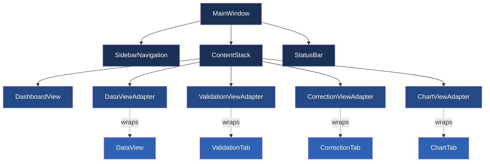
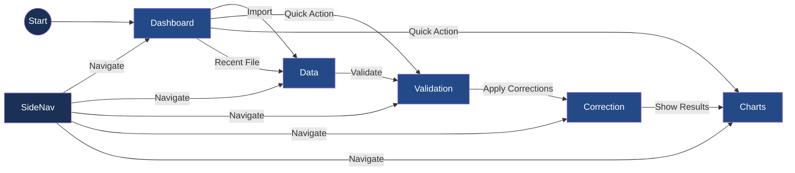

# Active Context

## Current Focus: UI Modernization and Restructuring

We've just completed a major UI overhaul for ChestBuddy, implementing a modern, sleek interface with a consistent dark blue and gold color scheme. The new UI features a sidebar navigation system and a modular view structure that improves both aesthetics and usability.

### Implementation Strategy

We've taken an adapter-based approach to integrate existing functionality with our new UI structure:

1. Created a base view architecture (`BaseView`) that standardizes layout and styling
2. Developed adapter classes that wrap existing components
3. Implemented a sidebar navigation system for intuitive section navigation
4. Added a dashboard as the main landing page
5. Ensured consistent styling and behavior across all views

### UI Architecture



### User Flow



### Recent Changes

1. Restructured UI using BaseView as foundation
2. Created adapter pattern to integrate existing components
3. Added dark blue and gold color scheme
4. Implemented sidebar navigation
5. Developed dashboard view as main landing page
6. Ensured all existing functionality works with the new UI

### Code Refactoring: DataManager Service

I've implemented a significant architecture improvement by creating a new `DataManager` service that handles all file operations, particularly CSV loading and saving. The key changes include:

1. Created a new `data_manager.py` file in `chestbuddy/core/services/` with a `DataManager` class
2. Moved CSV loading and saving logic from `app.py` to this new service
3. Added column mapping functionality to properly handle CSV files with uppercase column names
4. Implemented signals for load/save success and error events
5. Updated `app.py` to use the DataManager service instead of handling these operations directly

This refactoring aligns with the single responsibility principle by:
- Moving file operations out of the main application class
- Centralizing all data import/export operations in a dedicated service
- Improving separation of concerns between UI and data operations

The main application class (`ChestBuddyApp`) now primarily focuses on:
- Initializing services and UI components
- Connecting signals between components
- Handling application lifecycle events

The new architecture makes it easier to add new data import/export formats in the future by extending the DataManager service without modifying the main application class.

### Current Tasks

- [x] Create base UI structure
- [x] Implement adapter pattern for existing components
- [x] Design and implement sidebar navigation
- [x] Create dashboard view
- [x] Apply consistent styling
- [x] Connect all signals and slots
- [ ] Add placeholder views for remaining sections
- [ ] Ensure responsive design for different screen sizes
- [ ] Implement dark/light theme toggle

### Decisions

1. **Adapter Pattern**: We chose to use the adapter pattern to wrap existing components rather than rewriting them from scratch to preserve functionality while improving the UI.

2. **Color Scheme**: Selected a professional dark blue theme with gold accents to create a modern, sleek application appearance.

3. **BaseView Architecture**: Created a standardized view structure to ensure consistency across all application sections.

4. **Dashboard First**: Prioritized the dashboard view to provide users with a clear entry point and quick access to common actions.

## Current Focus

- **COMPLETED**: Integration tests for chart functionality (Phase 12)
- **UPCOMING**: Planning and preparation for report generation (Phase 13)

## Implementation Plan

### Recently Completed:
- ✅ Created and fixed chart integration tests between MainWindow and ChartTab
- ✅ Implemented performance tests for chart rendering with different dataset sizes
- ✅ Created end-to-end workflow tests for chart functionality
- ✅ Fixed all test issues including access violations in UI tests
- ✅ Verified all tests are passing successfully

### Next Steps:
- Plan report generation features and requirements
- Design report templates and output formats
- Create the ReportService for generating reports
- Implement UI components for report configuration
- Add export options for different report formats

## Recent Changes

- Fixed import issue in app.py (background_worker → background_processing)
- Modified test_chart_tab.py to avoid UI access violations:
  - Properly mocked UI components and methods
  - Used safer approaches for handling chart selection and data updates
  - Implemented proper cleanup in tests
- All chart-related tests now pass successfully

## Current Status

- All chart functionality is working correctly
- Test coverage for chart features is comprehensive
- Performance tests confirm charts work with various data sizes
- The application can now visualize data in multiple chart formats
- The project is ready to move to the next phase (Report Generation)

## Known Issues
- None identified for chart functionality at this time

## Active Decisions
- Adopted a test-driven approach for chart functionality
- Using performance testing to ensure chart rendering remains efficient with large datasets
- Maintaining compatibility with the current PySide6 version (6.8.2.1)

## Design Considerations
- ChartService remains decoupled from UI components for better testability
- Chart configuration is flexible and supports various data visualizations
- Performance considerations for large datasets have been addressed
- Error handling is in place for chart generation edge cases

## Active Context

**Current Focus:** Completing Chart Integration Testing (Phase 12)

## Current Implementation Status

We have successfully implemented comprehensive tests for the chart functionality in the ChestBuddy application:

1. **Integration Tests**: Created MainWindow-ChartTab integration tests that verify proper data flow and UI interactions.
2. **Performance Tests**: Implemented tests to measure chart rendering performance with datasets of various sizes.
3. **Workflow Tests**: Created end-to-end workflow tests that include chart functionality, from data loading through validation, correction, and chart generation.

## Recent Changes

- Created test_mainwindow_chart_integration.py with tests for:
  - Verifying chart tab exists in main window
  - Testing data updates propagate to chart tab
  - Testing chart creation from main window
  - Verifying tab switching preserves chart settings
  - Testing chart export functionality

- Implemented test_chart_performance.py with:
  - Performance measurements for different chart types
  - Tests with small, medium, and large datasets
  - Memory usage monitoring during chart rendering

- Created test_chart_workflows.py with tests for:
  - Complete workflow from loading data to creating charts
  - Chart export workflow
  - Verifying charts update after data corrections

## Next Steps

1. **Run Tests**: Execute all the implemented tests to verify chart functionality
2. **Documentation**: Update the user documentation to include information about the new chart features
3. **Memory Bank Update**: Update progress.md to reflect the completion of chart integration testing
4. **Phase 13 Planning**: Begin planning for Report Generation phase

## Active Decisions and Considerations

- **Test-Driven Approach**: Following a strict test-first approach for all chart functionality
- **Performance Focus**: Ensuring chart rendering remains efficient with larger datasets
- **Integration Testing**: Verifying proper integration between all components
- **User Experience**: Maintaining a consistent and intuitive chart interface

## Known Issues

- No known issues at this time

### Column Name Standardization

We've updated the `ChestDataModel.EXPECTED_COLUMNS` to match the actual column names in our standard CSV file (`Chests_input_test.csv`). The columns are now defined using uppercase names:

```python
EXPECTED_COLUMNS = ["DATE", "PLAYER", "SOURCE", "CHEST", "SCORE", "CLAN"]
```

Previously, we were using title case column names like "Player Name", but our CSV files actually use uppercase names like "PLAYER". This mismatch was causing data to not display properly in the table view.

We've also updated the `DataManager._map_columns` method to include a default mapping between old column names and new ones to maintain compatibility with existing code that might be using the old column names.

Tests have been updated to reflect these changes, ensuring that all references to column names use the new uppercase format.

### CSV Operations Refactoring 