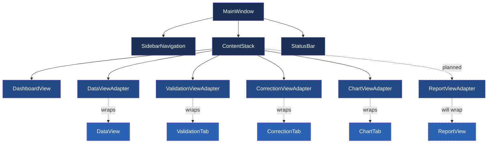
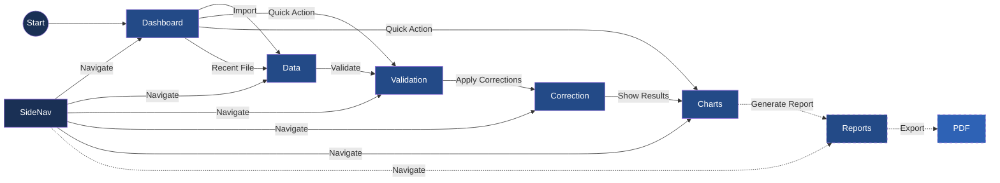

# Active Context

## Current Focus: Transition to Report Generation (Phase 14)

We've completed the CSV Loading Improvements and Bugfixing phase, implementing a significantly improved progress dialog experience and enhancing the multi-file loading capabilities of the application. We're now preparing to transition to Phase 14: Report Generation, which will focus on creating comprehensive reports with embedded charts.

### Implementation Strategy

We'll take a modular approach to the report generation functionality:

1. Design report templates with customizable sections
2. Implement a ReportService to handle generation
3. Create a ReportView component for the UI
4. Add PDF export capabilities
5. Integrate chart embedding functionality

### Recent Improvements

We've significantly enhanced the progress window experience for CSV loading:

1. **Enhanced Progress Dialog**
   - Created a consistent progress window that stays visible throughout loading
   - Added detailed information showing current file (x of y), file name, and row progress
   - Improved visual appearance with better window title and sizing
   - Implemented proper completion handling with 100% progress display
   - Enhanced cancellation support with proper cleanup

2. **Background Processing Improvements**
   - Enhanced thread management for better stability
   - Improved error handling during thread cleanup
   - Implemented a more graceful application shutdown process
   - Added consistent progress reporting on a 0-100 scale
   - Created better coordination between file-specific and overall progress

3. **User Experience Enhancements**
   - Added more informative loading messages
   - Improved UI responsiveness during loading operations
   - Provided clear file count and progress information
   - Created smoother transitions between loading and completion states

### UI Architecture

### User Flow with Reports

### Implementation Details for Progress Dialog Enhancements

1. **State Tracking Improvements**
   - Added a `_loading_state` dictionary to MainWindow to track:
     - Total number of files being processed
     - Current file index and path
     - List of processed files
     - Total rows being processed
   - This state allows for consistent progress reporting across all phases of loading

2. **Progress Reporting Enhancements**
   - Modified `_on_load_started` to properly initialize the progress dialog
   - Enhanced `_on_load_progress` to provide consistent file count and row information
   - Improved `_on_load_finished` to show proper completion status
   - Added visibility checks and reinforcement to ensure dialog remains visible

3. **Thread Management Improvements**
   - Enhanced BackgroundWorker.__del__ with better thread cleanup
   - Improved error handling during thread termination
   - Eliminated forced thread termination during shutdown
   - Added proper reference handling to prevent C++ object deletion errors

4. **User Experience Considerations**
   - Added minimum width to the progress dialog for better readability
   - Improved window title and button text
   - Enhanced progress messages with clearer information
   - Added event processing to ensure UI responsiveness

### Current Tasks

- [x] Complete progress dialog enhancements
- [x] Fix thread cleanup issues during application shutdown
- [x] Implement consistent progress reporting for multi-file operations
- [x] Ensure smooth transition between loading states
- [ ] Begin design of report templates and structure
- [ ] Research PDF generation libraries for Python/PySide6
- [ ] Design ReportView component interface
- [ ] Define data model for report generation

## Planning for Phase 14: Report Generation

### Core Components

1. **ReportService**
   - Handle report generation logic
   - Support different report types (summary, detailed, custom)
   - Manage chart embedding
   - Provide PDF export capabilities

2. **ReportView**
   - Interface for report creation and customization
   - Report preview functionality
   - Export options and settings
   - Template selection

3. **Report Templates**
   - Standard templates for common report types
   - Customizable sections
   - Chart placement options
   - Header and footer customization

4. **PDF Generation**
   - High-quality PDF rendering
   - Support for embedded charts and images
   - Font and layout options
   - Metadata support

### Development Approach

We'll approach the report generation phase in these steps:

1. **Research and Design (Week 1)**
   - Evaluate PDF libraries for Python/PySide6
   - Design report templates
   - Define the ReportService interface
   - Plan the ReportView component

2. **Backend Implementation (Week 2)**
   - Implement the ReportService
   - Create report generation logic
   - Implement PDF generation
   - Add chart embedding functionality

3. **Frontend Development (Week 3)**
   - Create the ReportView component
   - Implement report customization interface
   - Add report preview functionality
   - Integrate with the ReportService

4. **Testing and Refinement (Week 4)**
   - Write tests for all components
   - Verify PDF output quality
   - Test with various data sets
   - Optimize performance

## Known Issues

- Minor QThread object deletion warning at shutdown (non-critical)
  - Only occurs during application shutdown and doesn't affect functionality
  - Improved with better thread management and error handling
  - Warning level reduced to debug to avoid alarming users

## Next Steps

1. **Begin Phase 14: Report Generation**
   - Design report templates and structure
   - Research PDF generation libraries
   - Define ReportService interface
   - Design ReportView component

2. **Documentation Update**
   - Document completed progress dialog improvements
   - Create developer notes on thread management
   - Update user documentation with new features
   - Prepare documentation for report generation features

3. **Placeholder Development**
   - Create placeholder for Reports view in UI
   - Add basic ReportService structure
   - Implement minimal ReportView component
   - Add sidebar navigation item for Reports

## Active Decisions and Considerations

### Progress Dialog Enhancements
- We opted for a two-level progress tracking system (overall and per-file) for better user feedback during multi-file operations
- We standardized progress reporting to use a consistent 0-100 scale across all operations
- We implemented graceful thread cleanup to prevent application crashes during shutdown
- We chose to enhance the existing progress dialog rather than creating a new component to maintain consistency

### Report Generation Approach
- Considering a template-based approach for flexible report generation
- Evaluating different PDF generation libraries for the best balance of features and integration ease
- Planning to maintain HTML-based reports with PDF export as an additional option
- Considering how to best embed charts and maintain interactivity in reports

### UI Enhancement Considerations
- Keep the consistent UI style when designing the new report view
- Ensure the report generation process provides appropriate progress feedback
- Design the report customization interface to be intuitive and user-friendly
- Maintain visual consistency with the existing chart and data views