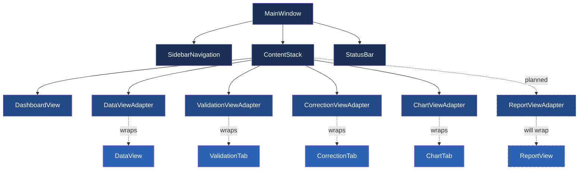
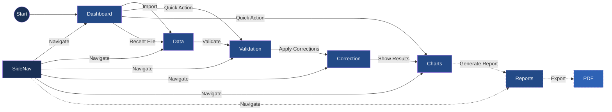

# Active Context

Updated: 2025-03-24

## Current Focus: CSV Import Progress Reporting Improvements

We've enhanced the progress reporting for CSV imports to provide a better user experience. The improvements address the issue of progress bars jumping from 0% to 100% and provide more detailed information during the import process. Key changes include:

1. **Incremental Progress Updates**:
   - Fixed progress bar jumping from 0% to 100% by implementing proper chunk-based progress reporting
   - Enhanced `MultiCSVLoadTask` to pass progress callbacks to `read_csv_chunked`
   - Added tracking of total rows loaded across multiple files

2. **Improved User Interface**:
   - Enhanced progress dialog to show detailed file and row information
   - Added formatted numbers with commas for better readability (e.g., "1,234" instead of "1234")
   - Implemented separate indicators for per-file progress and overall progress
   - Added file count information (e.g., "x / y files - z rows processed") for multi-file imports

3. **Simplified Progress Reporting**:
   - Removed row estimation in favor of showing only actual processed rows
   - Streamlined the progress display to "x / y files - z rows processed"
   - Improved final completion message clarity
   - Added processing state indication during data model updates

4. **Progress Pathways**:
   - Enhanced code pathways from background tasks to UI display
   - Updated `DataManager` to properly handle and forward progress signals
   - Improved `MainWindow._on_load_progress` to display comprehensive information
   - Enhanced initialization and cleanup of progress tracking variables

This work builds upon our previous stability improvements for CSV import functionality, creating a more robust and user-friendly experience when loading data.

## Next Steps

1. Implement the Report Generation system using the robust data importing capabilities
2. Enhance the UI to support more flexible data exploration and summarization
3. Develop visualization components to represent the chest data effectively

## Recent Decisions

1. **Memory Management**: We've decided to take a more proactive approach to memory management, explicitly freeing resources and using garbage collection strategically to prevent memory issues with large datasets.

2. **Progress Reporting**: We've implemented a throttled approach to progress updates to avoid overwhelming the UI thread with signals.

3. **Error Handling Strategy**: We've enhanced error handling to provide more detailed feedback while ensuring the application remains stable even with corrupted input files.

4. **Testing Approach**: We've created a dedicated test script that simulates real application usage, allowing us to identify and address issues in a controlled environment.

## Implementation Details

- Thread safety issues were addressed primarily in `BackgroundWorker` and `MultiCSVLoadTask` classes
- Memory management improvements focus on the `CSVService.read_csv_chunked` method
- Error handling was enhanced throughout the codebase, especially in the CSV service layer
- Progress reporting was made more robust in the `MultiCSVLoadTask` class

## Recent Improvements

We have enhanced the progress dialog experience with a completely redesigned custom UI component system, focusing on:

1. **Reusable Components**
   - Created a dedicated widgets package for reusable UI components
   - Implemented ProgressBar as a standalone, reusable widget
   - Developed ProgressDialog as a wrapper around ProgressBar with extended functionality

2. **Visual Enhancement**
   - Modern, rounded design with gradient backgrounds
   - Color-coded states (blue for normal, green for success, red for error)
   - Percentage indicator with dynamic updates
   - Status text display for detailed information
   - Consistent styling with the application theme

3. **Behavioral Improvements**
   - Clear state transitions (normal → success/error)
   - Proper error handling with visual feedback
   - Enhanced cancel button behavior based on context
   - Smoother animations and updates

4. **Integration**
   - Seamlessly integrated with existing MainWindow and DataManager
   - Maintained API compatibility while enhancing functionality
   - Added proper error state handling in App and MainWindow
   - Connected all relevant signals for a cohesive experience

## Next Steps: Report Generation System

With the CSV loading stability issues fully resolved and the UI components enhanced, we're now ready to begin implementing the Report Generation system. This will include:

1. **Report Templates Design**
   - Create standard report layouts for common data views
   - Define customizable elements within reports
   - Establish style guidelines for consistent reporting

2. **ReportService Implementation**
   - Develop a service for generating reports from data
   - Add PDF generation capabilities
   - Include chart embedding functionality
   - Implement export options for different formats

3. **ReportView UI Component**
   - Create a user interface for report configuration
   - Add report preview capabilities
   - Implement export options UI
   - Integrate with existing view system

4. **Integration with Existing Components**
   - Connect ChartService for visualization inclusion
   - Integrate with DataManager for data access
   - Add report generation to main application flow

## Active Decisions

1. **PDF Library Selection**: We need to identify the best PDF generation library that works well with PySide6. Currently considering reportlab, WeasyPrint, and PyFPDF.

2. **Chart Integration Approach**: Determining the best way to integrate charts into PDF reports - either as embedded images or dynamically generated elements.

3. **Report Template Structure**: Deciding between a fixed set of templates or a more flexible, configurable approach.

4. **UI Design for Report Configuration**: Working on how to present report options to users in an intuitive way.

## Current Issues and Considerations

1. **PDF Library Compatibility**: Ensuring the selected PDF library works well with PySide6 and our chart generation components.

2. **Memory Management**: Addressing memory pressure during report generation with large datasets and implementing streaming approaches where appropriate. Recent improvements to CSV import handling have provided a good pattern to follow for memory-efficient processing.

3. **User Experience Flow**: Designing an intuitive and efficient user flow for report generation.

4. **Test Strategy**: Developing a testing approach to verify visual output quality of the report generation system.

5. **Resolved Startup Issues**: Several issues affecting application startup have been fixed:
   - Removal of syntax error in `progress_bar.py` due to stray backticks.
   - Correction of incorrect import path for `DataView` in `main_window.py`.
   - Update of color constant in `progress_dialog.py` to use `TEXT_LIGHT` instead of non-existent `TEXT_PRIMARY`.

6. **CSV Import Robustness**: Addressed stability issues during CSV file import:
   - Improved memory management in the `read_csv_chunked` method to avoid memory exhaustion with large files.
   - Enhanced error handling and recovery options to allow partial data loading.
   - Added progress update throttling to reduce UI overhead.
   - Improved thread safety and signal handling for cross-thread communication.
   - Added proper cleanup of resources during cancellation and application shutdown.
   - Created specialized test script to validate CSV import functionality.
   - Fixed thread cleanup on shutdown to prevent "destroyed while still running" warnings.
   - Optimized progress reporting to balance feedback with performance.

## Implementation Strategy

### Core Components
- **ReportService**: Central service for managing report generation
- **ReportTemplate**: Abstract base class with concrete implementations for different report types
- **ReportRenderer**: Component to render reports to PDF or other formats
- **ReportView**: UI component for configuring and previewing reports

### Development Approach
1. **Research Phase**:
   - Investigate PDF generation libraries (reportlab, fpdf2)
   - Evaluate chart embedding options
   - Define report template structure

2. **Backend Implementation**:
   - Implement ReportService and core classes
   - Create base templates
   - Develop PDF rendering pipeline

3. **Frontend Development**:
   - Design ReportView UI
   - Implement configuration options
   - Create report preview functionality

4. **Testing & Integration**:
   - Unit test report generation
   - End-to-end testing with real data
   - Optimize performance for large reports

## User Flow with Reports
1. User loads CSV data
2. User navigates to Reports view
3. User selects report template and configures options
4. User previews report
5. User exports report to PDF
6. User can share or print the generated report

## Known Issues
- Minor flickering in progress dialog during rapid updates
- QThread object deletion warnings during shutdown (non-critical)
- Memory usage could be optimized for very large datasets

## Next Steps
1. Begin implementation of the Report Generation system (Phase 14)
2. Enhance error handling for edge cases
3. Optimize memory usage for large datasets
4. Add more comprehensive unit and integration tests
5. Update documentation with recent architectural changes

### UI Architecture

### User Flow with Reports

### Implementation Details for Progress Dialog Enhancements

1. **State Tracking Improvements**
   - Added a `_loading_state` dictionary to MainWindow to track:
     - Total number of files being processed
     - Current file index and path
     - List of processed files
     - Total rows being processed
   - This state allows for consistent progress reporting across all phases of loading

2. **Progress Reporting Enhancements**
   - Modified `_on_load_started` to properly initialize the progress dialog
   - Enhanced `_on_load_progress` to provide consistent file count and row information
   - Improved `_on_load_finished` to show proper completion status
   - Added visibility checks and reinforcement to ensure dialog remains visible

3. **Thread Management Improvements**
   - Enhanced BackgroundWorker.__del__ with better thread cleanup
   - Improved error handling during thread termination
   - Eliminated forced thread termination during shutdown
   - Added proper reference handling to prevent C++ object deletion errors

4. **User Experience Considerations**
   - Added minimum width to the progress dialog for better readability
   - Improved window title and button text
   - Enhanced progress messages with clearer information
   - Added event processing to ensure UI responsiveness

### Current Tasks

- [x] Complete progress dialog enhancements
- [x] Fix thread cleanup issues during application shutdown
- [x] Implement consistent progress reporting for multi-file operations
- [x] Ensure smooth transition between loading states
- [ ] Begin design of report templates and structure
- [ ] Research PDF generation libraries for Python/PySide6
- [ ] Design ReportView component interface
- [ ] Define data model for report generation

## Planning for Phase 14: Report Generation

### Core Components

1. **ReportService**
   - Handle report generation logic
   - Support different report types (summary, detailed, custom)
   - Manage chart embedding
   - Provide PDF export capabilities

2. **ReportView**
   - Interface for report creation and customization
   - Report preview functionality
   - Export options and settings
   - Template selection

3. **Report Templates**
   - Standard templates for common report types
   - Customizable sections
   - Chart placement options
   - Header and footer customization

4. **PDF Generation**
   - High-quality PDF rendering
   - Support for embedded charts and images
   - Font and layout options
   - Metadata support

### Development Approach

We'll approach the report generation phase in these steps:

1. **Research and Design (Week 1)**
   - Evaluate PDF libraries for Python/PySide6
   - Design report templates
   - Define the ReportService interface
   - Plan the ReportView component

2. **Backend Implementation (Week 2)**
   - Implement the ReportService
   - Create report generation logic
   - Implement PDF generation
   - Add chart embedding functionality

3. **Frontend Development (Week 3)**
   - Create the ReportView component
   - Implement report customization interface
   - Add report preview functionality
   - Integrate with the ReportService

4. **Testing and Refinement (Week 4)**
   - Write tests for all components
   - Verify PDF output quality
   - Test with various data sets
   - Optimize performance

## Known Issues

- Minor QThread object deletion warning at shutdown (non-critical)
  - Only occurs during application shutdown and doesn't affect functionality
  - Improved with better thread management and error handling
  - Warning level reduced to debug to avoid alarming users

## Next Steps

1. **Begin Phase 14: Report Generation**
   - Design report templates and structure
   - Research PDF generation libraries
   - Define ReportService interface
   - Design ReportView component

2. **Documentation Update**
   - Document completed progress dialog improvements
   - Create developer notes on thread management
   - Update user documentation with new features
   - Prepare documentation for report generation features

3. **Placeholder Development**
   - Create placeholder for Reports view in UI
   - Add basic ReportService structure
   - Implement minimal ReportView component
   - Add sidebar navigation item for Reports

## Active Decisions and Considerations

### Progress Dialog Enhancements
- We opted for a two-level progress tracking system (overall and per-file) for better user feedback during multi-file operations
- We standardized progress reporting to use a consistent 0-100 scale across all operations
- We implemented graceful thread cleanup to prevent application crashes during shutdown
- We chose to enhance the existing progress dialog rather than creating a new component to maintain consistency

### Report Generation Approach
- Considering a template-based approach for flexible report generation
- Evaluating different PDF generation libraries for the best balance of features and integration ease
- Planning to maintain HTML-based reports with PDF export as an additional option
- Considering how to best embed charts and maintain interactivity in reports

### UI Enhancement Considerations
- Keep the consistent UI style when designing the new report view
- Ensure the report generation process provides appropriate progress feedback
- Design the report customization interface to be intuitive and user-friendly
- Maintain visual consistency with the existing chart and data views
