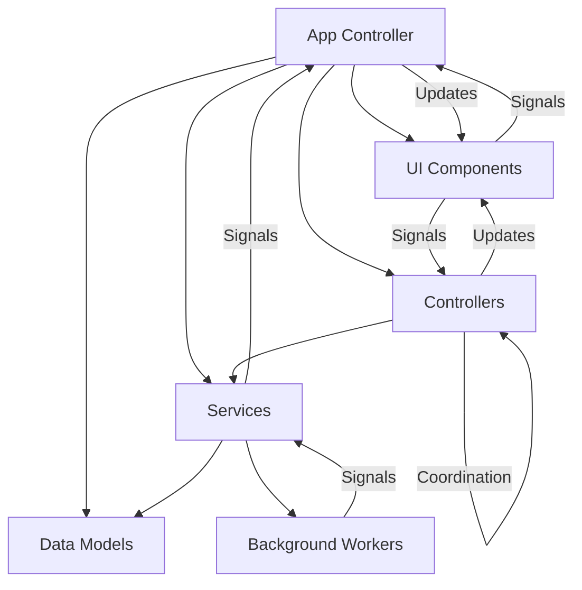
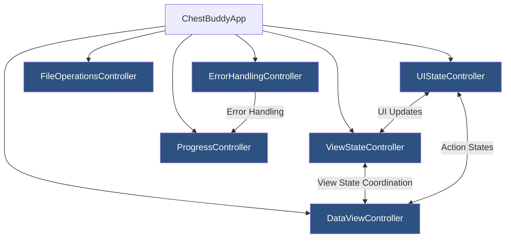
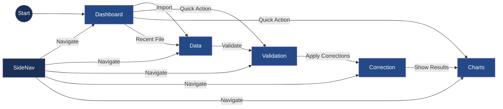
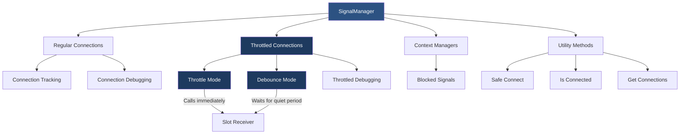

# Active Context: ChestBuddy Application

## Current State

The application architecture is stable with all core functionality implemented. The application has successfully transitioned to a controller-based architecture, with all UI components now using the appropriate controllers for business logic operations. 

We have implemented a SignalManager utility to centralize and improve signal connection management, including throttling capabilities to improve UI performance with rapidly firing signals.

### Current Implementation Focus

We are implementing the **Signal Connection Management Improvement Plan** to address issues with signal connection management in ChestBuddy:

1. **SignalManager Utility**: A utility class for managing PySide6 signal connections
   - Tracks all signal connections
   - Prevents duplicate connections
   - Provides centralized disconnection methods
   - Includes safety mechanisms and context managers
   - Offers debugging tools for connection tracking
   - Implements throttling for rapidly firing signals

2. **Signal Connection Standards**: Standardized patterns for signal connections across the application
   - Defines signal naming conventions (verb_noun, noun_changed, noun_requested, etc.)
   - Establishes slot naming conventions (_on_signal_name, etc.)
   - Creates standardized connection patterns for view adapters
   - Provides consistent error handling and debugging
   - Ensures proper signal disconnection during cleanup

3. **Overall Implementation Plan Progress**:
   - Phase 1 (SignalManager implementation) - **Completed**
   - Phase 2 (Signal Connection Standards) - **Completed**
     - Created signal_standards.py with naming conventions and patterns ✓
     - Updated BaseView with standardized signal management ✓
     - Refactored DataViewAdapter to use standardized patterns ✓
     - Created unit tests for signal standards implementation ✓
     - Documentation updated ✓
   - Phase 3 (View Adapter Enhancement) - **Completed**
     - Updated view adapters to use SignalManager ✓
     - Implemented consistent signal connection patterns ✓
     - Added signal disconnection during cleanup ✓
     - Enhanced error handling for signal failures ✓
   - Phase 4 (Integration with Controllers) - **Completed**
     - Created BaseController class for standardized signal management ✓
     - Updated all controllers to inherit from BaseController ✓
     - Added connection tracking for all controller signals ✓
     - Implemented automatic disconnection on controller deletion ✓
     - Ensured consistent error handling for connection failures ✓
     - Fixed bug in ViewStateController related to is_empty property ✓
   - Phase 5 (Signal Throttling Implementation) - **Completed**
     - Implemented throttling for signals to improve UI performance ✓
     - Added both throttle and debounce modes ✓
     - Created comprehensive unit tests for all throttling functionality ✓
     - Enhanced connection tracking to include throttled connections ✓
     - Improved error handling for disconnection operations ✓
     - Integrated throttled connections with existing management features ✓
     - Added throttling information to the connection debugging tools ✓
   - Phase 6 (Connection Safety Enhancements) - *In Progress*
     - Implement connection priority management
     - Create stronger typechecking for signal connections
     - Enhance debugging tools for signal flow visualization

### Next Implementation Steps

For Phase 6 (Connection Safety Enhancements), we will focus on:

1. **Connection Priority Management**
   - Implement a mechanism to control the order in which signal handlers are called
   - Create priority levels for different types of connections
   - Ensure critical handlers are called before less important ones
   - Add connection sorting based on priority

2. **Strong Type Checking for Signal Connections**
   - Add type checking for signal parameters and slot parameters
   - Implement runtime type verification
   - Add warnings or errors for type mismatches
   - Create decorators for type-safe signal connections

3. **Enhanced Debugging Tools**
   - Create visual signal flow diagrams
   - Add detailed signal path tracing
   - Implement timing analysis for signal propagation
   - Create a debugging UI for signal inspection

### Completed Components

- **Controller Architecture**: All key controllers have been implemented (FileOperations, Progress, ErrorHandling, ViewState, DataView, UIState)
- **UI Component Refactoring**: All UI components have been refactored to use controllers
  - **ChartViewAdapter**: Updated to use the DataViewController for chart operations
  - **ValidationViewAdapter**: Updated to use the DataViewController for validation operations
  - **CorrectionViewAdapter**: Updated to use the DataViewController for correction operations
  - **DataViewAdapter**: Updated to use the DataViewController for data handling
- **Integration Testing**: Comprehensive integration tests verify controllers work correctly with UI components
- **Signal-Based Communication**: Robust signal-based communication between controllers and UI components
- **SignalManager Utility**: New utility for centralized signal connection management
- **Signal Connection Standards**: New standardized patterns for signal connections
- **BaseController**: New base class for all controllers with integrated SignalManager functionality
  - Provides standardized signal connection management
  - Tracks connected views and models
  - Implements automatic connection cleanup
  - Ensures consistent error handling
- **Signal Throttling**: Implementation of throttling capabilities for signals
  - Supports both throttle and debounce modes
  - Integrates with existing connection tracking
  - Provides comprehensive error handling
  - Includes detailed debugging information

### Application Architecture

The application architecture follows a clean controller-based organization:

1. **Core Layer**:
   - Models: ChestDataModel, ValidationModel
   - Services: CSVService, ValidationService, CorrectionService, ChartService
   - Controllers: FileOperationsController, ProgressController, ErrorHandlingController, ViewStateController, DataViewController, UIStateController

2. **UI Layer**:
   - MainWindow: Main application window (delegates to controllers)
   - Views: Dashboard, Data, Validation, Correction, Charts

3. **Utils Layer**:
   - Configuration
   - Logging
   - File operations helpers
   - **SignalManager**: Utility for signal connection management
   - **Signal Standards**: Reference for signal naming and connection patterns

### Current UI Navigation

The navigation system uses a sidebar that provides access to:

1. **Dashboard**: Overview of data and recent files
2. **Data**: Tabular view of imported data
3. **Validation**: View and resolve validation issues
4. **Correction**: Apply automated corrections to data
5. **Charts**: Visualize data in various chart formats

### Known Issues

1. **Memory Usage**: Large datasets (>100,000 rows) can consume significant memory
2. **UI Performance**: Updates to the UI thread can cause momentary freezing with large datasets
3. **Thread Cleanup**: Minor QThread object deletion warning at shutdown (non-critical)
4. **Controller Tests**: Some controller tests that require QApplication need to be updated to use pytest-qt

### Column Name Standardization

The application supports diverse CSV file formats through:

- Column name mapping to standardize input data (using `EXPECTED_COLUMNS = ["DATE", "PLAYER", "SOURCE", "CHEST", "SCORE", "CLAN"]`)
- Case-insensitive comparison for column identification
- Regular expression patterns for fuzzy matching similar columns
- Default column templates for easy mapping

## Application Architecture

The current application architecture follows these patterns:



### Controller Relationships



## Current UI Navigation 

The implemented UI navigation structure:



## Key Components

### Core Components
- **BaseController**: Base class for all controllers providing standardized signal management
- **UIStateController**: Centralizes UI-specific state management (status messages, action states, UI themes)
- **DataViewController**: Handles data operations, validation, correction with signal-based communication
- **ViewStateController**: Manages view state, transitions, and histories
- **ErrorHandlingController**: Provides centralized error handling with typed error categories
- **FileOperationsController**: Manages file operations (opening, saving, recent files)
- **ProgressController**: Manages progress reporting with visual feedback
- **CSV Loading System**: Chunked processing with incremental progress updates
- **Background Worker System**: Thread management for long-running operations
- **UI Component Library**: Reusable UI components (ActionButton, ActionToolbar, EmptyStateWidget, FilterBar)
- **Navigation System**: Sidebar with data-dependent state handling
- **SignalManager**: Utility for signal connection management with throttling support

## Dashboard UI

### Dashboard with No Data Loaded

```
+-----------------------------------------------------+
|                     ChestBuddy                      |
+------------+----------------------------------------+
|            |                                        |
| Dashboard  |  Dashboard                             |
|            |  +---------------------------------+   |
| Data ⊗     |  |         Welcome to ChestBuddy   |   |
|            |  |                                 |   |
| Analysis ⊗ |  | No data loaded. Import data to  |   |
|            |  | start analyzing your chest data.|   |
| Reports ⊗  |  |                                 |   |
|            |  |  +-------------------------+    |   |
| Settings   |  |  |       IMPORT DATA      |    |   |
|            |  |  +-------------------------+    |   |
| Help       |  |                                 |   |
|            |  +---------------------------------+   |
|            |                                        |
|            |  Statistics                            |
|            |  +--------+ +--------+ +--------+     |
|            |  | Dataset | |Validated| |Corrections| |
|            |  |  0 rows | |   N/A   | |    0     | |
|            |  +--------+ +--------+ +--------+     |
|            |                                        |
|            |  Recent Files                          |
|            |  No recent files                       |
+------------+----------------------------------------+
```

### Dashboard with Data Loaded

```
+-----------------------------------------------------+
|                     ChestBuddy                      |
+------------+----------------------------------------+
|            |                                        |
| Dashboard  |  Dashboard                             |
|            |                                        |
| Data       |  Quick Actions                         |
|            |  +--------+ +--------+ +--------+     |
| Analysis   |  | Import  | |Validate| |Export  |     |
|  • Tables  |  |  Data   | |  Data  | |  Data  |     |
|  • Charts  |  +--------+ +--------+ +--------+     |
|            |                                        |
| Reports    |  Statistics                            |
|            |  +--------+ +--------+ +--------+     |
| Settings   |  | Dataset | |Validated| |Corrections| |
|  • Lists   |  | 125 rows| |  94%    | |    15    | |
|  • Rules   |  +--------+ +--------+ +--------+     |
|  • Prefs   |                                        |
|            |  Recent Files                          |
| Help       |  • chest_data_2023-03-11.csv          |
|            |  • older_data_2023-02-15.csv          |
|            |                                        |
|            |  [Chart visualization]                 |
+------------+----------------------------------------+
```

## Signal Management Architecture

The SignalManager and signal connection system now includes throttling capabilities:



The throttling functionality supports two modes:
1. **Throttle Mode**: First event fires immediately, then ignores events until the timer expires
2. **Debounce Mode**: Waits for events to stop coming in before firing, using the most recent values