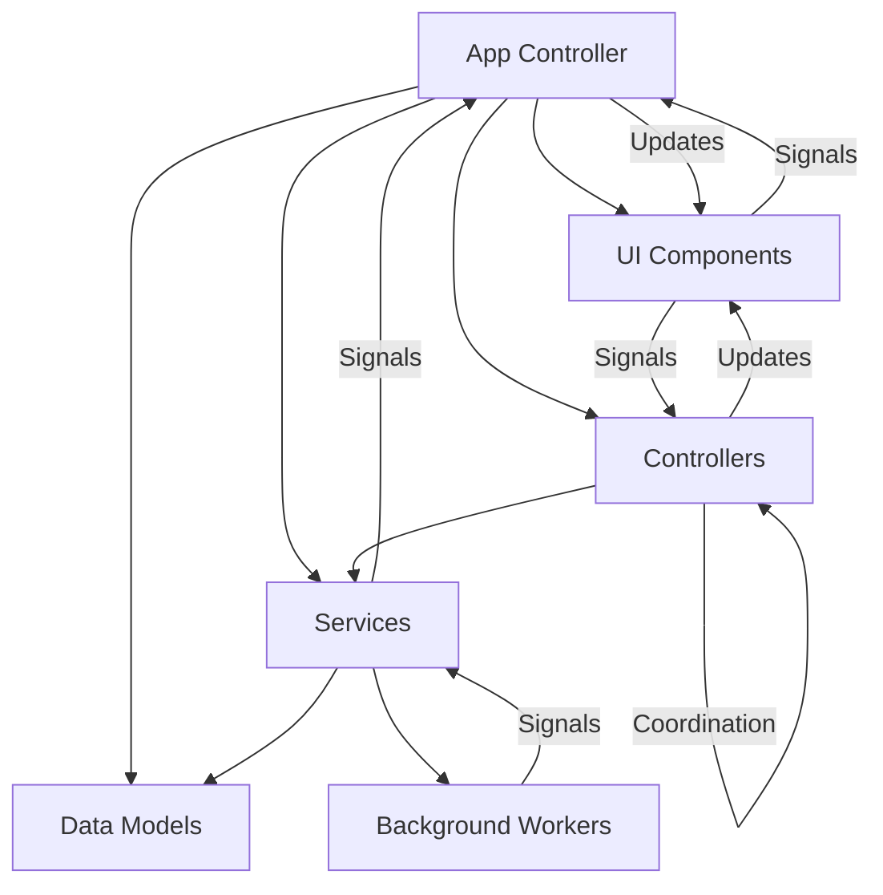
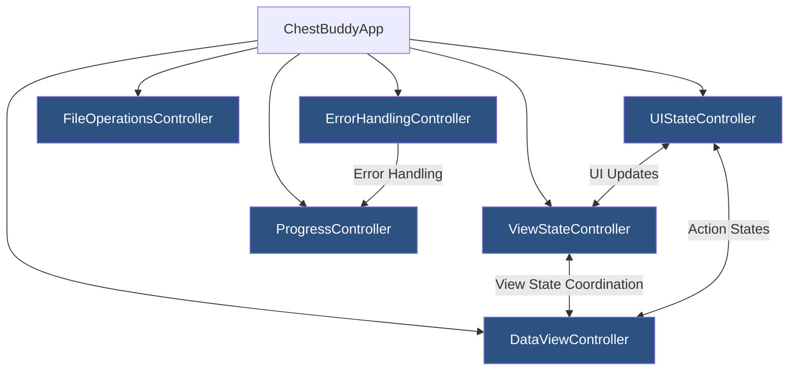
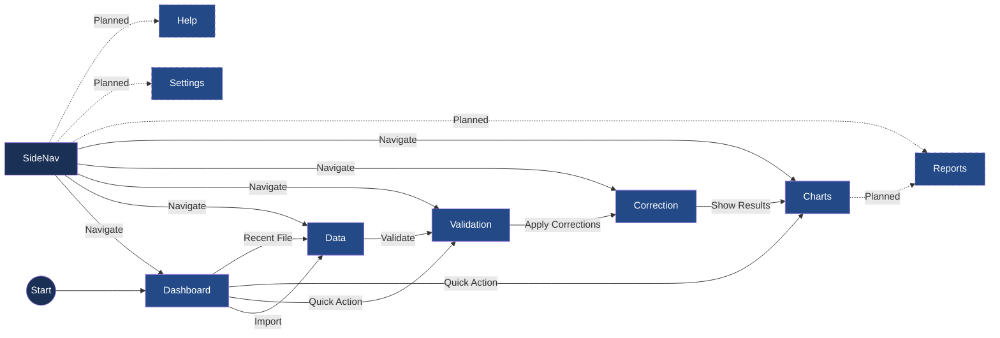

# Active Context: ChestBuddy Application

## Current State

The application architecture is stable with core functionality implemented. All UI components now use the controller-based architecture, with the ChartViewAdapter being the latest component to be refactored to use the DataViewController.

### Recently Completed Components

- **ChartViewAdapter Refactoring**: Updated the ChartViewAdapter to use the DataViewController for chart operations rather than handling them directly. This includes adding signals for chart events (creation, export), connecting to controller signals, and delegating chart requests to the controller. Created comprehensive tests to verify the integration.
- **ValidationViewAdapter Refactoring**: Updated the ValidationViewAdapter to use the DataViewController for validation operations rather than handling them directly. This includes adding signals for validation events, connecting to controller signals, and delegating validation requests to the controller. Created comprehensive tests to verify the integration.
- **UIStateController Implementation**: Successfully completed the implementation of the UIStateController class with comprehensive tests. The controller now centralizes UI-specific state management that doesn't fit into other controllers, including status bar updates, menu/action states, and UI component visibility. This reduces the responsibilities of the MainWindow class and improves separation of concerns.
- **DataViewAdapter Refactoring**: Updated the DataViewAdapter to use the DataViewController for business logic operations rather than handling them directly. This includes event handling, filtering, validation, and correction operations.
- **Integration Testing**: Created integration tests to verify UIStateController works correctly with other controllers and UI components, ensuring proper signal connections and state updates across the application.
- **DataViewController Implementation**: Successfully completed the implementation of the DataViewController class with full integration of validation and correction operations. The controller now centralizes data handling, filtering, sorting, validation, and correction operations, providing a clean interface for UI components to interact with data-related functionality.
- **ViewStateController Implementation**: Successfully completed the implementation of the ViewStateController class with 100% test coverage including integration tests. The controller now properly manages view transitions, data loading states, and view dependencies. Type annotations have been fixed to ensure compatibility with PySide6 signals.
- **Error Handling Controller Implementation**: Successfully implemented the ErrorHandlingController class that centralizes all error handling logic including displaying error messages, logging errors, and integrating with the progress system. The controller provides different methods for different error types (errors, warnings, info), supports exception handling with stack traces, and emits signals for error events.
- **File Operations Controller Implementation**: Successfully implemented the FileOperationsController class that centralizes all file operation logic including opening files, saving files, and managing recent files. Moved these responsibilities out of the MainWindow class to improve separation of concerns.
- **Main Window Integration**: Updated the MainWindow class to delegate all file operations to the FileOperationsController, reducing its complexity and improving maintainability.
- **Signal-Based Communication**: Implemented a robust signal-based communication system between the FileOperationsController and MainWindow to keep the UI updated when file operations occur.
- **Comprehensive Test Coverage**: Created thorough tests for the ViewStateController, FileOperationsController, ErrorHandlingController, and UIStateController to ensure reliability of the refactored code, including integration tests.
- **CorrectionViewAdapter Refactoring**: Updated CorrectionViewAdapter to utilize the DataViewController for correction operations, added necessary signals for correction events (started, completed, error), connected to controller signals and implemented appropriate handlers, created comprehensive tests verifying integration with DataViewController, added fallback behavior for cases when controller isn't set, updated MainWindow to set controller for the CorrectionViewAdapter.
- **ValidationViewAdapter Refactoring**: Updated ValidationViewAdapter to utilize the DataViewController for validation operations, added necessary signals for validation events (started, completed, error), connected to controller signals and implemented appropriate handlers, created comprehensive tests verifying integration with DataViewController, added fallback behavior for cases when controller isn't set, updated MainWindow to set controller for the ValidationViewAdapter.
- **UIStateController Implementation**: Complete state management for application, proper view transitions with prerequisite checking, history tracking for navigation, state persistence between sessions.
- **DataViewAdapter Refactoring**: Updated to use DataViewController for table population, separated filtering and sorting logic into controller, enhanced error handling through controller signals, added comprehensive tests.

### Application Architecture

The current state of the application architecture is evolving, with a focus on proper controller-based organization:

1. **Core Layer**:
   - Models: ChestDataModel, ValidationModel
   - Services: CSVService, ValidationService, CorrectionService, ChartService
   - Controllers: FileOperationsController, ProgressController, ErrorHandlingController, ViewStateController (100% complete), DataViewController (100% complete), UIStateController (100% complete)

2. **UI Layer**:
   - MainWindow: Main application window (refactored to delegate to controllers)
   - Views: Dashboard, Data, Validation, Correction, Charts

3. **Utils Layer**:
   - Configuration
   - Logging
   - File operations helpers

### Current UI Navigation

The navigation system has been enhanced with a sidebar that provides access to:

1. **Dashboard**: Overview of data and recent files
2. **Data**: Tabular view of imported data
3. **Validation**: View and resolve validation issues
4. **Correction**: Apply automated corrections to data
5. **Charts**: Visualize data in various chart formats

### Known Issues

1. **Memory Usage**: Large datasets consume significant memory, which needs optimization.
2. **UI Performance**: Updates to the UI thread can cause momentary freezing.
3. **Validation Rules Complexity**: Some validation rules are complex and need better documentation.

### Column Name Standardization

Progress has been made to ensure compatibility with CSV files that use different column naming conventions:

- Column name mapping is implemented to standardize input data
- Case-insensitive comparison for column identification
- Regular expression patterns for fuzzy matching similar columns
- Default column templates for easy mapping

## Current Tasks

### UI Refactoring to Controllers

Progress is being made to refactor the UI code, moving logic from UI classes into specialized controllers:

1. **FileOperationsController (Completed)**: Handles all file-related operations including opening, saving, and recent files management
2. **ProgressController (Completed)**: Manages progress dialogs and updates during long-running operations
3. **ErrorHandlingController (Completed)**: Centralizes error handling and display logic, integrates with logging and progress controller
4. **ViewStateController (Completed - 100%)**: Managing view state and transitions between different views, with comprehensive integration tests
5. **DataViewController (Completed - 100%)**: Handling data display, filtering, sorting, validation, and correction operations
6. **UIStateController (Completed - 100%)**: Managing UI-specific state like status bar updates, action states, and UI component visibility

The refactoring follows these principles:
- Move business logic out of UI classes into controllers
- Use signals for communication between controllers and UI
- Create comprehensive tests for all controllers
- Update documentation to reflect the new architecture

### Next Steps (Priority Order)

1. **Continue UI Component Refactoring**
   - Update remaining views to use controllers
   - Complete removal of direct event handling from UI components
   - Finish adapting UI components to be controller-driven

2. **Implement Additional View Adapters**
   - Refactor ValidationViewAdapter to use controllers
   - Refactor CorrectionViewAdapter to use controllers
   - Refactor ChartViewAdapter to use controllers

3. **Complete Test Coverage**
   - Finish integration tests for controller interactions
   - Test UI components with controllers
   - Verify error handling across controllers

4. **Update Project Documentation**
   - Reflect the new controller-based architecture
   - Document signal/slot connections for clarity
   - Update class diagrams

## Key Components

### Recently Completed Components
- **UIStateController**: Centralizes UI-specific state management with signals for status messages, action states, and UI themes
- **DataViewController**: Fully implemented controller for handling data operations, validation, correction with proper signal-based communication
- **ViewStateController**: Fully implemented controller for managing view state, transitions, and histories with comprehensive integration tests and fixed type annotations
- **Error Handling Controller**: Centralized error handling with typed error categories, signal-based error reporting, and progress integration
- **Progress Dialog Enhancements**: Custom-styled progress dialog with improved visual feedback
- **Background Processing Improvements**: Enhanced thread management and error handling
- **UI Component Library**: Reusable UI components like ActionButton, ActionToolbar, EmptyStateWidget, and FilterBar
- **Navigation System**: Enhanced sidebar with data-dependent state handling
- **CSV Loading Improvements**: Better progress reporting and error handling during file operations
- **CorrectionViewAdapter**: Updated to utilize the DataViewController for correction operations, added necessary signals for correction events (started, completed, error), connected to controller signals and implemented appropriate handlers, created comprehensive tests verifying integration with DataViewController, added fallback behavior for cases when controller isn't set, updated MainWindow to set controller for the CorrectionViewAdapter
- **ValidationViewAdapter**: Updated to utilize the DataViewController for validation operations, added necessary signals for validation events (started, completed, error), connected to controller signals and implemented appropriate handlers, created comprehensive tests verifying integration with DataViewController, added fallback behavior for cases when controller isn't set, updated MainWindow to set controller for the ValidationViewAdapter
- **UIStateController**: Complete state management for application, proper view transitions with prerequisite checking, history tracking for navigation, state persistence between sessions
- **DataViewAdapter**: Updated to use DataViewController for table population, separated filtering and sorting logic into controller, enhanced error handling through controller signals, added comprehensive tests

## Application Architecture

The current application architecture follows these patterns:



### Controller Relationships



## Current UI Navigation 

The implemented UI navigation structure:



## Known Issues

- Minor QThread object deletion warning at shutdown (non-critical)
  - Only occurs during application shutdown and doesn't affect functionality
  - Improved with better thread management but not fully resolved
  - Warning level reduced to debug to avoid alarming users

## Column Name Standardization

The `ChestDataModel.EXPECTED_COLUMNS` have been updated to match the actual column names in standard CSV files. The columns are now defined using uppercase names:

```python
EXPECTED_COLUMNS = ["DATE", "PLAYER", "SOURCE", "CHEST", "SCORE", "CLAN"]
```

Previously, title case column names were used (e.g., "Player Name"), but CSV files actually use uppercase names like "PLAYER". This standardization ensures proper data display in the table view.

The `DataManager._map_columns` method includes a default mapping between old column names and new ones to maintain compatibility with existing code that might be using the old column names.

Tests have been updated to reflect these changes, ensuring that all references to column names use the new uppercase format.

### Dashboard with No Data Loaded

```
+-----------------------------------------------------+
|                     ChestBuddy                      |
+------------+----------------------------------------+
|            |                                        |
| Dashboard  |  Dashboard                             |
|            |  +---------------------------------+   |
| Data ⊗     |  |         Welcome to ChestBuddy   |   |
|            |  |                                 |   |
| Analysis ⊗ |  | No data loaded. Import data to  |   |
|            |  | start analyzing your chest data.|   |
| Reports ⊗  |  |                                 |   |
|            |  |  +-------------------------+    |   |
| Settings   |  |  |       IMPORT DATA      |    |   |
|            |  |  +-------------------------+    |   |
| Help       |  |                                 |   |
|            |  +---------------------------------+   |
|            |                                        |
|            |  Statistics                            |
|            |  +--------+ +--------+ +--------+     |
|            |  | Dataset | |Validated| |Corrections| |
|            |  |  0 rows | |   N/A   | |    0     | |
|            |  +--------+ +--------+ +--------+     |
|            |                                        |
|            |  Recent Files                          |
|            |  No recent files                       |
+------------+----------------------------------------+
```

### Dashboard with Data Loaded

```
+-----------------------------------------------------+
|                     ChestBuddy                      |
+------------+----------------------------------------+
|            |                                        |
| Dashboard  |  Dashboard                             |
|            |                                        |
| Data       |  Quick Actions                         |
|            |  +--------+ +--------+ +--------+     |
| Analysis   |  | Import  | |Validate| |Export  |     |
|  • Tables  |  |  Data   | |  Data  | |  Data  |     |
|  • Charts  |  +--------+ +--------+ +--------+     |
|            |                                        |
| Reports    |  Statistics                            |
|            |  +--------+ +--------+ +--------+     |
| Settings   |  | Dataset | |Validated| |Corrections| |
|  • Lists   |  | 125 rows| |  94%    | |    15    | |
|  • Rules   |  +--------+ +--------+ +--------+     |
|  • Prefs   |                                        |
|            |  Recent Files                          |
| Help       |  • chest_data_2023-03-11.csv          |
|            |  • older_data_2023-02-15.csv          |
|            |                                        |
|            |  [Chart visualization]                 |
+------------+----------------------------------------+
```

## Current Focus

The current focus is on stabilizing the application's core file import and data loading functionality. Recent work has addressed several critical issues:

1. **Duplicate File Dialog Issue**: Fixed a problem where multiple file dialogs would appear when importing files.
   - Implemented state tracking flags to prevent duplicate dialogs
   - Added robust try/finally blocks to ensure proper cleanup
   - Fixed signal connection issues causing multiple dialog triggers

2. **Data Loading Issues**: Solved problems with data not properly loading or being displayed after import.
   - Enhanced error handling in the DataManager's load operations
   - Fixed signal blockage issues that prevented UI updates
   - Improved cancellation handling to properly clean up state
   - Added comprehensive logging for better debugging

3. **Signal Connection Improvements**: Enhanced the application's signal/slot connections for better reliability.
   - Added robust error handling for signal connections
   - Improved logging of signal activities
   - Added state tracking for data loaded status

## Recent Changes

- Implemented state tracking flags in MainWindow (`_is_opening_file`, `_is_saving_file`) to prevent duplicate dialogs
- Enhanced error handling in DataManager's `_on_csv_load_success`, `cancel_loading`, and `load_csv` methods
- Improved signal connections in App's `_connect_signals` method with better error handling and logging
- Added comprehensive diagnostics for debugging signal connections and data state changes
- Updated documentation in `bugfixing.mdc` and other memory files to track issues and solutions

## Next Steps

1. **Data Persistence**: Ensure data state is properly maintained throughout the application lifecycle.
2. **Error Recovery**: Improve robustness when handling unexpected states or errors during file operations.
3. **Performance Optimization**: Review and improve performance with large CSV files.
4. **UI Feedback**: Enhance user feedback during long-running operations.
5. **Testing**: Add more comprehensive tests for file operations and data loading to catch regressions.

## Active Decisions

- State tracking should be used throughout the application to prevent UI issues and race conditions.
- Signal connections should include robust error handling and logging.
- All methods handling user data should have try/except blocks with proper error reporting.
- The application should provide clear feedback during long-running operations.
- File and data operations should be cancellable with clean state reset.