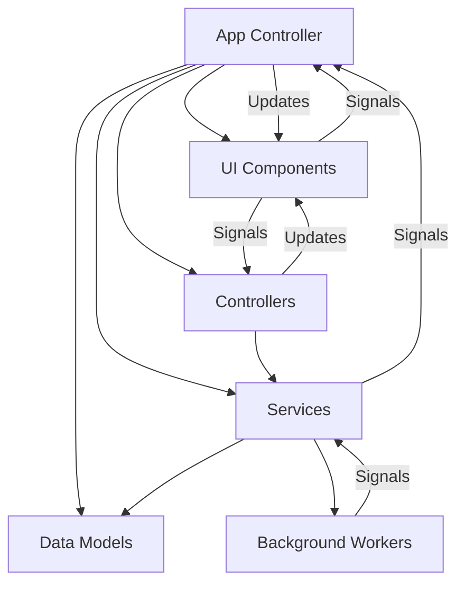
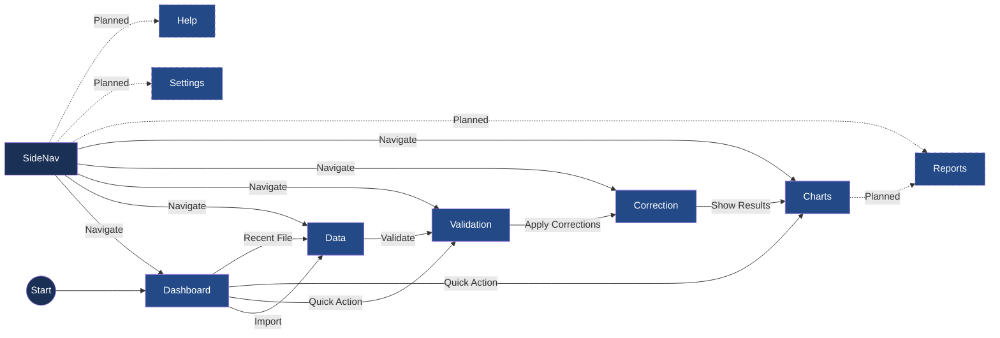
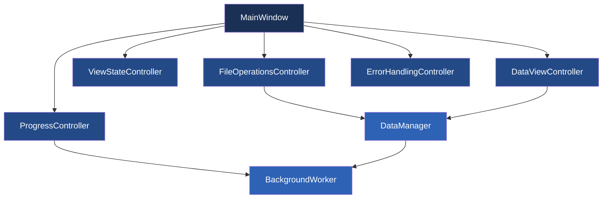

# Active Context: ChestBuddy Application

## Current State

The application architecture is stable with core functionality implemented. The current focus is on improving the codebase structure through refactoring, particularly implementing a proper controller architecture to separate UI logic from business logic.

### Recently Completed Components

- **Error Handling Controller Implementation**: Successfully implemented the ErrorHandlingController class that centralizes all error handling logic including displaying error messages, logging errors, and integrating with the progress system. The controller provides different methods for different error types (errors, warnings, info), supports exception handling with stack traces, and emits signals for error events.
- **File Operations Controller Implementation**: Successfully implemented the FileOperationsController class that centralizes all file operation logic including opening files, saving files, and managing recent files. Moved these responsibilities out of the MainWindow class to improve separation of concerns.
- **Main Window Integration**: Updated the MainWindow class to delegate all file operations to the FileOperationsController, reducing its complexity and improving maintainability.
- **Signal-Based Communication**: Implemented a robust signal-based communication system between the FileOperationsController and MainWindow to keep the UI updated when file operations occur.
- **Comprehensive Test Coverage**: Created thorough tests for the FileOperationsController and ErrorHandlingController to ensure reliability of the refactored code.

### Application Architecture

The current state of the application architecture is evolving, with a focus on proper controller-based organization:

1. **Core Layer**:
   - Models: ChestDataModel, ValidationModel
   - Services: CSVService, ValidationService, CorrectionService, ChartService
   - Controllers (New): FileOperationsController, ProgressController, ErrorHandlingController, ViewStateController (partial), DataViewController (partial)

2. **UI Layer**:
   - MainWindow: Main application window (being refactored to delegate to controllers)
   - Views: Dashboard, Data, Validation, Correction, Charts

3. **Utils Layer**:
   - Configuration
   - Logging
   - File operations helpers

### Current UI Navigation

The navigation system has been enhanced with a sidebar that provides access to:

1. **Dashboard**: Overview of data and recent files
2. **Data**: Tabular view of imported data
3. **Validation**: View and resolve validation issues
4. **Correction**: Apply automated corrections to data
5. **Charts**: Visualize data in various chart formats

### Known Issues

1. **Memory Usage**: Large datasets consume significant memory, which needs optimization.
2. **UI Performance**: Updates to the UI thread can cause momentary freezing.
3. **Validation Rules Complexity**: Some validation rules are complex and need better documentation.
4. **UI Code Organization**: MainWindow class still handles too many responsibilities, but refactoring is in progress to move these into specialized controllers.

### Column Name Standardization

Progress has been made to ensure compatibility with CSV files that use different column naming conventions:

- Column name mapping is implemented to standardize input data
- Case-insensitive comparison for column identification
- Regular expression patterns for fuzzy matching similar columns
- Default column templates for easy mapping

## Current Tasks

### UI Refactoring to Controllers

Progress is being made to refactor the UI code, moving logic from UI classes into specialized controllers:

1. **FileOperationsController (Completed)**: Handles all file-related operations including opening, saving, and recent files management
2. **ProgressController (Completed)**: Manages progress dialogs and updates during long-running operations
3. **ErrorHandlingController (Completed)**: Centralizes error handling and display logic, integrates with logging and progress controller
4. **ViewStateController (In Progress)**: Managing view state and transitions between different views
5. **DataViewController (In Progress)**: Handling data display, filtering, and sorting operations

The refactoring follows these principles:
- Move business logic out of UI classes into controllers
- Use signals for communication between controllers and UI
- Create comprehensive tests for all controllers
- Update documentation to reflect the new architecture

### Next Steps

1. Complete the implementation of the ViewStateController
2. Complete the implementation of the DataViewController
3. Update all views to use the controllers instead of direct event handling
4. Continue adding tests for each controller component
5. Update documentation to reflect the new architecture

## Key Components

### Recently Completed Components
- **Error Handling Controller**: Centralized error handling with typed error categories, signal-based error reporting, and progress integration
- **Progress Dialog Enhancements**: Custom-styled progress dialog with improved visual feedback
- **Background Processing Improvements**: Enhanced thread management and error handling
- **UI Component Library**: Reusable UI components like ActionButton, ActionToolbar, EmptyStateWidget, and FilterBar
- **Navigation System**: Enhanced sidebar with data-dependent state handling
- **CSV Loading Improvements**: Better progress reporting and error handling during file operations

## Application Architecture

The current application architecture follows these patterns:



## Current UI Navigation 

The implemented UI navigation structure:



## Known Issues

- Minor QThread object deletion warning at shutdown (non-critical)
  - Only occurs during application shutdown and doesn't affect functionality
  - Improved with better thread management but not fully resolved
  - Warning level reduced to debug to avoid alarming users

## Column Name Standardization

The `ChestDataModel.EXPECTED_COLUMNS` have been updated to match the actual column names in standard CSV files. The columns are now defined using uppercase names:

```python
EXPECTED_COLUMNS = ["DATE", "PLAYER", "SOURCE", "CHEST", "SCORE", "CLAN"]
```

Previously, title case column names were used (e.g., "Player Name"), but CSV files actually use uppercase names like "PLAYER". This standardization ensures proper data display in the table view.

The `DataManager._map_columns` method includes a default mapping between old column names and new ones to maintain compatibility with existing code that might be using the old column names.

Tests have been updated to reflect these changes, ensuring that all references to column names use the new uppercase format.

### CSV Operations Refactoring 

### Dashboard with No Data Loaded

```
+-----------------------------------------------------+
|                     ChestBuddy                      |
+------------+----------------------------------------+
|            |                                        |
| Dashboard  |  Dashboard                             |
|            |  +---------------------------------+   |
| Data ⊗     |  |         Welcome to ChestBuddy   |   |
|            |  |                                 |   |
| Analysis ⊗ |  | No data loaded. Import data to  |   |
|            |  | start analyzing your chest data.|   |
| Reports ⊗  |  |                                 |   |
|            |  |  +-------------------------+    |   |
| Settings   |  |  |       IMPORT DATA      |    |   |
|            |  |  +-------------------------+    |   |
| Help       |  |                                 |   |
|            |  +---------------------------------+   |
|            |                                        |
|            |  Statistics                            |
|            |  +--------+ +--------+ +--------+     |
|            |  | Dataset | |Validated| |Corrections| |
|            |  |  0 rows | |   N/A   | |    0     | |
|            |  +--------+ +--------+ +--------+     |
|            |                                        |
|            |  Recent Files                          |
|            |  No recent files                       |
+------------+----------------------------------------+
```

### Dashboard with Data Loaded

```
+-----------------------------------------------------+
|                     ChestBuddy                      |
+------------+----------------------------------------+
|            |                                        |
| Dashboard  |  Dashboard                             |
|            |                                        |
| Data       |  Quick Actions                         |
|            |  +--------+ +--------+ +--------+     |
| Analysis   |  | Import  | |Validate| |Export  |     |
|  • Tables  |  |  Data   | |  Data  | |  Data  |     |
|  • Charts  |  +--------+ +--------+ +--------+     |
|            |                                        |
| Reports    |  Statistics                            |
|            |  +--------+ +--------+ +--------+     |
| Settings   |  | Dataset | |Validated| |Corrections| |
|  • Lists   |  | 125 rows| |  94%    | |    15    | |
|  • Rules   |  +--------+ +--------+ +--------+     |
|  • Prefs   |                                        |
|            |  Recent Files                          |
| Help       |  • chest_data_2023-03-11.csv          |
|            |  • older_data_2023-02-15.csv          |
|            |                                        |
|            |  [Chart visualization]                 |
+------------+----------------------------------------+
```

### Optimized Data View 

```
+-----------------------------------------------------+
|                     ChestBuddy                      |
+------------+----------------------------------------+
|            |                                        |
| Dashboard  | Data  [📥 Import] [📤 Export] | [✓ Validate] [🔄 Correct] | [🔍] [↻] [✕] |
|            |                                        |
| Data       | Search: [___________________] [Adv ▼]  |
|            | +------------------------------------+ |
| Analysis   | | Date ▼ | Player ▼ | Chest ▼| Value▼| |
|  • Tables  | |-----------------------------------| |
|  • Charts  | |                                  | |
|            | |                                  | |
| Reports    | |                                  | |
|            | |                                  | |
| Settings   | |                                  | |
|  • Lists   | |                                  | |
|  • Rules   | |                                  | |
|  • Prefs   | |                                  | |
|            | |                                  | |
| Help       | |                                  | |
|            | |                                  | |
|            | |                                  | |
|            | |                                  | |
|            | +------------------------------------+ |
+------------+ Showing 78 of 125 rows | Filter: Date>2022-01 [Clear] |
```

These mockups illustrate the key UI enhancements, including:
1. Clear visual indication when views are disabled (⊗ symbol) when no data is loaded
2. Prominent call-to-action on the dashboard when empty
3. Compact header design in the Data view to maximize table space
4. Streamlined filtering and status display
5. Logical grouping of action buttons 

## Current Tasks & Progress

### UI Refactoring Plan

We've identified that significant UI logic is currently mixed in with the MainWindow class, particularly related to data loading and importing. This makes the code difficult to maintain and test, with the main_window.py file exceeding 1500 lines.

To improve this situation, we're implementing a controller layer to separate UI concerns from data management:

### New Controllers Architecture



1. **FileOperationsController**
   - Handle file dialogs and operations
   - Manage recent files list
   - Coordinate with DataManager for import/export

2. **ProgressController**
   - Create and manage progress dialogs
   - Track progress for long operations
   - Handle cancellation requests

3. **ViewStateController**
   - Manage enabling/disabling views based on data availability
   - Update navigation sidebar state
   - Coordinate view transitions

4. **DataViewController**
   - Handle populating data tables
   - Manage filtering and sorting
   - Connect data model updates to UI components

5. **ErrorHandlingController**
   - Standardize error display
   - Log errors appropriately
   - Provide recovery options

### Implementation Plan

We're taking a phased approach to gradually improve the architecture:

**Phase 1:** Extract FileOperationsController
**Phase 2:** Extract ProgressController
**Phase 3:** Extract ViewStateController
**Phase 4:** Extract DataViewController
**Phase 5:** Refine DataManager

This approach allows us to maintain application functionality throughout the process while steadily improving the architecture.

### Recently Completed

- Fixed issue with unnecessary table repopulation when switching views
- Fixed issue with data view not refreshing when importing new files with the same dimensions
- Improved data hash tracking to detect actual data content changes, not just dimension changes
- Enhanced the dashboard view to properly update statistics on refresh
- Updated UI refresh mechanism to be more selective about when components need refreshing

## Current Focus

- **Controller Architecture Implementation**: We've refactored the application to use a controller-based architecture to improve code organization and separation of concerns.
  - ✅ Implemented `FileOperationsController` to manage file operations
  - ✅ Implemented `ProgressController` to manage progress dialog operations
  - 🔄 Refactoring to use controllers for data validation and correction operations
  - 🔄 Refactoring to use controllers for view state management

- **UI Navigation**: The sidebar navigation needs a proper active state highlight on the current section.

## Current UI Navigation

- **Dashboard**: The main landing page that shows data statistics and suggestions.
- **Data**: Displays the raw data table with filtering and sorting capabilities.
- **Validation**: Shows validation results and issues found in the data.
- **Correction**: Provides tools to correct data issues.
- **Charts**: Displays visualizations of the data.

## Recently Completed Tasks

- **Progress Reporting Refactoring**: Completed refactoring the progress dialog logic into a `ProgressController` class, which improves reusability and separation of concerns:
  - Created a centralized `ProgressController` class to manage progress dialog creation and state
  - Refactored `MainWindow` to use the controller instead of directly creating and managing progress dialogs
  - Updated references in `data_view.py` to check for the controller's status instead of directly accessing progress dialog
  - Added unit tests for the `ProgressController` to verify its functionality
  - Removed legacy code, including the `_close_progress_dialog` method and direct references to _progress_dialog

- **File Operations Controller**: Implemented a controller for file operations to decouple file handling from the UI code.
  - Added methods for opening and saving files
  - Added proper error handling and progress reporting
  - Connected signals to update UI components
  