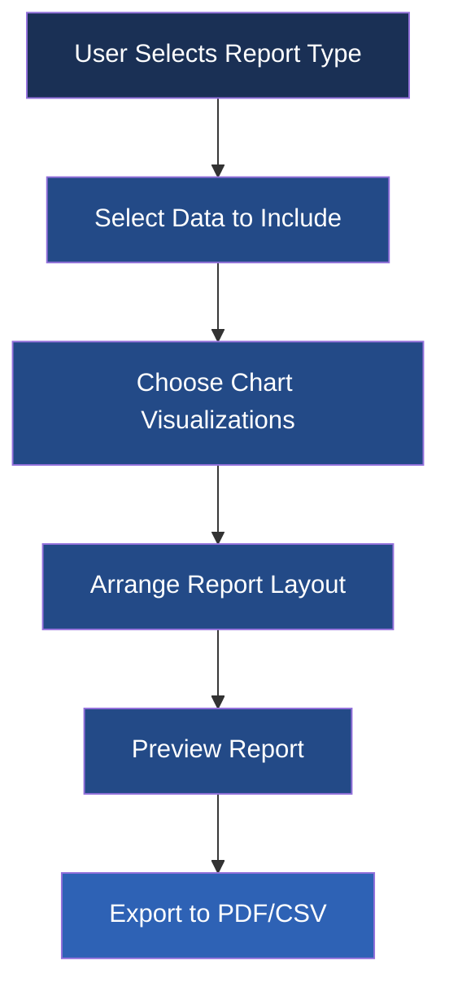

# Active Context

*Last Updated: 2023-10-18*

## Current Focus

### UI Enhancement - Phase 3 Complete

We've successfully completed Phase 3 of the UI Enhancement plan, which includes:

- **Phase 1**: ✅ Creation of reusable UI components (ActionButton, ActionToolbar, EmptyStateWidget, FilterBar)
- **Phase 2**: ✅ Enhancement of navigation and state management (sidebar navigation, data state management, empty state handling)
- **Phase 3**: ✅ Implementation of the Dashboard redesign using our new components (ActionCard, ChartCard)

The new dashboard provides a modern user interface with:
- Card-based grid layout for quick actions
- Recent files list with file cards
- Chart previews with thumbnails
- Empty states for each section
- Responsive layout with proper spacing and visual dividers

### Next Steps

1. **Phase 4**: Implement Data View Optimization
   - Apply the new UI components to the Data View
   - Improve table performance and usability
   - Enhance filtering and sorting capabilities

2. **Testing and Integration**
   - Run all UI component tests (currently passing)
   - Test the integrated dashboard functionality
   - Fix any integration issues

3. **Documentation and Polish**
   - Update documentation with new UI components
   - Address edge cases and error handling
   - Apply final polish to the UI

## Recent Decisions

1. **Navigation Structure**
   - Dashboard always accessible regardless of data state
   - Other views require data to be loaded
   - Appropriate empty states guide users to load data

2. **Data View Priority**
   - Focus on optimizing the Data View next as it's the most used feature
   - Implement filtering and sorting enhancements

3. **Empty State Handling**
   - Each view has customized empty states with actionable buttons
   - Dashboard provides a welcome experience for new users

4. **Component Reusability**
   - Designed components for maximum reuse across the application
   - Standardized API for all UI components
   - Comprehensive test suite ensures stability

5. **Memory Management**
   - Implemented clearing mechanisms for charts and large data
   - Careful widget cleanup to prevent memory leaks

## Implementation Strategy

### UI Enhancement Plan

#### Phase 1: Reusable Components ✅ COMPLETE
- Created base UI components:
  - ActionButton: Customizable button with icon support
  - ActionToolbar: Container for organizing buttons
  - EmptyStateWidget: Widget for empty state messaging
  - FilterBar: Search and filter interface

#### Phase 2: Navigation Enhancement ✅ COMPLETE
- Enhanced navigation and state management:
  - Updated sidebar navigation to be state-aware
  - Implemented unified data state management
  - Added empty states for data-dependent views

#### Phase 3: Dashboard Redesign ✅ COMPLETE
- Redesigned dashboard using new components:
  - Implemented ActionCard for dashboard actions
  - Created ChartCard for chart previews
  - Organized content into clear sections
  - Added responsive layout with proper spacing

#### Phase 4: Data View Optimization 🚧 PLANNED
- Enhance data display functionality:
  - Optimize table for large datasets
  - Improve filtering and sorting capabilities
  - Add visual enhancements for better readability

## Recent Improvements

### CSV Loading Enhancements

Significant improvements to the CSV import process:

1. **Progress Reporting**
   - Real-time progress updates during file loading
   - Cancellable operations with responsive UI

2. **Memory Management**
   - Optimized memory usage for large datasets
   - Intelligent batching for smoother performance

3. **Thread Safety**
   - Multi-threaded processing with proper synchronization
   - Background processing to keep UI responsive

4. **Error Handling**
   - Comprehensive error catching and reporting
   - Detailed feedback on import issues

5. **UI Feedback**
   - Status indicators during and after loading
   - Informative messages about process completion

## Report Generation System

### User Flow with Reports

1. **Create Report**: User selects data and report type
2. **Configure**: User customizes report parameters
3. **Generate**: System processes data and creates report
4. **Preview**: User reviews the generated report
5. **Export/Share**: User exports or shares the report

### Known Issues

- Large dataset performance in charts needs optimization
- Report templates need refinement for better layout
- Advanced filtering capabilities in report generation

### Current Focus

Working on improving the CSV loading experience by:
1. Creating a `MultiCSVLoadTask` class for handling multiple files
2. Updating the `DataManager` to track progress for each file
3. Adding a progress dialog with detailed status information
4. Implementing intelligent file processing for memory efficiency

### Expected Benefits
- More responsive UI during data loading
- Better memory management for large datasets
- Clearer feedback to users during operations
- Improved overall stability for large data processing

## Dashboard Redesign Progress

### Completed Components:

1. **StatCard**: A card component for displaying data metrics with visual indicators
   - Features:
     - Icon support for visual context
     - Trend indicators (up/down arrows with custom colors)
     - Click actions for navigation
     - Color customization based on value
     - Compact and expanded modes
     - Subtitle/trend text display
   - Located at: `chestbuddy/ui/widgets/stat_card.py`
   - Tests: All 12 tests passing

2. **ChartPreview**: A component for displaying interactive chart previews
   - Features:
     - Title and subtitle display
     - Icon support for visual context
     - Clickable interaction for detailed view
     - Compact mode for space-efficient display
     - Stacked layout with placeholder when no chart is available
     - Supports setting and clearing charts dynamically
   - Located at: `chestbuddy/ui/widgets/chart_preview.py`
   - Tests: All 10 tests passing

### In Progress:
- **ActionCard**: Developing a component to group related actions with context
- **RecentFilesList**: Enhancing the file list component with metadata and actions
- **WelcomeStateWidget**: Extending the EmptyStateWidget for welcome experience

## Recent Decisions

1. **Dashboard Component Design**: We've decided to create standalone, reusable dashboard components that can be composed in different arrangements, making the dashboard more flexible and maintainable.

2. **Trend Indicators**: For the StatCard component, we're using colored up/down arrows for trend visualization, with green for positive trends and red for negative trends.

3. **Dashboard States**: We're implementing multiple states for the dashboard:
   - Empty state (no data)
   - Welcome state (first-time users)
   - Data loaded state
   - Error state

4. **Chart Integration**: The ChartPreview component will leverage the existing chart functionality but provide a more compact and interactive preview.

5. **Dashboard Architecture**: We're following a modular approach with a DashboardService providing data to the components via the DashboardViewAdapter.

## Implementation Strategy

We are taking a phased approach to implementing the Dashboard Redesign:

### Phase 3a: Dashboard Components
1. ✅ Create StatCard component for displaying metrics with visual indicators
2. ✅ Create ChartPreview component with Qt Charts integration
3. 🚧 Implement ActionCard for grouped actions
4. 🚧 Enhance RecentFilesList with metadata and actions
5. 🚧 Create WelcomeStateWidget for first-time user experience

### Phase 3b: Dashboard Service
1. 🚧 Create DashboardDataService for statistics and chart data
2. 🚧 Implement data change monitoring
3. 🚧 Add frequently used actions tracking
4. 🚧 Create dashboard configuration management

### Phase 3c: Dashboard View Integration
1. 🚧 Refactor DashboardView to use new components
2. 🚧 Implement state transitions
3. 🚧 Create DashboardViewAdapter
4. 🚧 Update MainWindow integration

## Next Steps

1. **Continue Dashboard Components Implementation**:
   - Implement ActionCard component
   - Enhance RecentFilesList
   - Develop WelcomeStateWidget

2. **Begin Dashboard Service Implementation**:
   - Create service for statistics and chart data
   - Implement data change monitoring

3. **Plan Dashboard View Refactoring**:
   - Design component layout and state transitions
   - Plan integration with existing navigation system

## Technical Considerations

1. **Trend Calculation**: Need to track historical values to calculate trends for StatCard components.

2. **Chart Rendering**: The ChartPreview component will need to handle efficient rendering of matplotlib charts within the Qt framework.

3. **Performance**: Dashboard needs to remain responsive even with multiple components and real-time updates.

4. **Widget Communication**: Components need to communicate with each other and the main application through a well-defined signal/slot mechanism.

5. **Test Mocking**: For testing the dashboard components, we'll need to mock the data service and chart generation.

## Recent Component Implementation Details

### StatCard Implementation Details

The StatCard component is implemented as a QWidget-based class with these key features:

- **Trend Visualization**: Custom-drawn arrows indicate upward, downward, or neutral trends
- **Value Formatting**: Displays metric value with customizable styling
- **Icon Support**: Optional icon for visual context
- **Compact Mode**: Supports both standard and space-efficient displays
- **Click Handling**: Emits clicked signal for navigation
- **Visual Feedback**: Hover effects and custom styling
- **Value Coloring**: Support for color customization based on thresholds

Technical details:
- Custom painting for trend indicators in the paintEvent method
- QLabel-based layout for text content
- Signal/slot connections for click handling
- Comprehensive property getters and setters
- Style customization based on the application's color scheme

### ChartPreview Implementation Details

The ChartPreview component is implemented as a QWidget-based class designed to display interactive chart previews with these key features:

- **Chart Display**: Shows QtCharts objects in a visually appealing container
- **Title and Subtitle**: Configurable text elements for context
- **Compact Mode**: Adjusts layout sizes based on available space
- **Placeholder State**: Shows a message when no chart is available
- **Hover Effects**: Visual feedback on mouse hover
- **Click Handling**: Emits clicked signal for showing detailed chart view
- **Icon Support**: Optional icon for additional context

Technical details:
- QStackedLayout to switch between chart view and placeholder
- Customized QChartView for display of QtCharts
- Consistent styling with application color scheme
- Comprehensive property getters and setters
- Signal/slot connections for user interaction
- Responsive layout adjustments based on compact mode

All components follow a consistent naming convention and structured test approach, with each feature covered by appropriate test cases.

## Report Generation System

We are planning a report generation system that will allow users to create custom reports from their chest data. This system will:

1. **Define Report Templates**: Create predefined templates for common reports
2. **Support Custom Reports**: Allow users to define custom report layouts
3. **Export Options**: Provide multiple export formats (PDF, HTML, CSV)
4. **Visualization Integration**: Include charts and graphs in reports
5. **Scheduling**: Allow automated report generation on a schedule

This feature will be implemented after completing the current UI enhancement phases.

### Recent Decisions

1. **Navigation Structure**:
   - Import/Export are actions, not views - moved to toolbar
   - Data, Analysis, and Reports views require data to be loaded
   - Dashboard, Settings, and Help always accessible

2. **Data View Priority**:
   - Data view is the primary interaction point after data loading
   - Empty states should provide clear path to data loading

3. **Empty State Handling**:
   - Each view has customized empty state messaging and icons
   - Action buttons in empty states trigger data import
   - BaseView now manages empty state display logic

4. **Component Reusability**:
   - Created a more extendable BaseView with QStackedWidget for content/empty states
   - Used EmptyStateWidget consistently across all data-dependent views
   - Standardized action button styling and behavior

5. **Memory Management**:
   - Improved object ownership for more reliable cleanup
   - Fixed potential memory leaks in background workers

### Implementation Strategy

The UI enhancement plan is being implemented in phases:

#### Phase 1: Reusable Components ✅
1. Create ActionButton component ✅
2. Create ActionToolbar component ✅
3. Create EmptyStateWidget component ✅
4. Create FilterBar component ✅
5. Implement comprehensive tests for all components ✅

#### Phase 2: Navigation & State Management ✅
1. Update SidebarNavigation to support disabled states ✅
2. Remove Import/Export from navigation sidebar ✅ 
3. Implement data_loaded state tracking in MainWindow ✅
4. Make views dependent on data being loaded ✅
5. Provide clear visual feedback when views are disabled ✅

#### Phase 3: Dashboard Redesign 🚧
1. Create data summary cards
2. Implement recent files with actions
3. Add chart previews for quick insights
4. Design welcome state for new users

#### Phase 4: Data View Optimization 🚧
1. Integrate FilterBar for data searching
2. Add column visibility controls
3. Implement data grouping functionality
4. Add export options directly in view

### Recent Improvements

#### UI Component Library
- Created reusable UI components with consistent styling
- Implemented comprehensive test suite for components
- Added state management to main window and navigation

#### CSV Loading Process
- Enhanced progress reporting with detailed file information
- Improved memory management during large file loading
- Added thread safety improvements for background operations

#### Progress Dialog Enhancements
- Improved visibility and interaction during long operations
- Added estimated time remaining calculation
- Implemented cancelation with proper cleanup

#### Empty State Management
- Added clear visual feedback when data is required
- Implemented centralized data state tracking
- Provided direct paths to action from empty states

### Report Generation System

We are planning to implement a report generation system that will allow users to create custom reports with data visualizations and analysis. This will be a key feature for Phase 3.

#### Report Design Mockup



#### Navigation Flow


### Design Mockups

#### Data View Enhancement

```
+----------------------------------------+
|            ChestBuddy - Data           |
+----------------------------------------+
| ┌──────┐ | FilterBar                 | |
| │      │ +----------------------------+ |
| │ Side │ | Data Table with Filters     |
| │      │ |                             |
| │ Nav  │ |                             |
| │      │ |                             |
| │      │ |                             |
| │      │ |                             |
| └──────┘ |                             |
+----------------------------------------+
```

#### Empty Dashboard State

```
+----------------------------------------+
|         ChestBuddy - Dashboard         |
+----------------------------------------+
| ┌──────┐ |                            |
| │      │ |     ╭───────────────╮      |
| │ Side │ |     │               │      |
| │      │ |     │  No Data Yet  │      |
| │ Nav  │ |     │               │      |
| │      │ |     │  [Import]     │      |
| │      │ |     │               │      |
| │      │ |     ╰───────────────╯      |
| └──────┘ |                            |
+----------------------------------------+
```

#### Dashboard with Data

```
+----------------------------------------+
|         ChestBuddy - Dashboard         |
+----------------------------------------+
| ┌──────┐ | ┌──────────┐ ┌──────────┐  |
| │      │ | │ Files    │ │ Records  │  |
| │ Side │ | │ 5        │ │ 1,250    │  |
| │      │ | └──────────┘ └──────────┘  |
| │ Nav  │ |                            |
| │      │ | ┌──────────────────────┐   |
| │      │ | │ Recent Chart         │   |
| │      │ | │                      │   |
| └──────┘ | └──────────────────────┘   |
+----------------------------------------+
```

## Implementation Details

### Navigation Enhancement Implementation

1. **SidebarNavigation Changes**
   - Added disabled state styling to NavigationButton and SubNavigationButton
   - Implemented methods to enable/disable sections and items
   - Updated button click handling to respect disabled state
   - Removed Import/Export sub-items from Data section

2. **MainWindow State Management**
   - Added data_loaded property to track data loading state
   - Updated loading methods to manage this state
   - Added methods to update UI based on data state
   - Created toolbar for Import/Export actions

3. **View State Management**
   - Updated BaseView to support EmptyStateWidget integration
   - Added data_required property to views 
   - Implemented methods to show/hide empty state based on data availability
   - Connected EmptyStateWidget actions to data import

4. **User Interaction Flow**
   - Disabled navigation to views requiring data when no data is loaded
   - Added direct paths to data import from empty states
   - Preserved state between views when switching navigation
