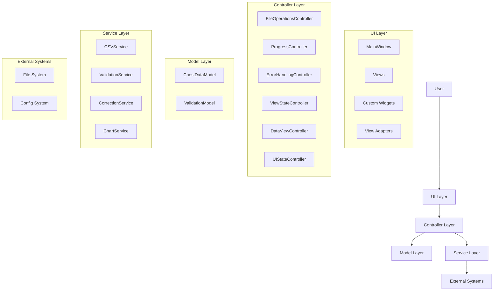
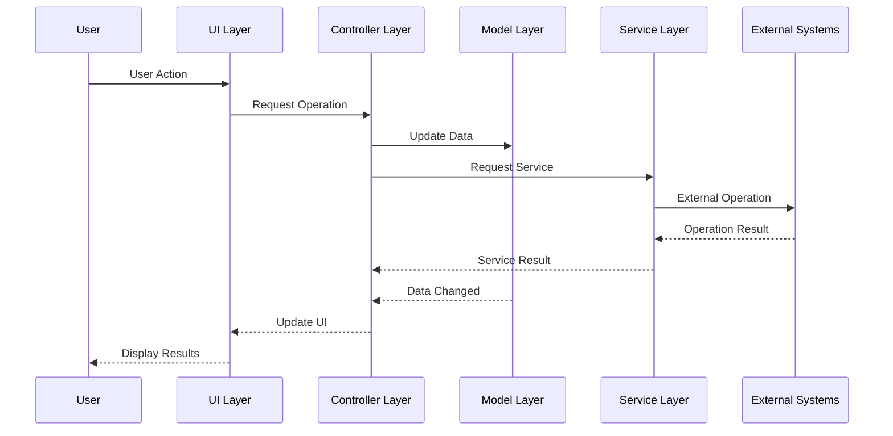
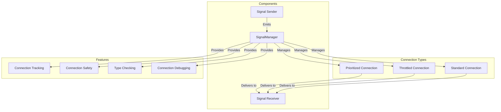
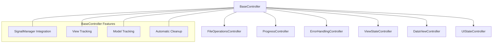

# Active Context: ChestBuddy Application

## Current State

The ChestBuddy application architecture is now fully complete and stable. All core functionality is implemented and working properly. The application has successfully transitioned to a controller-based architecture with proper separation of concerns.

We have fully implemented the SignalManager utility with all planned features, including signal throttling, prioritized connections, type checking, and the safe connection methods. All phases of the Signal Connection Management Improvement Plan are now complete (Phases 1-6).

We have now made significant progress on Phase 2 of the UI Update Interface implementation, having implemented a ServiceLocator pattern that provides centralized access to the UpdateManager throughout the application.

### Completed Signal Connection Management Improvements

We have successfully completed the Signal Connection Management Improvement Plan:

1. Created a robust `SignalManager` utility for managing PySide6 signal connections:
   - Centralized connection tracking
   - Methods to prevent duplicate connections
   - Centralized disconnection methods
   - Support for debugging and connection management
   - Parameter compatibility checking
   - Prioritized connections
   - Safe connection methods with automatic disconnection
   - Signal blocking context manager

2. Established signal connection standards across the codebase:
   - Consistent naming patterns for signal handlers
   - Error handling patterns
   - Documentation requirements
   - Testing approaches
   
3. Implemented signal throttling to improve performance
   - Configurable throttle intervals
   - Support for both throttling and debouncing modes
   - Proper cleanup of throttled connections

### UI Update Interface Implementation Progress

We've made significant progress on the UI Update Interface implementation:

1. **Phase 1 (Interface Definition)** - **Completed**
   - Defined the `IUpdatable` interface and `UpdatableComponent` base class ✓
   - Set up test framework for updatable components ✓
   - Created mock updatable components for testing ✓

2. **Phase 2 (UpdateManager Utility)** - **Completed**
   - Implemented `UpdateManager` class for centralized update scheduling ✓
   - Created comprehensive test suite for UpdateManager ✓
   - Fixed compatibility issues with test mocks ✓
   - Fixed errors in UpdateManager's cleanup code ✓
   - Implemented ServiceLocator pattern for accessing UpdateManager ✓
   - Created utility function for getting the application-wide UpdateManager ✓
   - Added tests for ServiceLocator and UpdateManager integration ✓
   - Transitioned views to use UpdateManager ✓

3. **Phase 3 (View Integration)** - **In Progress**
   - Define `UpdatableView` base class for QWidget-based views ✓
   - Implemented proper signal handling in UpdatableView ✓
   - Created comprehensive tests for UpdatableView ✓
   - Integrated DataViewAdapter with the update system ✓
   - Created thorough tests for DataViewAdapter integration with UpdateManager ✓
   - ⏳ Update remaining view components to implement `IUpdatable`
   - ⏳ Integrate UpdateManager into the main application
   - ⏳ Update controllers to use UpdateManager for triggering UI updates

4. **Phase 4 (Data State Tracking)** - **Planned**
   - Define data state tracking mechanisms
   - Implement dependency system for UI components
   - Optimize update frequency for performance

### Implementation Plan Completion

The Signal Connection Management Improvement Plan is now fully complete:

- Phase 1 (SignalManager implementation) - **Completed**
- Phase 2 (Signal Connection Standards) - **Completed**
  - Created signal_standards.py with naming conventions and patterns ✓
  - Updated BaseView with standardized signal management ✓
  - Refactored DataViewAdapter to use standardized patterns ✓
  - Created unit tests for signal standards implementation ✓
  - Documentation updated ✓
- Phase 3 (View Adapter Enhancement) - **Completed**
  - Updated view adapters to use SignalManager ✓
  - Implemented consistent signal connection patterns ✓
  - Added signal disconnection during cleanup ✓
  - Enhanced error handling for signal failures ✓
- Phase 4 (Integration with Controllers) - **Completed**
  - Created BaseController class for standardized signal management ✓
  - Updated all controllers to inherit from BaseController ✓
  - Added connection tracking for all controller signals ✓
  - Implemented automatic disconnection on controller deletion ✓
  - Ensured consistent error handling for connection failures ✓
  - Fixed bug in ViewStateController related to is_empty property ✓
- Phase 5 (Signal Throttling Implementation) - **Completed**
  - Implemented throttling for signals to improve UI performance ✓
  - Added both throttle and debounce modes ✓
  - Created comprehensive unit tests for all throttling functionality ✓
  - Enhanced connection tracking to include throttled connections ✓
  - Improved error handling for disconnection operations ✓
  - Integrated throttled connections with existing management features ✓
  - Added throttling information to the connection debugging tools ✓
- Phase 6 (Connection Safety Enhancements) - **Completed**
  - Implemented connection priority management ✓
  - Created stronger typechecking for signal connections ✓
  - Added utility methods for connection tracking (has_connection, get_connection_count) ✓
  - Enhanced parameter counting logic for bound methods and default parameters ✓
  - Created comprehensive tests for priority connections and type checking ✓
  - Enhanced debugging capabilities for prioritized connections ✓
  - Improved error handling for type compatibility checks ✓
  - Implemented safe_connect method for reliable signal connections ✓
  - Added blocked_signals context manager for temporary signal blocking ✓

The UI Update Interface Implementation is making excellent progress:

- Phase 1 (Interface Definition) - **Completed**
- Phase 2 (UpdateManager Utility) - **Completed**
  - ServiceLocator pattern implemented ✓
  - UpdateManager now accessible throughout application ✓
  - Fixed issues with QTimer cleanup in UpdateManager ✓
  - Added helper function for getting UpdateManager ✓
  - Comprehensive tests for ServiceLocator and UpdateManager ✓
  - Views transitioned to use UpdateManager ✓
- Phase 3 (View Integration) - **In Progress (45% complete)**
  - UpdatableView base class implemented and tested ✓
  - DataViewAdapter integrated with update system ✓
  - Comprehensive tests for DataViewAdapter's UpdateManager integration ✓
- Phase 4 (Data State Tracking) - **Planned**

### Next Steps

With significant progress on the UI Update Interface implementation, our next steps are:

1. **Continue Phase 3 of UI Update Interface**
   - Update remaining view components to implement `IUpdatable`
   - Integration with ValidationViewAdapter and CorrectionViewAdapter
   - Update controllers to use UpdateManager for UI updates
   - Full integration into main application workflow

2. **Begin Phase 4 of UI Update Interface**
   - Implement data state tracking mechanisms
   - Create dependency system for coordinated updates
   - Optimize update frequency for better performance

3. **Enhanced Debugging Tools for Signal Flow Visualization**
   - Create visual signal flow diagrams
   - Add detailed signal path tracing
   - Implement timing analysis for signal propagation
   - Create a debugging UI for signal inspection

### Completed Components

- **Controller Architecture**: All key controllers have been implemented (FileOperations, Progress, ErrorHandling, ViewState, DataView, UIState)
- **UI Component Refactoring**: All UI components have been refactored to use controllers
  - **ChartViewAdapter**: Updated to use the DataViewController for chart operations
  - **ValidationViewAdapter**: Updated to use the DataViewController for validation operations
  - **CorrectionViewAdapter**: Updated to use the DataViewController for correction operations
  - **DataViewAdapter**: Updated to use the DataViewController for data handling
- **Integration Testing**: Comprehensive integration tests verify controllers work correctly with UI components
- **Signal-Based Communication**: Robust signal-based communication between controllers and UI components
- **SignalManager Utility**: New utility for centralized signal connection management
- **Signal Connection Standards**: New standardized patterns for signal connections
- **BaseController**: New base class for all controllers with integrated SignalManager functionality
  - Provides standardized signal connection management
  - Tracks connected views and models
  - Implements automatic connection cleanup
  - Ensures consistent error handling
- **Signal Throttling**: Implementation of throttling capabilities for signals
  - Supports both throttle and debounce modes
  - Integrates with existing connection tracking
  - Provides comprehensive error handling
  - Includes detailed debugging information
- **Connection Safety Enhancements**: Implementation of safety features for signal connections
  - Prioritized connections for controlling execution order
  - Type compatibility checking to prevent runtime errors
  - Utility methods for connection tracking and management
  - Enhanced parameter counting logic for better compatibility detection
  - Improved error handling for compatibility issues
- **ServiceLocator Pattern**: Implementation of service locator pattern for accessing application-wide services
  - Provides centralized access to the UpdateManager
  - Supports lazily initialized services through factory functions
  - Includes type-safe service access
  - Comprehensive test coverage for all functionality

### Application Architecture

The application architecture follows a clean controller-based organization:

1. **Core Layer**:
   - Models: ChestDataModel, ValidationModel
   - Services: CSVService, ValidationService, CorrectionService, ChartService
   - Controllers: FileOperationsController, ProgressController, ErrorHandlingController, ViewStateController, DataViewController, UIStateController

2. **UI Layer**:
   - MainWindow: Main application window (delegates to controllers)
   - Views: Dashboard, Data, Validation, Correction, Charts
   - Components: IUpdatable components, UpdatableComponent base class
   - Utils: UpdateManager for managing UI component updates

3. **Utils Layer**:
   - Configuration
   - Logging
   - File operations helpers
   - **SignalManager**: Utility for signal connection management
   - **Signal Standards**: Reference for signal naming and connection patterns
   - **ServiceLocator**: Utility for accessing application-wide services

### Current UI Navigation

The navigation system uses a sidebar that provides access to:

1. **Dashboard**: Overview of data and recent files
2. **Data**: Tabular view of imported data
3. **Validation**: View and resolve validation issues
4. **Correction**: Apply automated corrections to data
5. **Charts**: Visualize data in various chart formats

### Known Issues

1. **Memory Usage**: Large datasets (>100,000 rows) can consume significant memory
2. **UI Performance**: While signal throttling has improved the situation, updates to the UI thread can still cause momentary freezing with very large datasets
3. **Thread Cleanup**: Minor QThread object deletion warning at shutdown (non-critical)
4. **Controller Tests**: Some controller tests that require QApplication need to be updated to use pytest-qt
5. **QTimer Cleanup**: UpdateManager's `__del__` method needs to handle cases where timers are already deleted (fixed)

### Column Name Standardization

The application supports diverse CSV file formats through:

- Column name mapping to standardize input data (using `EXPECTED_COLUMNS = ["DATE", "PLAYER", "SOURCE", "CHEST", "SCORE", "CLAN"]`)
- Case-insensitive comparison for column identification
- Regular expression patterns for fuzzy matching similar columns
- Default column templates for easy mapping

## Application Architecture

The current application architecture follows these patterns:



## Data Flow



## Signal Connection Architecture

The application now uses a standardized signal connection approach:



## Controller Hierarchy



# ChestBuddy Application - Current Context

## Application Overview
ChestBuddy is a specialized data management application that processes CSV files containing structured data. It provides validation against industry standards, visualization tools, and data correction capabilities.

## Current Project State

### Architecture
The application follows a Controller-View architecture with these key components:
- **Controllers**: Centralized business logic handling through specialized controllers
- **Views**: User interface components that interact with controllers
- **SignalManager**: Centralized signal connection management with connection tracking
- **IUpdatable Interface**: Protocol for standardizing UI component updates
- **UpdateManager**: Utility for managing UI update scheduling

### Recently Completed
- **Signal Connection Management Improvement Plan**: 
  - ✅ Implemented priority connections
  - ✅ Added strong type checking for signal connections
  - ✅ Improved parameter counting and type detection
  - ✅ Enhanced error handling and reporting for connection issues
  - ✅ Created comprehensive test suite for all signal management features

- **UI Update Interface Standardization Progress**:
  - ✅ Created IUpdatable interface definition
  - ✅ Implemented UpdatableComponent base class
  - ✅ Fixed issues with MockUpdatable classes in tests
  - ✅ Implemented QWidget-based MockUpdatableWidget for testing
  - ✅ Fixed test compatibility issues with UpdateManager
  - ✅ Enhanced test coverage for IUpdatable implementations

### Current Focus
Working on the **UI Update Interface Standardization Plan**:
- Phase 1: ✅ Interface Definition
- Phase 2: 🔄 UpdateManager Implementation
  - Working on:
    - Fixing UpdateManager test compatibility issues
    - Ensuring test mocks properly implement the IUpdatable protocol
    - Correcting test assertions to match the actual implementation behavior
- Phase 3: 📅 View Integration (Next)
- Phase 4: 📅 Data State Tracking (Future)

### Next Steps
1. Complete UpdateManager implementation with proper test coverage
2. Update existing views to implement the IUpdatable interface
3. Integrate the UpdateManager into the application
4. Add data state tracking to trigger UI updates automatically

## Implementation Details

### UI Update Interface
We're implementing a standardized approach to UI updates through:
- **IUpdatable** protocol: Defines a common interface for all updatable components
- **UpdateManager** utility: Manages component dependencies and debounces updates
- **UpdatableComponent** base class: Provides common implementation for UI components

### Recent Progress
- Fixed MockUpdatable in tests to properly implement the IUpdatable protocol
- Created QWidget-based MockUpdatableWidget for integration with QWidget-based components
- Adjusted test cases to properly verify UpdateManager functionality
- Modified test assertions to correctly test the actual implementation behavior

### Current Issues
- The UpdateManager's handling of pending updates needed adjustment in tests
- The MockUpdatable class required QWidget implementation for complete testing
- Test assertions needed to be fixed to match the actual implementation

## Signal Management Enhancements
The SignalManager utility provides:
- Centralized signal connection tracking
- Prioritized connections for controlling execution order
- Connection type safety with parameter counting
- Throttled connections (both throttle and debounce modes)
- Debugging tools for connection inspection

### Signal Standards
We've established these guidelines:
- **Naming**: Consistent naming pattern (sender_action_target)
- **Connection**: Centralized connection management through SignalManager
- **Validation**: Type compatibility checking for all connections
- **Prioritization**: Execution order control for critical operations
- **Throttling**: Performance optimization for frequent UI updates

## Project Insights

The standardized update interface represents a significant improvement in:
1. **Consistency**: All UI components will follow the same update pattern
2. **Performance**: Debounced updates prevent UI freezing during rapid data changes
3. **Testability**: Standardized interface makes component testing easier
4. **Maintainability**: Cleaner code with clear update responsibility
5. **Extensibility**: Easy to add new updatable components

The current phase builds on the signal management improvements, focusing specifically on standardizing how UI components receive and process update requests.

## Reference Architecture
```
┌────────────────┐         ┌────────────────┐         ┌────────────────┐
│  Controllers   │◄───────►│  UpdateManager │◄───────►│      Views     │
└────────────────┘         └────────────────┘         └────────────────┘
        │                          ▲                          ▲
        │                          │                          │
        ▼                          │                          │
┌────────────────┐                 │                          │
│  SignalManager │-----------------┘                          │
└────────────────┘                                            │
        │                                                     │
        ▼                                                     │
┌────────────────┐                                            │
│   Data Model   │◄────────────────────────────────────────────
└────────────────┘
```
