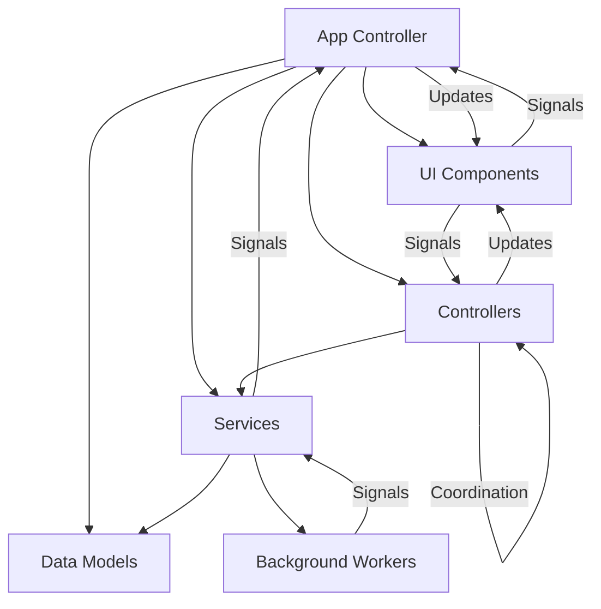
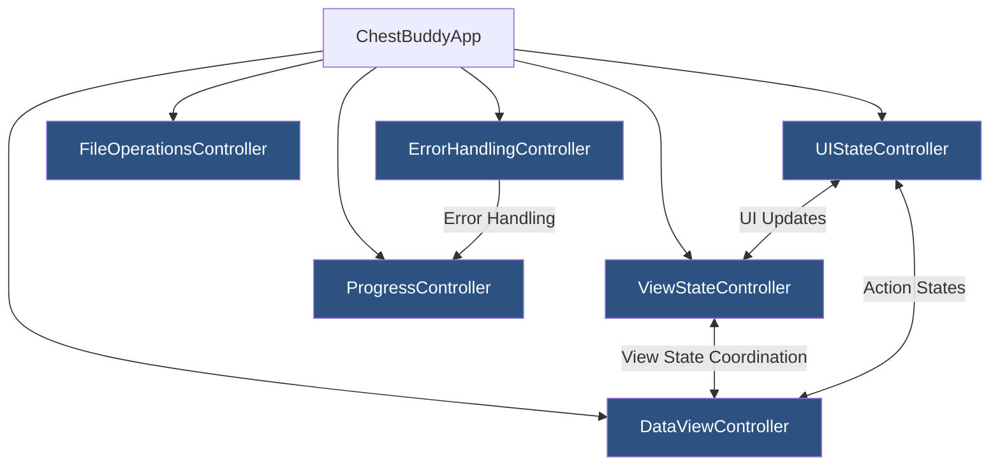
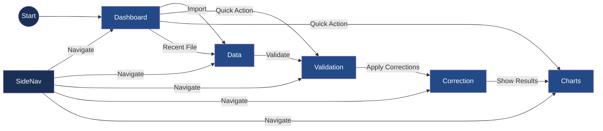

# Active Context: ChestBuddy Application

## Current State

The application architecture is stable with all core functionality implemented. The application has successfully transitioned to a controller-based architecture, with all UI components now using the appropriate controllers for business logic operations. 

We are now implementing a new SignalManager utility to centralize and improve signal connection management as identified in our improvement plan.

### Current Implementation Focus

We are implementing the **Signal Connection Management Improvement Plan** to address issues with signal connection management in ChestBuddy:

1. **SignalManager Utility**: A new utility class for managing PySide6 signal connections
   - Tracks all signal connections
   - Prevents duplicate connections
   - Provides centralized disconnection methods
   - Includes safety mechanisms and context managers
   - Offers debugging tools for connection tracking

2. **Signal Connection Standards**: Standardized patterns for signal connections across the application
   - Defines signal naming conventions (verb_noun, noun_changed, noun_requested, etc.)
   - Establishes slot naming conventions (_on_signal_name, etc.)
   - Creates standardized connection patterns for view adapters
   - Provides consistent error handling and debugging
   - Ensures proper signal disconnection during cleanup

3. **Overall Implementation Plan Progress**:
   - Phase 1 (SignalManager implementation) - **Completed**
   - Phase 2 (Signal Connection Standards) - **In Progress**
     - Created signal_standards.py with naming conventions and patterns ✓
     - Updated BaseView with standardized signal management ✓
     - Refactored DataViewAdapter to use standardized patterns ✓
     - Created unit tests for signal standards implementation ✓
     - Documentation update in progress ✓
   - Phase 3 (View Adapter Enhancement) - *Pending*
   - Phase 4 (Integration with Controllers) - *Pending*
   - Phase 5 (Connection Safety Enhancements) - *Pending*

### Completed Components

- **Controller Architecture**: All key controllers have been implemented (FileOperations, Progress, ErrorHandling, ViewState, DataView, UIState)
- **UI Component Refactoring**: All UI components have been refactored to use controllers
  - **ChartViewAdapter**: Updated to use the DataViewController for chart operations
  - **ValidationViewAdapter**: Updated to use the DataViewController for validation operations
  - **CorrectionViewAdapter**: Updated to use the DataViewController for correction operations
  - **DataViewAdapter**: Updated to use the DataViewController for data handling
- **Integration Testing**: Comprehensive integration tests verify controllers work correctly with UI components
- **Signal-Based Communication**: Robust signal-based communication between controllers and UI components
- **SignalManager Utility**: New utility for centralized signal connection management
- **Signal Connection Standards**: New standardized patterns for signal connections

### Application Architecture

The application architecture follows a clean controller-based organization:

1. **Core Layer**:
   - Models: ChestDataModel, ValidationModel
   - Services: CSVService, ValidationService, CorrectionService, ChartService
   - Controllers: FileOperationsController, ProgressController, ErrorHandlingController, ViewStateController, DataViewController, UIStateController

2. **UI Layer**:
   - MainWindow: Main application window (delegates to controllers)
   - Views: Dashboard, Data, Validation, Correction, Charts

3. **Utils Layer**:
   - Configuration
   - Logging
   - File operations helpers
   - **SignalManager**: Utility for signal connection management
   - **Signal Standards**: Reference for signal naming and connection patterns

### Current UI Navigation

The navigation system uses a sidebar that provides access to:

1. **Dashboard**: Overview of data and recent files
2. **Data**: Tabular view of imported data
3. **Validation**: View and resolve validation issues
4. **Correction**: Apply automated corrections to data
5. **Charts**: Visualize data in various chart formats

### Known Issues

1. **Memory Usage**: Large datasets (>100,000 rows) can consume significant memory
2. **UI Performance**: Updates to the UI thread can cause momentary freezing with large datasets
3. **Thread Cleanup**: Minor QThread object deletion warning at shutdown (non-critical)

### Column Name Standardization

The application supports diverse CSV file formats through:

- Column name mapping to standardize input data (using `EXPECTED_COLUMNS = ["DATE", "PLAYER", "SOURCE", "CHEST", "SCORE", "CLAN"]`)
- Case-insensitive comparison for column identification
- Regular expression patterns for fuzzy matching similar columns
- Default column templates for easy mapping

## Application Architecture

The current application architecture follows these patterns:



### Controller Relationships



## Current UI Navigation 

The implemented UI navigation structure:



## Key Components

### Core Components
- **UIStateController**: Centralizes UI-specific state management (status messages, action states, UI themes)
- **DataViewController**: Handles data operations, validation, correction with signal-based communication
- **ViewStateController**: Manages view state, transitions, and histories
- **ErrorHandlingController**: Provides centralized error handling with typed error categories
- **FileOperationsController**: Manages file operations (opening, saving, recent files)
- **ProgressController**: Manages progress reporting with visual feedback
- **CSV Loading System**: Chunked processing with incremental progress updates
- **Background Worker System**: Thread management for long-running operations
- **UI Component Library**: Reusable UI components (ActionButton, ActionToolbar, EmptyStateWidget, FilterBar)
- **Navigation System**: Sidebar with data-dependent state handling

## Dashboard UI

### Dashboard with No Data Loaded

```
+-----------------------------------------------------+
|                     ChestBuddy                      |
+------------+----------------------------------------+
|            |                                        |
| Dashboard  |  Dashboard                             |
|            |  +---------------------------------+   |
| Data ⊗     |  |         Welcome to ChestBuddy   |   |
|            |  |                                 |   |
| Analysis ⊗ |  | No data loaded. Import data to  |   |
|            |  | start analyzing your chest data.|   |
| Reports ⊗  |  |                                 |   |
|            |  |  +-------------------------+    |   |
| Settings   |  |  |       IMPORT DATA      |    |   |
|            |  |  +-------------------------+    |   |
| Help       |  |                                 |   |
|            |  +---------------------------------+   |
|            |                                        |
|            |  Statistics                            |
|            |  +--------+ +--------+ +--------+     |
|            |  | Dataset | |Validated| |Corrections| |
|            |  |  0 rows | |   N/A   | |    0     | |
|            |  +--------+ +--------+ +--------+     |
|            |                                        |
|            |  Recent Files                          |
|            |  No recent files                       |
+------------+----------------------------------------+
```

### Dashboard with Data Loaded

```
+-----------------------------------------------------+
|                     ChestBuddy                      |
+------------+----------------------------------------+
|            |                                        |
| Dashboard  |  Dashboard                             |
|            |                                        |
| Data       |  Quick Actions                         |
|            |  +--------+ +--------+ +--------+     |
| Analysis   |  | Import  | |Validate| |Export  |     |
|  • Tables  |  |  Data   | |  Data  | |  Data  |     |
|  • Charts  |  +--------+ +--------+ +--------+     |
|            |                                        |
| Reports    |  Statistics                            |
|            |  +--------+ +--------+ +--------+     |
| Settings   |  | Dataset | |Validated| |Corrections| |
|  • Lists   |  | 125 rows| |  94%    | |    15    | |
|  • Rules   |  +--------+ +--------+ +--------+     |
|  • Prefs   |                                        |
|            |  Recent Files                          |
| Help       |  • chest_data_2023-03-11.csv          |
|            |  • older_data_2023-02-15.csv          |
|            |                                        |
|            |  [Chart visualization]                 |
+------------+----------------------------------------+
```

## Recent Improvements

File import and data loading have been stabilized with several bug fixes:

1. **Fixed File Import Dialog Duplication**
   - Added state tracking flags to prevent multiple dialogs
   - Implemented try/finally blocks to reset flags properly
   - Added better logging for dialog state tracking

2. **Improved Data Loading**
   - Enhanced error handling in CSV load operations
   - Fixed signal blockage issues for data model updates
   - Improved cancellation handling and state cleanup
   - Added detailed logging for better debugging

3. **Fixed Signal Connections**
   - Enhanced connections for data loading signals
   - Added error handling for signal connections
   - Improved state tracking for data loaded status

4. **Type Annotation Improvements**
   - Fixed PySide6 signal compatibility by using built-in Python types
   - Created comprehensive type annotation tests
   - Documented signal parameter types consistently

5. **Progress Reporting Enhancements**
   - Added incremental progress updates during CSV loading
   - Improved progress dialog with file-specific information
   - Added automatic dialog closing after operations complete

## Current Focus

### Signal Connection Management Improvements

We've successfully implemented and tested the SignalManager utility for centralized signal management. This utility provides:

1. **Connection Tracking**: Prevents duplicate connections and maintains a registry of all active connections
2. **Safety Features**: Includes blocked_signals context manager, safe_connect method, and disconnection safety mechanisms
3. **Cleanup Utilities**: Provides methods to safely disconnect signals during object destruction

The implementation has been thoroughly tested with both unit tests and integration tests, verifying:
- Core functionality works as expected
- Integration with controllers and views is seamless
- Safety features prevent common signal-related bugs
- Proper cleanup occurs during object destruction

Next steps include:
1. Continue updating existing components to use SignalManager
2. Standardize handler naming with the `_on_signal_name` convention
3. Implement throttling for frequently emitted signals
4. Document best practices in app-rules.mdc

This implementation addresses key issues in our signal connection management, making the codebase more maintainable and less prone to signal-related bugs.