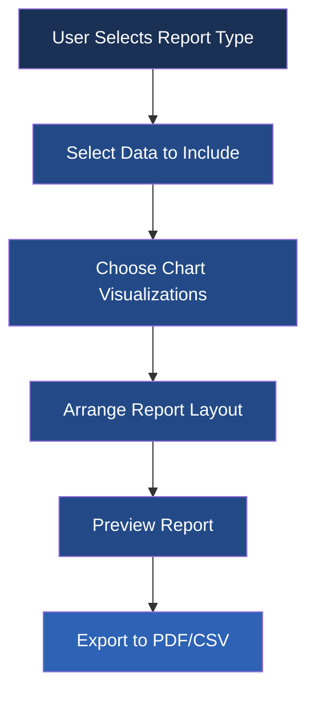

# Active Context

*Last Updated: 2023-10-18*

## Current Focus: UI Enhancement - Phase 2 Complete

We have successfully implemented both Phase 1 (Reusable UI Components) and Phase 2 (Navigation Enhancement) of our UI Enhancement plan. Phase 2 focused on improving the navigation and state management in the application, particularly ensuring views that require data properly communicate this requirement to users.

### Completed Enhancements

#### Phase 1: Reusable UI Components ✅
We have successfully implemented and tested the following reusable UI components:

1. **ActionButton**: A customizable button with icon, text, and styling options
   - Features: hover effects, different styles, icon positioning, size options
   - Tests: All 10 tests passing, including appearance, signals, property tests

2. **ActionToolbar**: A toolbar for organizing action buttons
   - Features: vertical/horizontal orientation, spacing controls, uniform sizing
   - Tests: All 12 tests passing, including layout, button addition, spacing

3. **EmptyStateWidget**: A widget for displaying empty state information
   - Features: title, message, icon, and action button
   - Tests: All 11 tests passing, including property tests and signal emissions

4. **FilterBar**: A search and filter bar for data filtering
   - Features: search field, filter button, clear button, placeholder text
   - Tests: All 14 tests passing, including search functionality and signals

#### Phase 2: Navigation Enhancement ✅
We have successfully implemented navigation state management:

1. **Sidebar Navigation Improvements**:
   - Added support for disabling navigation items
   - Removed Import/Export from navigation (moved to toolbar)
   - Added visual feedback for disabled state

2. **Data State Management**:
   - Added data_loaded tracking in MainWindow
   - Connected data loading signals to update UI state
   - Added file toolbar for Import/Export actions

3. **Empty State Handling**:
   - Integrated EmptyStateWidget into data-dependent views
   - Added data_required property to views
   - Implemented clear visual feedback when data is needed
   - Connected empty state actions to data import

### Next Steps

1. **Phase 3: Dashboard Redesign** 🚧
   - Implement dynamic dashboard with multiple states
   - Add data summary cards and quick access buttons
   - Create chart preview components

2. **Phase 4: Data View Optimization** 🚧
   - Integrate FilterBar into Data view
   - Implement column visibility controls
   - Add data grouping functionality
   - Create improved data loading progress feedback

### Recent Decisions

1. **Navigation Structure**:
   - Import/Export are actions, not views - moved to toolbar
   - Data, Analysis, and Reports views require data to be loaded
   - Dashboard, Settings, and Help always accessible

2. **Data View Priority**:
   - Data view is the primary interaction point after data loading
   - Empty states should provide clear path to data loading

3. **Empty State Handling**:
   - Each view has customized empty state messaging and icons
   - Action buttons in empty states trigger data import
   - BaseView now manages empty state display logic

4. **Component Reusability**:
   - Created a more extendable BaseView with QStackedWidget for content/empty states
   - Used EmptyStateWidget consistently across all data-dependent views
   - Standardized action button styling and behavior

5. **Memory Management**:
   - Improved object ownership for more reliable cleanup
   - Fixed potential memory leaks in background workers

### Implementation Strategy

The UI enhancement plan is being implemented in phases:

#### Phase 1: Reusable Components ✅
1. Create ActionButton component ✅
2. Create ActionToolbar component ✅
3. Create EmptyStateWidget component ✅
4. Create FilterBar component ✅
5. Implement comprehensive tests for all components ✅

#### Phase 2: Navigation & State Management ✅
1. Update SidebarNavigation to support disabled states ✅
2. Remove Import/Export from navigation sidebar ✅ 
3. Implement data_loaded state tracking in MainWindow ✅
4. Make views dependent on data being loaded ✅
5. Provide clear visual feedback when views are disabled ✅

#### Phase 3: Dashboard Redesign 🚧
1. Create data summary cards
2. Implement recent files with actions
3. Add chart previews for quick insights
4. Design welcome state for new users

#### Phase 4: Data View Optimization 🚧
1. Integrate FilterBar for data searching
2. Add column visibility controls
3. Implement data grouping functionality
4. Add export options directly in view

### Recent Improvements

#### UI Component Library
- Created reusable UI components with consistent styling
- Implemented comprehensive test suite for components
- Added state management to main window and navigation

#### CSV Loading Process
- Enhanced progress reporting with detailed file information
- Improved memory management during large file loading
- Added thread safety improvements for background operations

#### Progress Dialog Enhancements
- Improved visibility and interaction during long operations
- Added estimated time remaining calculation
- Implemented cancelation with proper cleanup

#### Empty State Management
- Added clear visual feedback when data is required
- Implemented centralized data state tracking
- Provided direct paths to action from empty states

### Report Generation System

We are planning to implement a report generation system that will allow users to create custom reports with data visualizations and analysis. This will be a key feature for Phase 3.

#### Report Design Mockup


```mermaid
graph TD
    Start[User Selects Report Type] --> Data[Select Data to Include]
    Data --> Charts[Choose Chart Visualizations]
    Charts --> Layout[Arrange Report Layout]
    Layout --> Preview[Preview Report]
    Preview --> Export[Export to PDF/CSV]
    
    style Start fill:#1a3055,color:#fff
    style Data fill:#234a87,color:#fff
    style Charts fill:#234a87,color:#fff
    style Layout fill:#234a87,color:#fff
    style Preview fill:#234a87,color:#fff
    style Export fill:#2e62b5,color:#fff
```

#### Navigation Flow


```mermaid
graph LR
    Start[Application Start] --> Dashboard
    Dashboard --> |Import| Data
    Data -->|Validate| Validation
    Validation -->|Apply Corrections| Correction
    Correction -->|Show Results| Charts
    Charts -.Generate Report.-> Reports
    Reports -.Export.-> PDF
    
    style Start fill:#1a3055,color:#fff
    style Dashboard fill:#234a87,color:#fff
    style Data fill:#234a87,color:#fff
    style Validation fill:#234a87,color:#fff
    style Correction fill:#234a87,color:#fff
    style Charts fill:#234a87,color:#fff
    style Reports fill:#234a87,color:#fff,stroke-dasharray: 5 5
    style PDF fill:#2e62b5,color:#fff,stroke-dasharray: 5 5
```

### Design Mockups

#### Data View Enhancement

```
+----------------------------------------+
|            ChestBuddy - Data           |
+----------------------------------------+
| ┌──────┐ | FilterBar                 | |
| │      │ +----------------------------+ |
| │ Side │ | Data Table with Filters     |
| │      │ |                             |
| │ Nav  │ |                             |
| │      │ |                             |
| │      │ |                             |
| │      │ |                             |
| └──────┘ |                             |
+----------------------------------------+
```

#### Empty Dashboard State

```
+----------------------------------------+
|         ChestBuddy - Dashboard         |
+----------------------------------------+
| ┌──────┐ |                            |
| │      │ |     ╭───────────────╮      |
| │ Side │ |     │               │      |
| │      │ |     │  No Data Yet  │      |
| │ Nav  │ |     │               │      |
| │      │ |     │  [Import]     │      |
| │      │ |     │               │      |
| │      │ |     ╰───────────────╯      |
| └──────┘ |                            |
+----------------------------------------+
```

#### Dashboard with Data

```
+----------------------------------------+
|         ChestBuddy - Dashboard         |
+----------------------------------------+
| ┌──────┐ | ┌──────────┐ ┌──────────┐  |
| │      │ | │ Files    │ │ Records  │  |
| │ Side │ | │ 5        │ │ 1,250    │  |
| │      │ | └──────────┘ └──────────┘  |
| │ Nav  │ |                            |
| │      │ | ┌──────────────────────┐   |
| │      │ | │ Recent Chart         │   |
| │      │ | │                      │   |
| └──────┘ | └──────────────────────┘   |
+----------------------------------------+
```

## Implementation Details

### Navigation Enhancement Implementation

1. **SidebarNavigation Changes**
   - Added disabled state styling to NavigationButton and SubNavigationButton
   - Implemented methods to enable/disable sections and items
   - Updated button click handling to respect disabled state
   - Removed Import/Export sub-items from Data section

2. **MainWindow State Management**
   - Added data_loaded property to track data loading state
   - Updated loading methods to manage this state
   - Added methods to update UI based on data state
   - Created toolbar for Import/Export actions

3. **View State Management**
   - Updated BaseView to support EmptyStateWidget integration
   - Added data_required property to views 
   - Implemented methods to show/hide empty state based on data availability
   - Connected EmptyStateWidget actions to data import

4. **User Interaction Flow**
   - Disabled navigation to views requiring data when no data is loaded
   - Added direct paths to data import from empty states
   - Preserved state between views when switching navigation