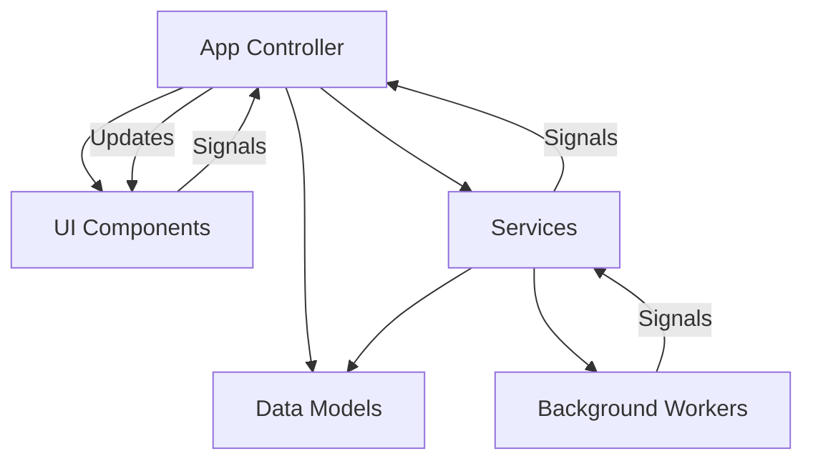
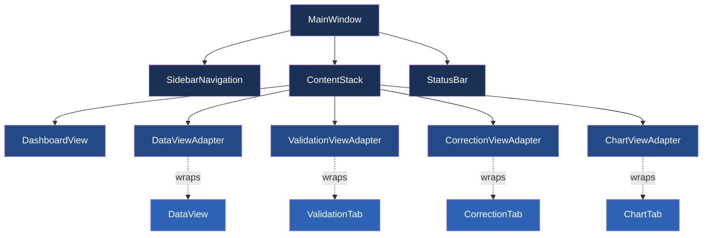
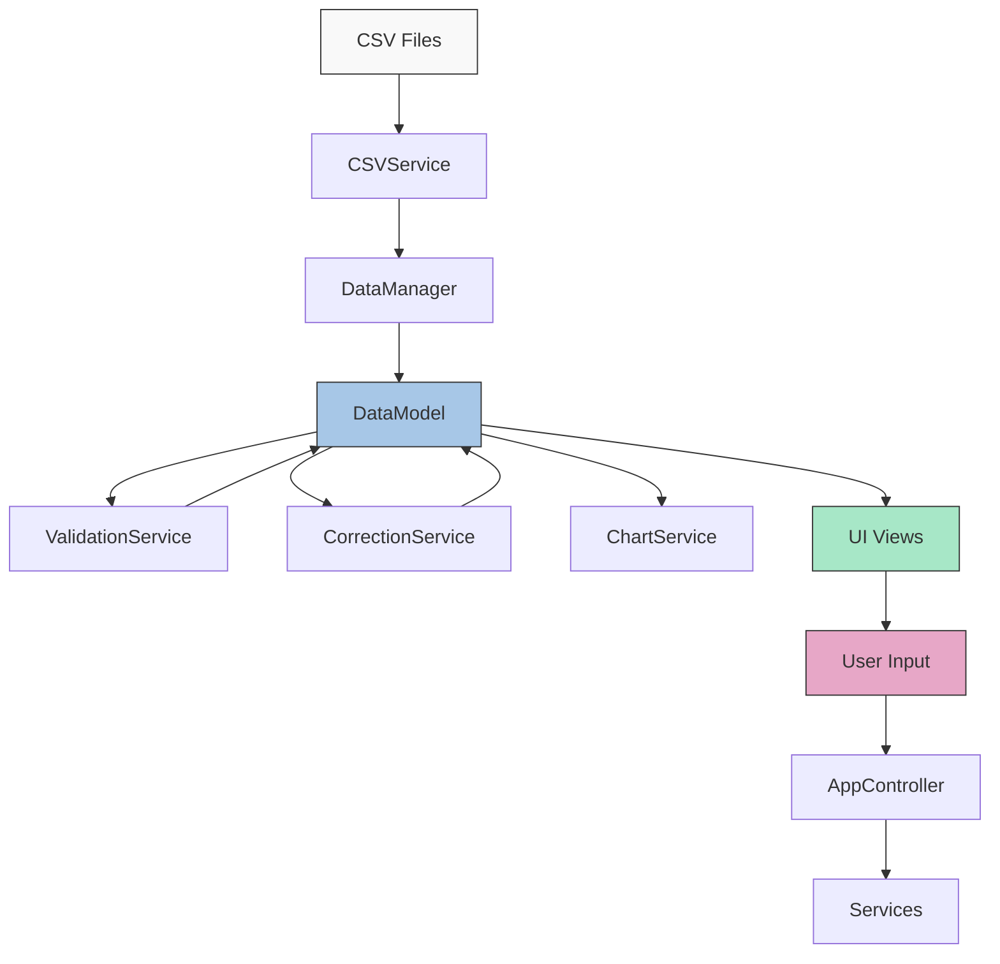
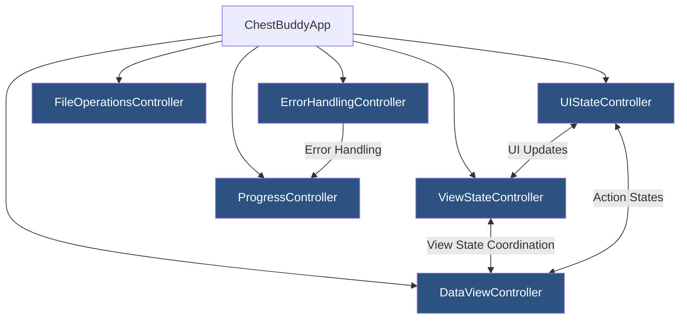
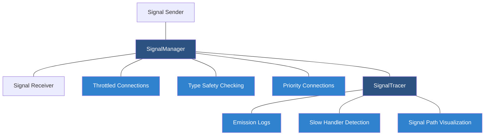

# System Architecture and Design Patterns

This document outlines the major architectural decisions, design patterns, and component relationships within the ChestBuddy application.

## Application Architecture

ChestBuddy follows a layered architecture with clear separation of concerns:



### Layers

1. **Presentation Layer**: UI components built with PySide6
   - MainWindow and view components
   - Reusable widgets and controls
   - Signal-based communication with app layer

2. **Application Layer**: Application logic and controllers
   - App controller (ChestBuddyApp)
   - Signal coordination between UI and services
   - Background processing management

3. **Domain Layer**: Business rules and domain models
   - ChestDataModel for core data structure
   - Validation and correction rules
   - Chart configuration and generation

4. **Infrastructure Layer**: Data access, file operations, and utilities
   - CSV import/export 
   - Configuration management
   - Resource handling

## Core Design Patterns

### 1. Model-View-Controller (MVC)

The application follows an MVC pattern with clear separation:

- **Models**: 
  - ChestDataModel: Manages chest data using pandas DataFrames
  - Emits signals when data changes
  - Provides methods for filtering and transformation

- **Views**: 
  - MainWindow: Primary UI container
  - Specialized views (DataView, ValidationView, etc.)
  - Reusable UI components

- **Controllers**:
  - ChestBuddyApp: Coordinates between models and views
  - ServiceControllers: Handle specific business logic domains

### 2. Service Layer

Services encapsulate specific functionality and are injected where needed:

```python
def __init__(self, config_service: ConfigService, csv_service: CSVService):
    self._config_service = config_service
    self._csv_service = csv_service
```

Key services:
- `CSVService`: Handles CSV file operations
- `ValidationService`: Validates data against rules
- `CorrectionService`: Applies corrections to data
- `ChartService`: Generates data visualizations
- `ConfigService`: Manages application configuration
- `DataManager`: Coordinates data operations

### 3. Observer Pattern

The application uses Qt's signal-slot mechanism to implement the observer pattern:

```python
# Model emits signals when state changes
self._data_model.data_changed.connect(self._on_data_changed)

# UI components observe model changes
data_model.data_changed.connect(self.update_view)
```

This allows for loose coupling between components and reactive UI updates.

### 4. Command Pattern

Correction and validation operations are implemented as commands:

```python
class CorrectionCommand:
    def __init__(self, data_model, rules):
        self._data_model = data_model
        self._rules = rules
        self._original_state = None
        
    def execute(self):
        # Save original state
        self._original_state = self._data_model.get_data().copy()
        # Apply corrections
        # ...
        
    def undo(self):
        # Restore original state
        self._data_model.update_data(self._original_state)
```

This enables future undo/redo functionality and operation batching.

### 5. Adapter Pattern

Adapters bridge between different components, particularly between old and new UI:

```python
class DataViewAdapter(BaseView):
    def __init__(self, parent=None):
        super().__init__("Data", parent)
        self._data_view = DataView(parent=self.content_widget)
        self.content_layout.addWidget(self._data_view)
        # Connect signals from wrapped component
        self._data_view.filter_changed.connect(self._on_filter_changed)
```

This allows for incremental modernization while maintaining compatibility.

#### DataView/DataViewAdapter Implementation

The `DataViewAdapter` is a prime example of the adapter pattern in this application:

1. **Component Wrapping**: The adapter creates and embeds the original `DataView` component:
   ```python
   self._data_view = DataView(data_model)
   self._data_view.disable_auto_update()  # Control update behavior
   ```

2. **Method Delegation**: The adapter implements methods with similar names that delegate to the wrapped component:
   ```python
   def populate_table(self):
       if self._controller and not self._data_model.is_empty:
           self._controller.populate_table()
       # Update state tracking
       self._update_data_state()
   ```

3. **Signal Redirection**: The adapter connects to signals from the wrapped component and emits its own signals:
   ```python
   # In _connect_ui_signals
   self._data_view.import_clicked.connect(self._on_import_requested)
   
   # In _on_import_requested
   def _on_import_requested(self):
       self.import_requested.emit()
   ```

4. **Enhanced Functionality**: The adapter adds controller integration, state management, and other features not present in the original component:
   ```python
   # Auto-update management
   def enable_auto_update(self):
       self._signal_manager.connect(self._data_model, "data_changed", self, "request_update")
   
   def disable_auto_update(self):
       self._signal_manager.disconnect(self._data_model, "data_changed", self, "request_update")
   ```

5. **Parallel Methods**: The adapter implements methods that appear redundant with the wrapped component, but serve different purposes:
   - `DataView.populate_table()`: Directly updates the table UI
   - `DataViewAdapter.populate_table()`: Coordinates with the controller and manages state

This implementation enables the original `DataView` component to be seamlessly integrated into the new UI architecture while adding new capabilities through the adapter layer.

### 6. Factory Pattern

Used for creating various chart types and UI components:

```python
def create_chart(self, chart_type, data, **options):
    if chart_type == "bar":
        return self._create_bar_chart(data, **options)
    elif chart_type == "pie":
        return self._create_pie_chart(data, **options)
    elif chart_type == "line":
        return self._create_line_chart(data, **options)
    else:
        raise ValueError(f"Unsupported chart type: {chart_type}")
```

### 7. Background Worker Pattern

Long-running operations are executed in background threads to maintain UI responsiveness:

```python
class BackgroundWorker(QObject):
    task_completed = Signal(object)
    task_failed = Signal(str)
    progress = Signal(int, int)  # current, total
    cancelled = Signal()
    
    def execute_task(self, task):
        self._current_task = task
        self._thread = QThread()
        task.moveToThread(self._thread)
        
        # Connect signals
        self._thread.started.connect(task.run)
        task.completed.connect(self._on_task_completed)
        task.failed.connect(self._on_task_failed)
        task.progress.connect(self._on_progress)
        
        # Start the thread
        self._thread.start()
```

Tasks report progress via signals and can be cancelled.

## UI Component Architecture

The UI follows a component-based architecture with reusable elements:



### Reusable UI Components

1. **ActionButton**: Styled button with consistent appearance
2. **ActionToolbar**: Groups related buttons with separators
3. **EmptyStateWidget**: Shows informative content when no data is available
4. **FilterBar**: Provides search and filtering functionality
5. **ProgressBar**: Shows visual progress with state-based styling
6. **ProgressDialog**: Displays detailed progress information

### UI Design Principles

1. **Signal-Based Communication**
   - Components emit signals when state changes
   - Parent components connect to signals to handle events
   - Reduces tight coupling between components

2. **Consistent Styling**
   - Application-wide style sheet for visual consistency
   - Centralized color definitions in Colors class
   - Style inheritance for maintaining look and feel

3. **Property-Based Configuration**
   - Components expose properties for configuration
   - Changes to properties update component appearance
   - Default values ensure components work out-of-the-box

4. **Composition Over Inheritance**
   - Complex widgets built by composing simpler ones
   - Limited inheritance to cases where it adds clear value
   - QWidget containment for complex components

5. **Test-Driven Development**
   - Comprehensive test suite for all UI components
   - Tests validate component behavior and edge cases
   - Changes must pass all tests before integration

## Data Flow Architecture



### Key Data Flows

1. **Import Flow**
   - CSV files imported via CSVService
   - DataManager coordinates loading process
   - Data loaded into DataModel
   - UI views notified via data_changed signal

2. **Validation Flow**
   - ValidationService validates against reference lists
   - Results stored in validation_status DataFrame
   - UI updated with validation results
   - User can review and address issues

3. **Correction Flow**
   - CorrectionService applies rules to data
   - Corrections tracked in correction_status DataFrame
   - DataModel updated with corrected values
   - UI reflects changes to data

4. **Visualization Flow**
   - ChartService generates visualizations from DataModel
   - Chart configurations saved for reuse
   - UI displays charts and allows customization
   - Export functionality for sharing results

## Error Handling Architecture

The application implements a comprehensive error handling architecture:

1. **Exception Hierarchy**
   - Custom exceptions for different error categories
   - Specific exception types for file, validation, correction errors

2. **Error Propagation**
   - Lower layers catch and transform exceptions
   - Higher layers receive structured error information
   - UI components present appropriate error feedback

3. **Recovery Mechanisms**
   - Graceful degradation during errors
   - State preservation for critical operations
   - Recovery options presented to users

4. **Logging Strategy**
   - Errors logged with context information
   - Debug logs for troubleshooting
   - Log rotation and management

## Controller Architecture

The application follows a controller-based architecture that separates UI from business logic:



### Key Controllers

1. **ViewStateController**: Manages active view, navigation history, and view transitions
   - Tracks view dependencies and prerequisites
   - Manages navigation history
   - Handles view availability based on data state

2. **DataViewController**: Centralizes data operations, validation, and correction
   - Handles data filtering and sorting
   - Coordinates validation processes
   - Manages correction application

3. **UIStateController**: Manages UI-specific state not related to data or views
   - Updates status bar messages
   - Controls action enablement states
   - Handles UI theme changes

4. **FileOperationsController**: Manages file operations
   - Handles file opening and saving
   - Tracks recent files
   - Manages file dialogs

5. **ProgressController**: Manages long-running operations feedback
   - Shows progress dialogs with status information
   - Updates progress indicators
   - Provides cancellation options

6. **ErrorHandlingController**: Centralizes error management
   - Displays error messages
   - Logs errors with context
   - Provides recovery options

### Controller-UI Communication

The controllers communicate with UI components via signals:

```python
# Controller emits signals when state changes
self._ui_state_controller.status_message_changed.connect(self._on_status_message_changed)
self._view_state_controller.navigation_history_changed.connect(self._on_navigation_history_changed)

# UI components emit signals that controllers handle
self._data_view.filter_changed.connect(self._data_controller.apply_filter)
self._validation_view.validate_clicked.connect(self._data_controller.validate_data)
```

This signal-based communication ensures loose coupling between UI and business logic components. 

## Signal Management and Debugging Architecture

ChestBuddy implements a sophisticated signal management and debugging architecture that provides centralized control and visibility into signal connections throughout the application.



### Key Components

1. **SignalManager**: Centralizes signal connection tracking and management
   - Prevents duplicate connections
   - Enforces type safety
   - Provides connection prioritization
   - Implements signal throttling
   - Manages automatic disconnection

2. **SignalTracer**: Provides real-time visibility into signal flow
   - Tracks signal emissions across the application
   - Records signal paths and emission chains
   - Measures timing of signal handling
   - Detects slow handlers for performance optimization
   - Visualizes nested signal chains

### Signal Connection Patterns

The application follows standardized patterns for signal connections:

1. **Standard Connection**: Basic signal connection with tracking
   ```python
   signal_manager.connect(sender, "signal_name", receiver, "slot_name")
   ```

2. **Throttled Connection**: Rate-limited signal processing
   ```python
   signal_manager.connect_throttled(sender, "signal_name", receiver, "slot_name", 
                                   throttle_ms=100)
   ```

3. **Prioritized Connection**: Controlled execution order
   ```python
   signal_manager.connect(sender, "signal_name", receiver, "slot_name", 
                         priority=SignalPriority.HIGH)
   ```

4. **Safe Connection**: Automatic disconnection on object deletion
   ```python
   signal_manager.safe_connect(sender, "signal_name", receiver, "slot_name")
   ```

### Signal Debugging Patterns

The SignalTracer provides comprehensive signal flow debugging:

1. **Tracing Session**: Capture and analyze signal flow
   ```python
   # Start tracing
   signal_tracer.start_tracing()
   
   # Run code that emits signals
   # ...
   
   # Generate report
   signal_tracer.stop_tracing()
   report = signal_tracer.generate_report()
   ```

2. **Slow Handler Detection**: Identify performance bottlenecks
   ```python
   # Set threshold for slow handler detection
   signal_tracer.set_slow_threshold("MyClass.data_changed", 50.0)  # ms
   
   # Get slow handlers after tracing
   slow_handlers = signal_tracer.find_slow_handlers()
   ```

3. **Signal Registration**: Focus on specific signals of interest
   ```python
   # Register specific signals for detailed tracking
   signal_tracer.register_signal(data_model, "data_changed", view, "update_view")
   ```

4. **Signal Path Analysis**: Visualize signal flow paths
   ```python
   # Get formatted signal paths
   paths = signal_tracer._build_signal_paths()
   for path in paths:
       print(path)
   ```

### Benefits

This architecture provides several key benefits:

1. **Maintainability**: Centralized signal management improves code organization
2. **Reliability**: Type checking prevents many common runtime errors
3. **Performance**: Throttling prevents UI freezing during rapid updates
4. **Debuggability**: Comprehensive tracing improves visibility into signal flow
5. **Safety**: Automatic disconnection prevents memory leaks

The signal management and debugging architecture is fundamental to the application's maintainability and helps developers understand the complex interactions between components. 