# System Patterns

*Last Updated: 2023-10-18*

## Application Architecture

The ChestBuddy application follows a layered architecture pattern with these key layers:

### 1. Presentation Layer (UI)
- **MainWindow**: Central UI container that manages views and navigation
- **SidebarNavigation**: Provides navigation between different application views
- **ViewAdapters**: Bridge between views and the application layer
- **Components**: Reusable UI elements like buttons, toolbars, and widgets

### 2. Application Layer (Services)
- **DataManager**: Coordinates data loading, saving, and manipulation
- **ConfigManager**: Handles application configuration and settings
- **ValidationService**: Manages validation rules and processing
- **CorrectionService**: Applies corrections to identified data issues
- **DashboardService**: Provides dashboard statistics and chart data (planned)

### 3. Domain Layer (Core Logic)
- **Models**: Core data structures representing chest data
- **Rules**: Business logic for data validation and processing
- **Algorithms**: Analysis and processing algorithms
- **Events**: Domain events representing significant state changes

### 4. Infrastructure Layer (Data & System)
- **FileIO**: Handles file reading and writing operations
- **Database**: Manages persistent storage (SQLite)
- **Logging**: System-wide logging functionality
- **Configuration**: Application settings storage and retrieval

## UI Component Library

ChestBuddy implements a custom UI component library designed for consistency and reusability:

### ActionButton
- **Purpose**: Standardized button with consistent styling and behavior
- **Features**:
  - Icon support (leading or trailing)
  - Multiple styles (primary, secondary, danger)
  - Size variations (small, medium, large)
  - Disabled state styling
  - Customizable tooltips

### ActionToolbar
- **Purpose**: Container for organizing action buttons
- **Features**:
  - Horizontal or vertical orientation
  - Consistent spacing and alignment
  - Button grouping capabilities
  - Overflow handling for smaller screens
  - Style coordination with ActionButtons

### EmptyStateWidget
- **Purpose**: Visual feedback when content is unavailable
- **Features**:
  - Customizable title and message
  - Icon display
  - Action button for resolution
  - Consistent visual style with the application
  - Signal for action button clicks

### FilterBar
- **Purpose**: Interface for searching and filtering data
- **Features**:
  - Search field with clear button
  - Filter button with dropdown options
  - Placeholder text customization
  - Search term highlighting
  - Real-time filtering capability

### Dashboard Components (Phase 3)

#### StatCard
- **Purpose**: Display data metrics with visual indicators
- **Features**:
  - Icon support for visual context
  - Trend indicators (up/down arrows)
  - Click actions for navigation
  - Color customization based on value
  - Compact and expanded modes

#### ChartPreview
- **Purpose**: Display interactive chart previews with context
- **Features**:
  - Qt Charts integration for chart rendering
  - Title and subtitle display for context
  - Clickable interaction for detailed view
  - Compact mode for space-efficient display
  - Placeholder state when no chart is available
  - Icon support for additional context
  - Responsive layout adjustments

#### ActionCard
- **Purpose**: Group related actions with context
- **Features**:
  - Multiple action buttons in a consistent layout
  - Section grouping for related actions
  - Status indicators for action state
  - Description text for context
  - Action tracking for frequently used actions

#### Enhanced RecentFilesList
- **Purpose**: Display recent files with metadata and actions
- **Features**:
  - File metadata display (size, date, row count)
  - Quick action buttons per file
  - File status indicators
  - Sorting and filtering capabilities
  - Empty state handling

#### WelcomeStateWidget
- **Purpose**: Provide first-time user experience
- **Features**:
  - Application branding and introduction
  - Getting started guidance
  - Quick start action buttons
  - Preference to disable in future sessions
  - Responsive layout for different screen sizes

## Navigation and State Management

### Sidebar Navigation System
- **Structure**: Hierarchical navigation with primary and secondary items
- **State Management**: Navigation items can be enabled/disabled based on application state
- **Visual Feedback**: Clear indication of current view and disabled items
- **Customization**: Configurable through the ConfigManager

### State-Dependent Navigation
- **Data Loading State**: Navigation sections requiring loaded data are disabled when no data is available
- **View Transitions**: Smooth transitions between views with state preservation
- **History Management**: Back/forward navigation capability
- **Persistent State**: View state is stored between sessions

### Empty State Handling
- **Data Required Views**: Views that require data display EmptyStateWidget when no data is loaded
- **Custom Messages**: Each view provides specific guidance when data is missing
- **Action Integration**: Empty state actions connect directly to data loading functionality
- **Consistent Experience**: Unified approach to no-data states across the application

### Dashboard States (Phase 3 Plan)
- **Welcome State**: First-time user experience with getting started information
- **Empty State**: No data loaded, prompting for data import
- **Data Loaded State**: Shows insights and statistics about loaded data
- **Error State**: Displays information about errors and recovery actions
- **State Transitions**: Handled by DashboardViewAdapter based on application state

## Design Principles

### Signal-Based Communication
- Components communicate through Qt signals and slots
- Changes in one component can trigger updates in others
- Clear separation of concerns with loose coupling
- Event-driven architecture for responsive UI

### Consistent Styling
- Unified color scheme defined in StyleConstants
- Common margins, paddings, and spacing values
- Typography system with defined text styles
- Shared icons and visual elements

### Property-Based Configuration
- UI components are configured through QProperties
- Dynamic updates when properties change
- Default values with override capabilities
- Type checking for properties

### Composition over Inheritance
- UI components built by composing smaller elements
- Limited inheritance depth to avoid complexity
- Clear interfaces between components
- Focused component responsibilities

### Test-Driven Development
- Comprehensive test suite for UI components
- Mock objects for testing complex interactions
- Automated UI testing for critical paths
- Performance testing for data-intensive operations

## Data Management

### Data Flow Patterns
- **Import → Validation → Correction → Analysis → Export** pipeline
- Clear boundaries between processing stages
- Progress tracking throughout the pipeline
- Error handling at each stage

### State Management
- Observable data models via Qt's Model/View framework
- Centralized DataManager for coordinating data operations
- Change notification via signals
- Undo/redo capability for data modifications

### Dashboard Data Service (Phase 3 Plan)
- **Statistics Calculation**: Compute metrics from data model
- **Chart Data Generation**: Prepare data for chart visualizations
- **User Activity Tracking**: Monitor frequently used actions
- **Dashboard Configuration**: Manage dashboard layout preferences
- **Data Change Monitoring**: Update dashboard on data changes

### Data Loading Process
1. File selection via standard dialog
2. Progress indication during loading
3. Initial validation of data structure
4. Population of data models
5. UI update with loaded data

### Data Processing
1. Validation rules application
2. Issue identification and categorization
3. Correction suggestions generation
4. Manual or automated corrections
5. Results visualization

### Data Export
1. Format selection (CSV, Excel, PDF)
2. Export configuration options
3. Progress indication during export
4. Success confirmation with file location
5. Error handling for export failures

## Testing Strategy

### Component Testing
- Individual UI components tested in isolation
- Property verification
- Signal emission testing
- Visual appearance verification
- Edge case handling

### Integration Testing
- Component interactions tested
- Data flow verification
- State transitions
- Error propagation

### End-to-End Testing
- Complete workflows tested
- File import/export
- Data processing pipeline
- Configuration persistence

## Extension and Plugin Architecture

### Plugin Interfaces
- **DataImportPlugin**: Custom data import formats
- **ValidationRulePlugin**: Custom validation rules
- **VisualizationPlugin**: Custom chart types
- **ExportFormatPlugin**: Custom export formats

### Future Architectural Considerations
- Multi-user support
- Cloud integration
- Mobile companion application
- Distributed processing for large datasets

## Dashboard Redesign Architecture (Phase 3 Plan)

### Component Relationships

```
┌───────────────────┐          ┌─────────────────────┐
│ DashboardAdapter  │◄────────►│  DashboardService   │
└───────┬───────────┘          └─────────┬───────────┘
        │                                 │
        │                                 │
        ▼                                 ▼
┌───────────────────┐          ┌─────────────────────┐
│   DashboardView   │◄────────►│   DataModel/Other   │
└───────┬───────────┘          │      Services       │
        │                      └─────────────────────┘
        │
        ├─────────────┬─────────────┬──────────────┐
        │             │             │              │
        ▼             ▼             ▼              ▼
┌───────────────┐ ┌─────────────┐ ┌────────────┐ ┌──────────────┐
│   StatCard    │ │ChartPreview │ │ ActionCard │ │RecentFilesList│
└───────────────┘ └─────────────┘ └────────────┘ └──────────────┘
```

### Key Architectural Patterns for Dashboard

1. **Adapter Pattern**:
   - DashboardViewAdapter mediates between MainWindow and DashboardView
   - Handles data state transitions and UI updates
   - Connects dashboard components to application services
   - Manages dashboard configuration

2. **Service Pattern**:
   - DashboardService provides data to dashboard components
   - Abstracts data retrieval and processing logic
   - Monitors data changes and updates dashboard
   - Handles dashboard-specific configuration

3. **Composite Pattern**:
   - Dashboard composed of multiple smaller components
   - Each component is self-contained with its own responsibility
   - Components communicate through well-defined interfaces
   - Layout manager handles component arrangement

4. **State Pattern**:
   - Dashboard handles multiple states (welcome, empty, data loaded)
   - State transitions are managed by the adapter
   - Each state has specific visual representation
   - Components respond to state changes

5. **Observer Pattern**:
   - Dashboard components observe data model changes
   - Components update when observed data changes
   - Loose coupling between data and visualization
   - Signal/slot mechanism for change notification

## Key Design Patterns

### 1. Model-View-Controller (MVC)

The application follows an MVC pattern:
- **Models**: Responsible for data structure and business logic
- **Views**: UI components for data display and user interaction
- **Controllers**: Coordinate between models and views

### 2. Service Layer

Services encapsulate specific functionality and are injected where needed:
- `CSVService`: Handles CSV file operations
- `ValidationService`: Validates data against rules
- `CorrectionService`: Applies corrections to data
- `ConfigService`: Manages application configuration
- `ChartService`: Generates data visualizations
- *Planned* `ReportService`: Will handle report generation

### 3. Dependency Injection

Dependencies are injected through constructors rather than created internally:
```python
def __init__(self, config_service: ConfigService, csv_service: CSVService):
    self._config_service = config_service
    self._csv_service = csv_service
```

### 4. Event-Driven Communication

Components communicate through Qt signals and slots:
```python
# Signal definition
data_loaded = Signal(pd.DataFrame)

# Connection
self._data_service.data_loaded.connect(self._on_data_loaded)

# Slot implementation
@Slot(pd.DataFrame)
def _on_data_loaded(self, df: pd.DataFrame) -> None:
    # Handle loaded data
```

### 5. Background Processing

Long-running operations are executed in background threads:
```python
# Running a task in background
self._worker.run_task(
    self._csv_service.load_csv, 
    file_path, 
    on_success=self._on_load_success,
    on_error=self._on_load_error
)
```

### 6. UI Component Composition

UI is built through composition of smaller components:
```python
# Main view composed of header and content
self._header = ViewHeader("Dashboard")
self._content = QWidget()
self._content_layout = QVBoxLayout(self._content)

# Add components to layout
self._content_layout.addWidget(self._chart_view)
self._content_layout.addWidget(self._stats_panel)
```

### 7. UI Widget Pattern

Custom widgets are created for reusable UI elements with consistent behavior and styling. Each widget follows patterns:

1. **Base Widget Class**: Define custom widget inheriting from Qt class with controlled API
2. **State Management**: Internal state tracking with signals for state changes
3. **Styling**: Use Colors and stylesheet constants for consistent appearance
4. **Custom Painting**: Override paintEvent for custom appearance when needed

Examples:
```python
# Signal definitions
valueChanged = Signal(int)
stateChanged = Signal(int)

# Property definition with getter/setter
@Property(int, value, setValue)
def progress(self):
    return self._value

# Custom painting
def paintEvent(self, event):
    painter = QPainter(self)
    painter.setRenderHint(QPainter.Antialiasing)
    # Custom drawing code
```

Key UI widgets:
- `ProgressBar`: Custom progress bar with state-based styling (normal, success, error)
- `ProgressDialog`: Dialog wrapping ProgressBar with enhanced functionality
- `StatusBar`: Custom status bar with multiple information sections
- `ViewHeader`: Standardized header for application views
- `ActionButton`: Customizable button with consistent styling for actions
  - Supports text, icon, or both
  - Offers primary and secondary styling variants
  - Configurable for compact mode (icon only with tooltip)
  - Manages enabled/disabled state with appropriate visual feedback
  - Provides hover and pressed state styling
  - Emits clicked signal for action handling
  
- `ActionToolbar`: Container for organizing related ActionButtons
  - Supports horizontal or vertical orientation
  - Can group buttons with separators for logical organization
  - Manages button visibility and enabled states
  - Handles button addition, removal and retrieval
  - Allows spacing customization between buttons
  
- `EmptyStateWidget`: Configurable empty state display with call-to-action
  - Displays title, message, and optional action button
  - Supports custom icons for visual context
  - Provides centralized layout with proper spacing
  - Emits signals when action button is clicked
  - Visually consistent representation of empty states across the application
  
- `FilterBar`: Compact search and filtering interface
  - Combines search field with expandable advanced filters
  - Supports multiple filter categories with options
  - Emits signals for filter and search text changes
  - Collapsible design to maximize content space when not in use
  - Provides clear visual feedback on active filters

### 8. Adapter Pattern for Views

View adapters connect the UI components to the application logic:
```python
class DataViewAdapter:
    def __init__(self, data_view: DataView, data_model: DataModel):
        self._data_view = data_view
        self._data_model = data_model
        
        # Connect signals
        self._data_model.data_changed.connect(self._update_view)
```

### 9. Resource Management

Resources like icons and styles are centrally managed:
```python
# Resource loading
icon = self._resource_manager.get_icon("open_file")
```

### 10. Configuration Management

Application settings are managed through a dedicated service:
```python
# Getting configuration
auto_save = self._config.get_bool("Autosave", "enabled", default=True)

# Setting configuration
self._config.set_value("Autosave", "interval", 5)
```

## Error Handling Strategy

1. **Service Level**: Catch and log specific errors, translate to appropriate signals
2. **Controller Level**: Connect error signals to UI updates
3. **UI Level**: Display error messages to users, recover gracefully
4. **Background Tasks**: Catch and report errors without crashing the application

Example error handling flow:
```python
try:
    # Operation that might fail
    result = potentially_failing_operation()
except SpecificError as e:
    logger.error(f"Operation failed: {e}")
    self.operation_failed.emit(str(e))
    return False
```

## Progress Reporting Pattern

Progress reporting follows a standardized pattern:

1. **Signal Definition**: Services define progress signals
   ```python
   load_started = Signal()
   load_progress = Signal(str, int, int)  # file_path, current, total
   load_finished = Signal(str)  # message
   ```

2. **Progress Dialog**: UI shows a custom ProgressDialog when operations start
   ```python
   # Create progress dialog
   self._progress_dialog = ProgressDialog(
       "Loading data...", 
       "Cancel", 
       0, 
       100, 
       self
   )
   self._progress_dialog.canceled.connect(self._cancel_operation)
   ```

3. **Progress Updates**: Operations emit progress updates
   ```python
   # Emit progress
   self.load_progress.emit(file_path, current_row, total_rows)
   ```

4. **State Management**: ProgressBar displays different states
   ```python
   # Set state based on result
   if success:
       self._progress_dialog.setState(ProgressBar.State.SUCCESS)
   else:
       self._progress_dialog.setState(ProgressBar.State.ERROR)
   ```

5. **Completion Handling**: Services emit finished signal
   ```python
   # Operation completed
   self.load_finished.emit("Data loaded successfully")
   ```

## File Structure 

The application follows a modular file structure:

```
chestbuddy/
├── app.py                  # Application entry point
├── config.py               # Configuration management
├── core/                   # Core functionality
│   ├── models/             # Data models
│   └── services/           # Business logic services
├── ui/                     # User interface components
│   ├── widgets/            # Reusable UI widgets
│   │   ├── progress_bar.py # Custom progress bar
│   │   └── progress_dialog.py # Custom progress dialog
│   ├── views/              # Main application views
│   ├── adapters/           # View adapters
│   └── resources/          # UI resources (icons, styles)
└── utils/                  # Utility functions and classes
    └── background_processing.py  # Background task handling
```

## Integration Points

1. **Data Loading → Validation**: Loaded data is passed to validation service
2. **Validation → Correction**: Validation results guide correction process
3. **Data → Charts**: Chart service uses data model for visualization
4. **Charts → Reports**: Chart outputs will be embedded in reports
5. **Configuration → All Components**: Configuration service informs component behavior

## Architecture Overview

The Chest Buddy application follows a Model-View-Controller (MVC) architecture with clear separation of concerns:

```
┌────────────────┐     ┌────────────────┐     ┌────────────────┐
│     Models     │◄────┤  Controllers   │◄────┤     Views      │
│  (Data Logic)  │     │ (App Logic)    │     │  (UI Elements) │
└───────┬────────┘     └────────────────┘     └────────────────┘
        │                                             ▲
        │                                             │
        ▼                                             │
┌────────────────┐                           ┌────────────────┐
│   Services     │                           │    Config      │
│  (Utilities)   │                           │   Management   │
└───────┬────────┘                           └────────────────┘
        │
        ▼
┌────────────────┐
│  Background    │
│   Processing   │
└────────────────┘
```

## Core Components

### 1. Data Model Layer
- **ChestDataModel**: Represents the core chest data structure
- **ValidationModel**: Manages validation lists and rules
- **CorrectionModel**: Manages correction rules and transformations

### 2. Controller Layer
- **ImportController**: Handles CSV import and initial processing
- **ValidationController**: Manages validation processes
- **CorrectionController**: Applies correction rules
- **AnalysisController**: Performs data analysis operations
- **ReportController**: Manages report generation

### 3. View Layer
- **MainWindow**: Primary application interface
- **DataTableView**: Displays and highlights data
- **ChartView**: Renders visualizations
- **ValidationView**: Interface for validation management
- **CorrectionView**: Interface for correction rules
- **ReportBuilderView**: Interface for report creation

### 4. Service Layer
- **CSVService**: Handles CSV file operations
- **CharsetService**: Manages character encoding detection and correction
- **AnalysisService**: Provides data analysis functions
- **ChartService**: Generates chart visualizations
- **ReportService**: Generates HTML reports
- **DataManager**: Handles high-level data operations including loading, saving, and column mapping

### 5. Background Processing Layer
- **BackgroundWorker**: Manages execution of tasks in separate threads
- **BackgroundTask**: Base class for defining asynchronous operations
- **CSVReadTask**: Specific implementation for CSV reading operations
- **MultiCSVLoadTask**: Handles loading of multiple CSV files with progress tracking

### 6. Configuration Layer
- **ConfigManager**: Manages application settings and user preferences
- **ValidationConfig**: Manages validation list configuration
- **CorrectionConfig**: Manages correction rule configuration

### 7. Testing Layer
- **Unit Tests**: Tests for individual components and functions
- **UI Component Tests**: Tests for UI components and interactions
- **Integration Tests**: Tests for cross-component workflows
- **Workflow Tests**: End-to-end tests for complete user scenarios
- **Performance Tests**: Tests for measuring performance metrics

## Key Design Patterns

### 1. Observer Pattern
Used for updating views when data models change:
- Data models emit signals when modified
- Views subscribe to relevant signals
- Ensures UI stays synchronized with data state

### 2. Strategy Pattern
Used for validation and correction operations:
- Common interface for different validation strategies
- Different correction approaches can be swapped
- Allows for flexible rule application

### 3. Factory Pattern
Used for creating visualization components:
- ChartFactory creates different chart types based on user selection
- ReportElementFactory creates different report elements

### 4. Singleton Pattern
Used for configuration and service instances:
- ConfigManager as a singleton
- Ensures consistent access to configuration

### 5. Command Pattern
Used for validation and correction operations:
- Each operation is encapsulated as a command
- Allows for undo/redo functionality
- Maintains operation history

### 6. Worker Pattern
Used for background processing:
- BackgroundWorker manages thread lifecycle
- Tasks implement a common interface (BackgroundTask)
- Signal-based communication between threads
- Ensures UI responsiveness during heavy operations

### 7. Fixture Pattern
Used for testing:
- Common test fixtures for reusable test setup
- Data fixtures for consistent test data
- Component fixtures for UI testing
- Ensures consistent test environments

## Test Architecture

The test architecture follows a layered approach to verify application functionality at multiple levels:

```
┌────────────────┐
│  Workflow      │
│    Tests       │ End-to-end user workflow tests
└───────┬────────┘
        │
        ▼
┌────────────────┐
│  Integration   │
│    Tests       │ Cross-component interaction tests
└───────┬────────┘
        │
        ▼
┌────────────────┐     ┌────────────────┐
│  UI Component  │     │  Background    │
│    Tests       │     │ Process Tests  │
└───────┬────────┘     └───────┬────────┘
        │                      │
        ▼                      ▼
┌────────────────┐     ┌────────────────┐
│  Unit Tests    │     │ Performance    │
│                │     │    Tests       │
└────────────────┘     └────────────────┘
```

## Data Flow

1. **Import Flow**:
   - CSV file → CSVService → ChestDataModel → DataTableView
   - Optional automatic validation and correction

2. **Background Import Flow**:
   - CSV file → CSVService → CSVReadTask → BackgroundWorker → ChestDataModel → DataTableView
   - Progress reporting during import
   - Non-blocking UI during processing

3. **Validation Flow**:
   - ChestDataModel → ValidationController → ValidationModel → ChestDataModel (updated)
   - UI feedback on validation errors

4. **Correction Flow**:
   - ChestDataModel → CorrectionController → CorrectionModel → ChestDataModel (corrected)
   - UI updates to show corrections

5. **Analysis Flow**:
   - ChestDataModel → AnalysisController → AnalysisService → ChartView
   - User-selected data dimensions determine visualization

6. **Report Flow**:
   - ChestDataModel + Charts → ReportController → ReportService → HTML Output
   - User-customized report elements

7. **Test Flow**:
   - Test Case → Test Fixtures → Component Under Test → Assertions → Test Results
   - Mock external dependencies where necessary
   - Use realistic data for integration and workflow tests

## Module Organization

```
chestbuddy/
├── core/
│   ├── models/
│   ├── controllers/
│   └── services/
├── ui/
│   ├── views/
│   ├── widgets/
│   └── resources/
├── utils/
│   ├── config/
│   ├── validation/
│   ├── correction/
│   └── background_processing.py
├── data/
│   ├── validators/
│   ├── correction_rules/
│   └── templates/
└── tests/
    ├── unit/
    ├── integration/
    ├── test_background_worker.py
    ├── test_csv_background_tasks.py
    ├── test_main_window.py (planned)
    ├── test_integration.py (planned)
    ├── test_workflows.py (planned)
    └── resources/
```

## Error Handling Strategy

- Comprehensive try-except blocks for all file operations
- Signal-based error reporting to the UI
- Status bar and dialog-based error notifications
- Logging of errors with sufficient context for debugging
- User-friendly error messages with suggested actions

## Testing Strategy

- Unit tests for individual components to ensure correct behavior
- UI component tests to verify proper UI initialization and interaction
- Integration tests to verify correct interaction between components
- Workflow tests to validate end-to-end user scenarios
- Performance tests to measure and ensure efficiency with large datasets
- Use of fixtures for consistent test setup and teardown
- QtBot for simulating user interactions with UI components
- Mocking external dependencies for isolation and reproducibility
- Test data generators for various test scenarios
- Cleanup mechanisms to ensure test isolation

## Background Processing Strategy

- Worker-based threading model for all long-running operations
- Clear separation between UI thread and worker threads
- Signal-based communication for progress updates and results
- Cancellation support for long-running operations
- Resource cleanup on task completion or cancellation
- Chunked processing for memory-intensive operations
- Improved thread management with graceful cleanup during application shutdown
- Two-level progress reporting for multi-file operations (overall progress and per-file progress)
- Consistent progress reporting on a 0-100 scale for all background tasks
- Callbacks for detailed progress reporting during complex operations

### Progress Dialog Architecture

The progress dialog system implements a comprehensive approach to providing feedback during long-running operations:

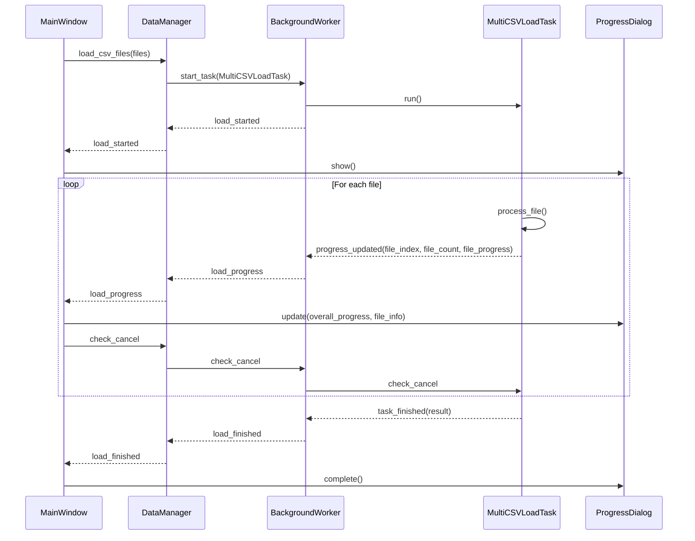

The progress reporting follows a consistent pattern:
1. Task initialization triggers load_started signal
2. Regular progress updates during processing with contextual information
3. Completion triggers load_finished signal with results
4. Cancellation can be checked and applied at any point in the process

### Multi-File Processing Pattern

For operations involving multiple files:

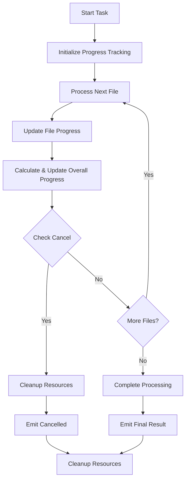

## Planned Report Generation Architecture

For the upcoming Report Generation phase, we're planning to implement the following architecture:

### 1. Report Service Components

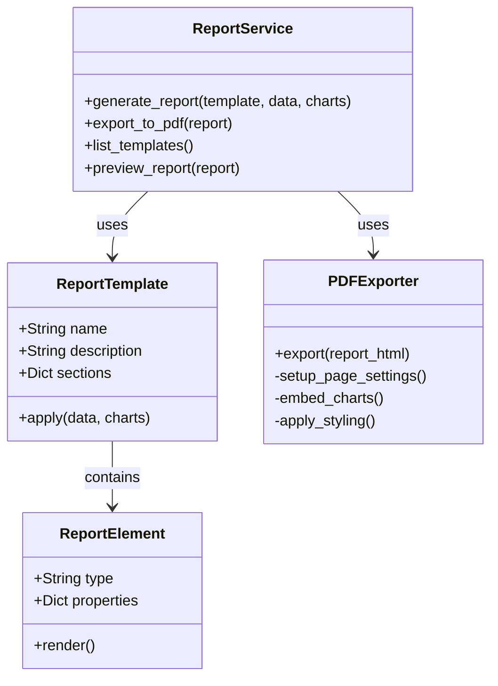

### 2. Report Generation Flow

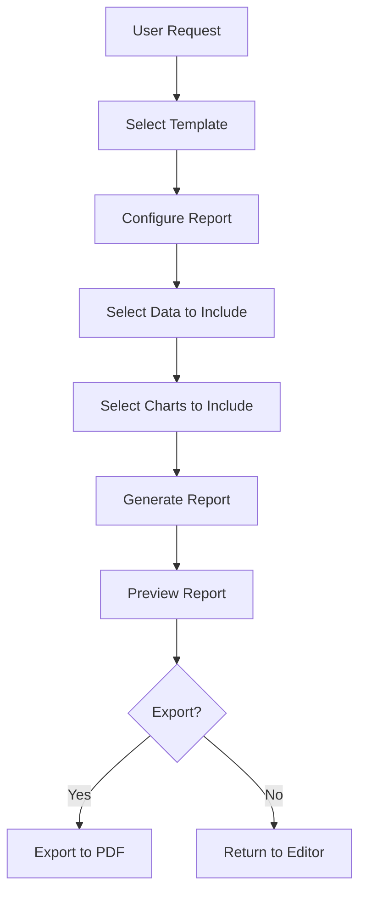

### 3. Report View Architecture

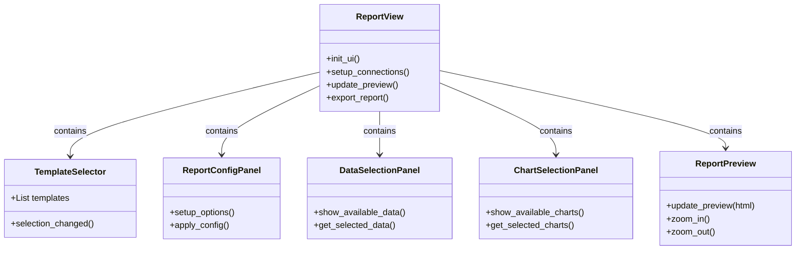

This architecture will allow for flexible, customizable report generation with a focus on user experience and high-quality output. The components are designed to be modular and extensible, enabling easy addition of new report templates and export formats in the future.

## UI Architecture

The UI architecture of ChestBuddy follows a component-based design with clear separation of concerns and standardized patterns for consistency.

### UI Component Hierarchy

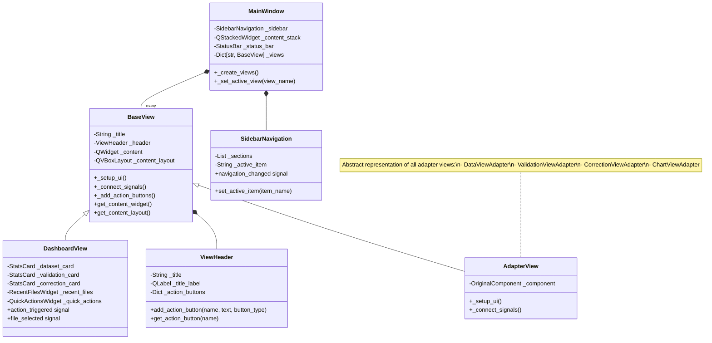

### Key UI Patterns

#### 1. Adapter Pattern

For integrating existing UI components with the new UI structure, we use the adapter pattern:

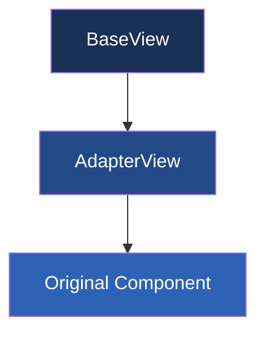

**Implementation Example:**
```python
class DataViewAdapter(BaseView):
    def __init__(self, data_model, parent=None):
        # Store references
        self._data_model = data_model
        
        # Create the original component
        self._data_view = DataView(data_model)
        
        # Initialize the base view
        super().__init__("Data View", parent)
        
    def _setup_ui(self):
        # First call the parent class's _setup_ui method
        super()._setup_ui()
        
        # Add the original component to the content widget
        self.get_content_layout().addWidget(self._data_view)
```

#### 2. Content View Pattern

For consistent UI components with standardized structure:

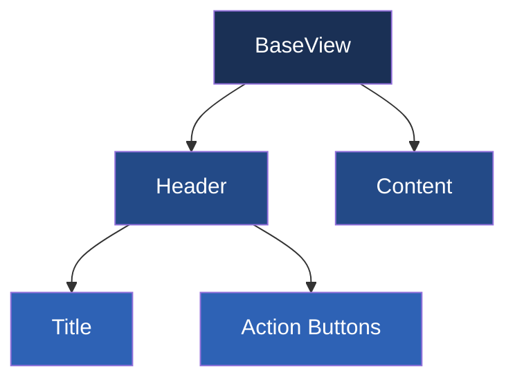

#### 3. Navigation Pattern

For consistent and organized application navigation:

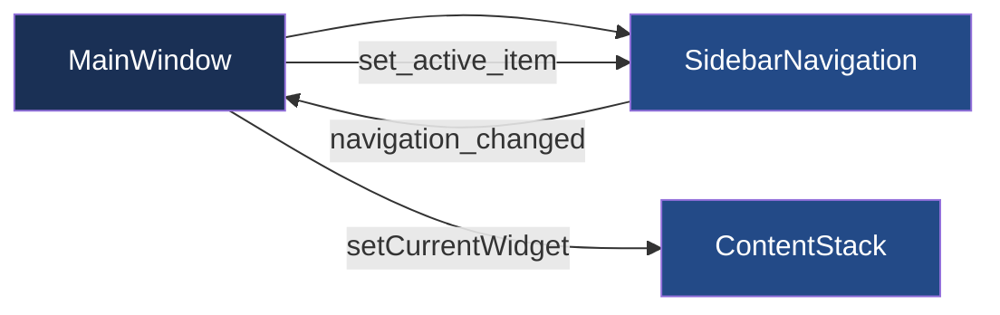

#### 4. Dashboard Pattern

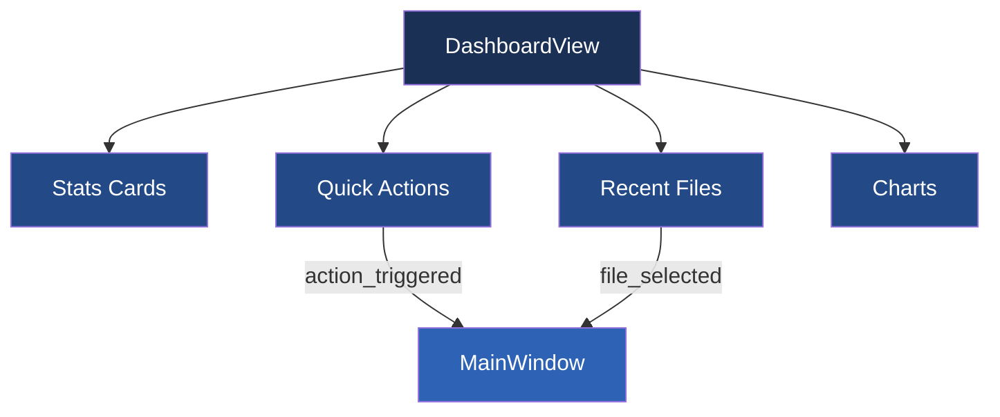

## UI Component Interactions

### Signal-Slot Mechanism

The UI components communicate primarily through the Qt Signal-Slot mechanism:

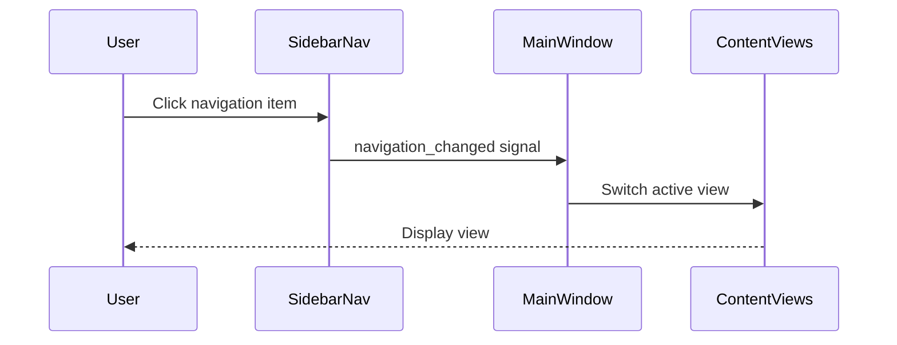

### UI Update Flow

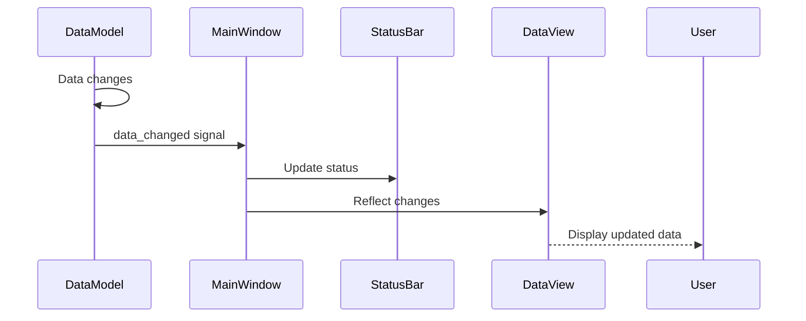

## UI Visual Style

### Color Scheme

We've selected a professional dark blue theme with gold accents:

```
PRIMARY: #1a3055 (Dark Blue)
SECONDARY: #ffc107 (Gold)
ACCENT: #f8c760 (Light Gold)
BACKGROUND: #141e30 (Darker Blue)
TEXT_LIGHT: #ffffff (White)
TEXT_MUTED: #a0aec0 (Light Gray)
BORDER: #2d4a77 (Medium Blue)
```

### Visual Mockup

```
┌────────────────────────────────────────────────────────────────────┐
│ ChestBuddy - Chest Data Analysis Tool                         _ □ X │
├────────┬───────────────────────────────────────────────────────────┤
│        │ ┌─────────────────────────────────────────────────────┐   │
│        │ │ Dashboard                                           │   │
│        │ ├─────────────────────────────────────────────────────┤   │
│        │ │                                                     │   │
│        │ │ ┌─────────┐ ┌─────────┐ ┌─────────┐ ┌─────────┐     │   │
│        │ │ │Current  │ │Validation│ │Correction│ │Last    │     │   │
│Dashboard│ │ │Dataset │ │Status   │ │Status   │ │Import  │     │   │
│        │ │ │0 rows   │ │N/A      │ │0 corrected│ │Never   │     │   │
│  Data  │ │ └─────────┘ └─────────┘ └─────────┘ └─────────┘     │   │
│        │ │                                                     │   │
│Validation│ │ ┌─────────────────┐ ┌─────────────────┐           │   │
│        │ │ │                 │ │                 │           │   │
│Correction│ │ │  Recent Files    │ │  Top Players     │           │   │
│        │ │ │                 │ │                 │           │   │
│ Charts │ │ │                 │ │                 │           │   │
│        │ │ └─────────────────┘ └─────────────────┘           │   │
│ Reports│ │                                                     │   │
│        │ │ ┌─────────────────┐ ┌─────────────────┐           │   │
│Settings│ │ │                 │ │ ┌────┐  ┌────┐  │           │   │
│        │ │ │ Top Chest       │ │ │Imp.│  │Val.│  │           │   │
│  Help  │ │ │ Sources         │ │ └────┘  └────┘  │           │   │
│        │ │ │                 │ │ ┌────┐  ┌────┐  │           │   │
│        │ │ │                 │ │ │Ana.│  │Rep.│  │           │   │
│        │ │ └─────────────────┘ └─────────────────┘           │   │
│        │ │                                                     │   │
│        │ └─────────────────────────────────────────────────────┘   │
├────────┴───────────────────────────────────────────────────────────┤
│ 0 records | No data loaded                                          │
└────────────────────────────────────────────────────────────────────┘
```

### Component Styling

Each component is styled with consistent properties:

```css
/* Example styling for cards */
{
    background-color: #1a3055;
    border-radius: 6px;
    border: 1px solid #2d4a77;
}

/* Text styling for headers */
{
    color: #ffffff;
    font-size: 22px;
    font-weight: 500;
}

/* Action buttons */
{
    background-color: #ffc107;
    color: #1a3055;
    border-radius: 4px;
    padding: 6px 12px;
}
```

## Service Layer Architecture

The application follows a service-oriented architecture with specialized services for different functionality domains:

- **CSVService**: Handles low-level CSV file operations (reading, writing, encoding detection)
- **ValidationService**: Validates chest data against rules and patterns
- **CorrectionService**: Applies corrections to invalid chest data
- **ChartService**: Generates charts and visualizations from chest data
- **DataManager**: Handles high-level data operations including loading, saving, and column mapping

Each service is responsible for a specific domain of functionality and interacts with other components through well-defined interfaces and signals.

### Service Dependencies

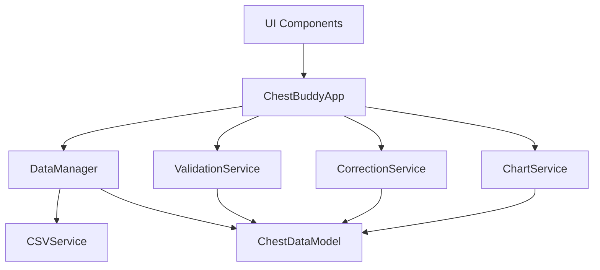

## Key UI Implementation Notes

### Data-Dependent UI Pattern

This pattern handles UI state based on data availability:

1. **State Tracking**: Track data loading state in central location (MainWindow)
2. **State Propagation**: Notify components of state changes through signals
3. **UI Adaptation**: Adapt UI based on data state (empty states, disabled controls)
4. **Visual Feedback**: Provide clear visual indication of data-dependent features
5. **User Guidance**: Guide users toward actions needed to enable functionality

Example implementation:
```python
# State tracking in MainWindow
self._data_loaded = False

# Method to update state
def set_data_loaded(self, is_loaded):
    if self._data_loaded != is_loaded:
        self._data_loaded = is_loaded
        self.data_state_changed.emit(is_loaded)
        self._update_navigation_state()

# UI adaptation in SidebarNavigation
def update_data_dependent_sections(self, data_loaded):
    for section_name in ["Data", "Analysis", "Reports"]:
        section = self._sections.get(section_name)
        if section:
            section.set_enabled(data_loaded)
```

### Empty State Pattern

For handling UI when no data is available:

1. **Empty Detection**: Logic to determine when an empty state should be shown
2. **Empty Widget**: Dedicated widget for empty state display
3. **Call-to-Action**: Clear guidance on how to proceed from empty state
4. **Visual Design**: Visually distinct appearance for empty state
5. **Transition**: Smooth transition between empty and populated states

Example implementation:
```python
# Empty state detection
def _update_content_state(self):
    if self._data_model.is_empty():
        self._show_empty_state()
    else:
        self._show_content()

# Empty state widget
def _show_empty_state(self):
    self._empty_widget.setVisible(True)
    self._content_widget.setVisible(False)
```

## Dashboard Architecture

The Dashboard provides users with an overview of the current data state, available actions, and key insights from the data.

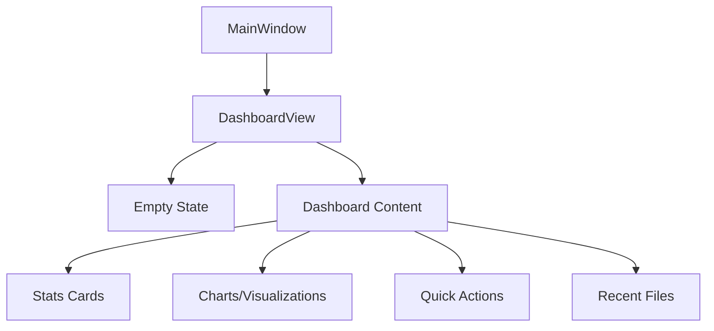

### Key Architectural Patterns for Dashboard

1. **Component Pattern**:
   - Reusable visual components for consistent UI
   - Each component manages its own state and appearance
   - Clear separation of concerns between components

2. **State Display Pattern**:
   - Dashboard adapts displays based on data availability
   - EmptyStateWidget shows when no data is loaded
   - Content widgets show when data is available

3. **Interactive Data Visualization**:
   - Chart components provide interactive previews of data
   - Clicking on charts can trigger detailed views
   - Visual indicators show trends and patterns

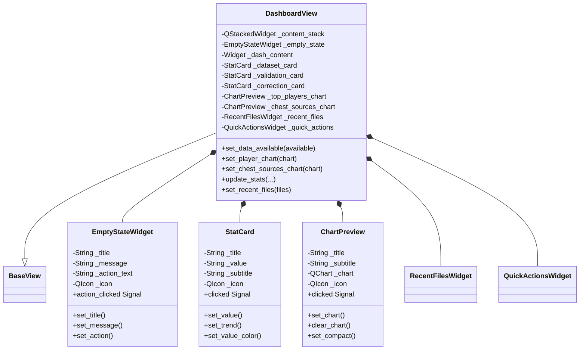

## UI Component Architecture

### Core UI Components

The application uses a component-based architecture with reusable UI elements:

1. **ActionButton**: A versatile button component with customizable appearance and behavior
   - Properties: text, icon, size, style, enabled state
   - Signals: clicked
   - Features: hover effects, different styles, icon positioning

2. **ActionToolbar**: A container for organizing buttons with consistent spacing
   - Layout: horizontal or vertical arrangement of buttons
   - Properties: spacing, alignment, orientation
   - Methods: add_button, add_spacer, clear

3. **EmptyStateWidget**: Widget displayed when a view has no content
   - Properties: title, message, icon, action_text
   - Signals: action_clicked
   - Methods: set_title, set_message, set_icon, set_action_text

4. **FilterBar**: Search and filter interface for data views
   - Properties: search_text, expanded state, filter categories
   - Signals: search_changed, filter_changed, expanded_changed
   - Methods: add_filter_category, clear_filters, set_expanded

5. **ActionCard**: Card-style widget for dashboard actions
   - Properties: title, description, icon, action_callback
   - Features: hover effects, click handling, visual feedback
   - Used in the dashboard for quick actions

6. **ChartCard**: Card-style widget for chart previews
   - Properties: title, description, chart_id, thumbnail
   - Signals: clicked, chart_selected
   - Used in the dashboard for chart previews

### View Adapter Pattern

The application follows a View Adapter pattern to separate UI components from data handling:

1. **BaseView**: Abstract base class for all view adapters
   - Properties: title, data_required
   - Methods: set_data_available, get_content_layout
   - Features: empty state handling, header configuration

2. **ViewAdapters**: Specific implementations for each major view
   - **DashboardViewAdapter**: Connects dashboard UI to data model
   - **DataViewAdapter**: Connects data view to data model
   - **ValidationViewAdapter**: Connects validation view to validation service
   - **CorrectionViewAdapter**: Connects correction view to correction service
   - **ChartViewAdapter**: Connects chart view to chart service

3. **Data Flow**:
   ```
   DataModel <-> Service <-> ViewAdapter <-> UI Components
   ```

4. **Signal Handling**:
   - ViewAdapters emit signals for user actions
   - MainWindow connects these signals to appropriate handlers
   - Services process data and emit result signals
   - ViewAdapters update UI based on service results

### Dashboard Architecture

The dashboard follows a card-based architecture with distinct sections:

1. **Quick Actions**: Grid layout of ActionCard components
   - Import Data, Export Data, Validate Data
   - Generate Report, Settings, Help

2. **Recent Files**: Vertical list of ActionCard components
   - Each card represents a recently opened file
   - Empty state shown when no recent files exist

3. **Charts & Analytics**: Horizontal layout of ChartCard components
   - Player Distribution, Chest Sources charts
   - Empty state shown when no data is available

4. **Layout Structure**:
   ```
   Dashboard
   ├── Header (Title + Actions)
   ├── ScrollArea
   │   ├── Quick Actions Section
   │   │   └── Grid of ActionCards
   │   ├── Divider
   │   ├── Recent Files Section
   │   │   └── List of ActionCards
   │   ├── Divider
   │   └── Charts Section
   │       └── Row of ChartCards
   └── Empty State (shown when no data)
   ```

5. **Data Availability Handling**:
   - Dashboard displays content even when no data is loaded
   - Charts section shows empty state when no data is available
   - Recent files section shows empty state when no files have been opened

This component-based architecture provides several benefits:
- Consistent UI patterns across the application
- Reusable components reduce code duplication
- Easier maintenance and testing
- Clear separation of concerns between UI and data handling
``` 