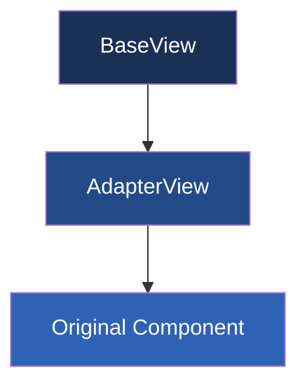
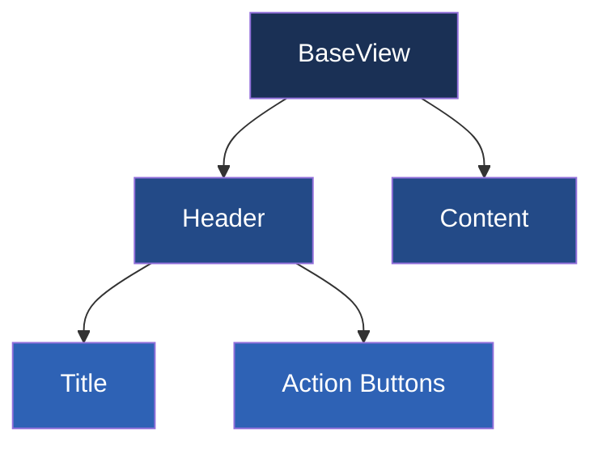
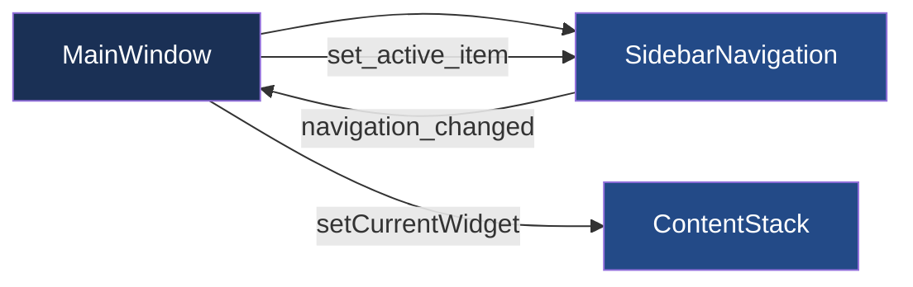
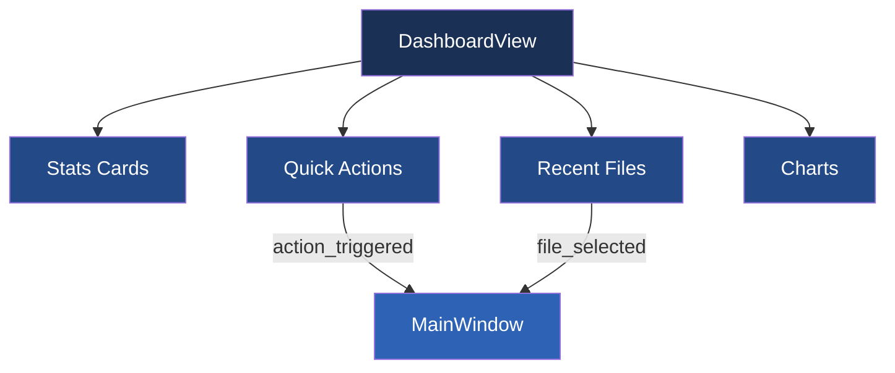
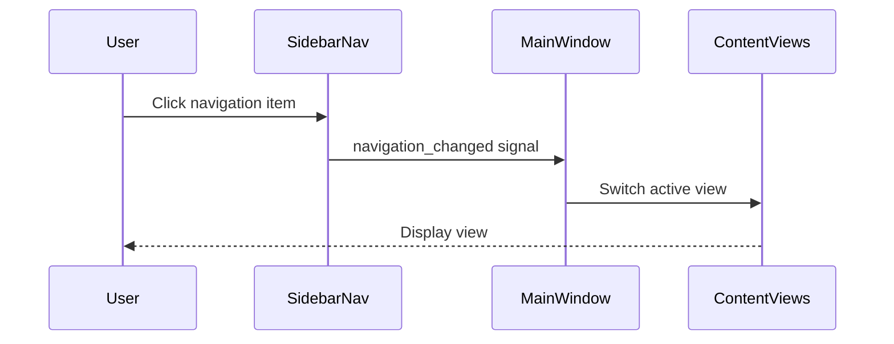
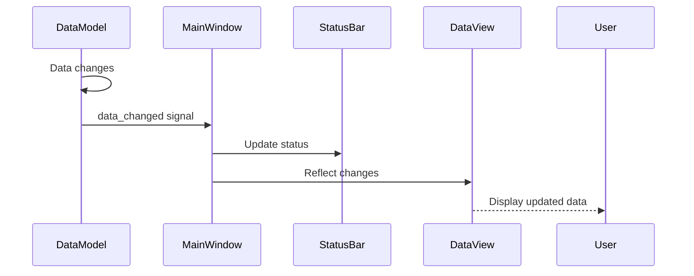

# System Patterns

## Architecture Overview

The Chest Buddy application follows a Model-View-Controller (MVC) architecture with clear separation of concerns:

```
┌────────────────┐     ┌────────────────┐     ┌────────────────┐
│     Models     │◄────┤  Controllers   │◄────┤     Views      │
│  (Data Logic)  │     │ (App Logic)    │     │  (UI Elements) │
└───────┬────────┘     └────────────────┘     └────────────────┘
        │                                             ▲
        │                                             │
        ▼                                             │
┌────────────────┐                           ┌────────────────┐
│   Services     │                           │    Config      │
│  (Utilities)   │                           │   Management   │
└───────┬────────┘                           └────────────────┘
        │
        ▼
┌────────────────┐
│  Background    │
│   Processing   │
└────────────────┘
```

## Core Components

### 1. Data Model Layer
- **ChestDataModel**: Represents the core chest data structure
- **ValidationModel**: Manages validation lists and rules
- **CorrectionModel**: Manages correction rules and transformations

### 2. Controller Layer
- **ImportController**: Handles CSV import and initial processing
- **ValidationController**: Manages validation processes
- **CorrectionController**: Applies correction rules
- **AnalysisController**: Performs data analysis operations
- **ReportController**: Manages report generation

### 3. View Layer
- **MainWindow**: Primary application interface
- **DataTableView**: Displays and highlights data
- **ChartView**: Renders visualizations
- **ValidationView**: Interface for validation management
- **CorrectionView**: Interface for correction rules
- **ReportBuilderView**: Interface for report creation

### 4. Service Layer
- **CSVService**: Handles CSV file operations
- **CharsetService**: Manages character encoding detection and correction
- **AnalysisService**: Provides data analysis functions
- **ChartService**: Generates chart visualizations
- **ReportService**: Generates HTML reports

### 5. Background Processing Layer
- **BackgroundWorker**: Manages execution of tasks in separate threads
- **BackgroundTask**: Base class for defining asynchronous operations
- **CSVReadTask**: Specific implementation for CSV reading operations

### 6. Configuration Layer
- **ConfigManager**: Manages application settings and user preferences
- **ValidationConfig**: Manages validation list configuration
- **CorrectionConfig**: Manages correction rule configuration

### 7. Testing Layer
- **Unit Tests**: Tests for individual components and functions
- **UI Component Tests**: Tests for UI components and interactions
- **Integration Tests**: Tests for cross-component workflows
- **Workflow Tests**: End-to-end tests for complete user scenarios
- **Performance Tests**: Tests for measuring performance metrics

## Key Design Patterns

### 1. Observer Pattern
Used for updating views when data models change:
- Data models emit signals when modified
- Views subscribe to relevant signals
- Ensures UI stays synchronized with data state

### 2. Strategy Pattern
Used for validation and correction operations:
- Common interface for different validation strategies
- Different correction approaches can be swapped
- Allows for flexible rule application

### 3. Factory Pattern
Used for creating visualization components:
- ChartFactory creates different chart types based on user selection
- ReportElementFactory creates different report elements

### 4. Singleton Pattern
Used for configuration and service instances:
- ConfigManager as a singleton
- Ensures consistent access to configuration

### 5. Command Pattern
Used for validation and correction operations:
- Each operation is encapsulated as a command
- Allows for undo/redo functionality
- Maintains operation history

### 6. Worker Pattern
Used for background processing:
- BackgroundWorker manages thread lifecycle
- Tasks implement a common interface (BackgroundTask)
- Signal-based communication between threads
- Ensures UI responsiveness during heavy operations

### 7. Fixture Pattern
Used for testing:
- Common test fixtures for reusable test setup
- Data fixtures for consistent test data
- Component fixtures for UI testing
- Ensures consistent test environments

## Test Architecture

The test architecture follows a layered approach to verify application functionality at multiple levels:

```
┌────────────────┐
│  Workflow      │
│    Tests       │ End-to-end user workflow tests
└───────┬────────┘
        │
        ▼
┌────────────────┐
│  Integration   │
│    Tests       │ Cross-component interaction tests
└───────┬────────┘
        │
        ▼
┌────────────────┐     ┌────────────────┐
│  UI Component  │     │  Background    │
│    Tests       │     │ Process Tests  │
└───────┬────────┘     └───────┬────────┘
        │                      │
        ▼                      ▼
┌────────────────┐     ┌────────────────┐
│  Unit Tests    │     │ Performance    │
│                │     │    Tests       │
└────────────────┘     └────────────────┘
```

## Data Flow

1. **Import Flow**:
   - CSV file → CSVService → ChestDataModel → DataTableView
   - Optional automatic validation and correction

2. **Background Import Flow**:
   - CSV file → CSVService → CSVReadTask → BackgroundWorker → ChestDataModel → DataTableView
   - Progress reporting during import
   - Non-blocking UI during processing

3. **Validation Flow**:
   - ChestDataModel → ValidationController → ValidationModel → ChestDataModel (updated)
   - UI feedback on validation errors

4. **Correction Flow**:
   - ChestDataModel → CorrectionController → CorrectionModel → ChestDataModel (corrected)
   - UI updates to show corrections

5. **Analysis Flow**:
   - ChestDataModel → AnalysisController → AnalysisService → ChartView
   - User-selected data dimensions determine visualization

6. **Report Flow**:
   - ChestDataModel + Charts → ReportController → ReportService → HTML Output
   - User-customized report elements

7. **Test Flow**:
   - Test Case → Test Fixtures → Component Under Test → Assertions → Test Results
   - Mock external dependencies where necessary
   - Use realistic data for integration and workflow tests

## Module Organization

```
chestbuddy/
├── core/
│   ├── models/
│   ├── controllers/
│   └── services/
├── ui/
│   ├── views/
│   ├── widgets/
│   └── resources/
├── utils/
│   ├── config/
│   ├── validation/
│   ├── correction/
│   └── background_processing.py
├── data/
│   ├── validators/
│   ├── correction_rules/
│   └── templates/
└── tests/
    ├── unit/
    ├── integration/
    ├── test_background_worker.py
    ├── test_csv_background_tasks.py
    ├── test_main_window.py (planned)
    ├── test_integration.py (planned)
    ├── test_workflows.py (planned)
    └── resources/
```

## Error Handling Strategy

- Comprehensive try-except blocks for all file operations
- Signal-based error reporting to the UI
- Status bar and dialog-based error notifications
- Logging of errors with sufficient context for debugging
- User-friendly error messages with suggested actions

## Testing Strategy

- Unit tests for individual components to ensure correct behavior
- UI component tests to verify proper UI initialization and interaction
- Integration tests to verify correct interaction between components
- Workflow tests to validate end-to-end user scenarios
- Performance tests to measure and ensure efficiency with large datasets
- Use of fixtures for consistent test setup and teardown
- QtBot for simulating user interactions with UI components
- Mocking external dependencies for isolation and reproducibility
- Test data generators for various test scenarios
- Cleanup mechanisms to ensure test isolation

## Background Processing Strategy

- Worker-based threading model for all long-running operations
- Clear separation between UI thread and worker threads
- Signal-based communication for progress updates and results
- Cancellation support for long-running operations
- Resource cleanup on task completion or cancellation
- Chunked processing for memory-intensive operations

## UI Architecture

The UI architecture of ChestBuddy follows a component-based design with clear separation of concerns and standardized patterns for consistency.

### UI Component Hierarchy


### Key UI Patterns

#### 1. Adapter Pattern

For integrating existing UI components with the new UI structure, we use the adapter pattern:



**Implementation Example:**
```python
class DataViewAdapter(BaseView):
    def __init__(self, data_model, parent=None):
        # Store references
        self._data_model = data_model
        
        # Create the original component
        self._data_view = DataView(data_model)
        
        # Initialize the base view
        super().__init__("Data View", parent)
        
    def _setup_ui(self):
        # First call the parent class's _setup_ui method
        super()._setup_ui()
        
        # Add the original component to the content widget
        self.get_content_layout().addWidget(self._data_view)
```

#### 2. Content View Pattern

For consistent UI components with standardized structure:



#### 3. Navigation Pattern

For consistent and organized application navigation:



#### 4. Dashboard Pattern



## UI Component Interactions

### Signal-Slot Mechanism

The UI components communicate primarily through the Qt Signal-Slot mechanism:



### UI Update Flow



## UI Visual Style

### Color Scheme

We've selected a professional dark blue theme with gold accents:

```
PRIMARY: #1a3055 (Dark Blue)
SECONDARY: #ffc107 (Gold)
ACCENT: #f8c760 (Light Gold)
BACKGROUND: #141e30 (Darker Blue)
TEXT_LIGHT: #ffffff (White)
TEXT_MUTED: #a0aec0 (Light Gray)
BORDER: #2d4a77 (Medium Blue)
```

### Visual Mockup

```
┌────────────────────────────────────────────────────────────────────┐
│ ChestBuddy - Chest Data Analysis Tool                         _ □ X │
├────────┬───────────────────────────────────────────────────────────┤
│        │ ┌─────────────────────────────────────────────────────┐   │
│        │ │ Dashboard                                           │   │
│        │ ├─────────────────────────────────────────────────────┤   │
│        │ │                                                     │   │
│        │ │ ┌─────────┐ ┌─────────┐ ┌─────────┐ ┌─────────┐     │   │
│        │ │ │Current  │ │Validation│ │Correction│ │Last    │     │   │
│Dashboard│ │ │Dataset │ │Status   │ │Status   │ │Import  │     │   │
│        │ │ │0 rows   │ │N/A      │ │0 corrected│ │Never   │     │   │
│  Data  │ │ └─────────┘ └─────────┘ └─────────┘ └─────────┘     │   │
│        │ │                                                     │   │
│Validation│ │ ┌─────────────────┐ ┌─────────────────┐           │   │
│        │ │ │                 │ │                 │           │   │
│Correction│ │ │  Recent Files    │ │  Top Players     │           │   │
│        │ │ │                 │ │                 │           │   │
│ Charts │ │ │                 │ │                 │           │   │
│        │ │ └─────────────────┘ └─────────────────┘           │   │
│ Reports│ │                                                     │   │
│        │ │ ┌─────────────────┐ ┌─────────────────┐           │   │
│Settings│ │ │                 │ │ ┌────┐  ┌────┐  │           │   │
│        │ │ │ Top Chest       │ │ │Imp.│  │Val.│  │           │   │
│  Help  │ │ │ Sources         │ │ └────┘  └────┘  │           │   │
│        │ │ │                 │ │ ┌────┐  ┌────┐  │           │   │
│        │ │ │                 │ │ │Ana.│  │Rep.│  │           │   │
│        │ │ └─────────────────┘ └─────────────────┘           │   │
│        │ │                                                     │   │
│        │ └─────────────────────────────────────────────────────┘   │
├────────┴───────────────────────────────────────────────────────────┤
│ 0 records | No data loaded                                          │
└────────────────────────────────────────────────────────────────────┘
```

### Component Styling

Each component is styled with consistent properties:

```css
/* Example styling for cards */
{
    background-color: #1a3055;
    border-radius: 6px;
    border: 1px solid #2d4a77;
}

/* Text styling for headers */
{
    color: #ffffff;
    font-size: 22px;
    font-weight: 500;
}

/* Action buttons */
{
    background-color: #ffc107;
    color: #1a3055;
    border-radius: 4px;
    padding: 6px 12px;
}
``` 