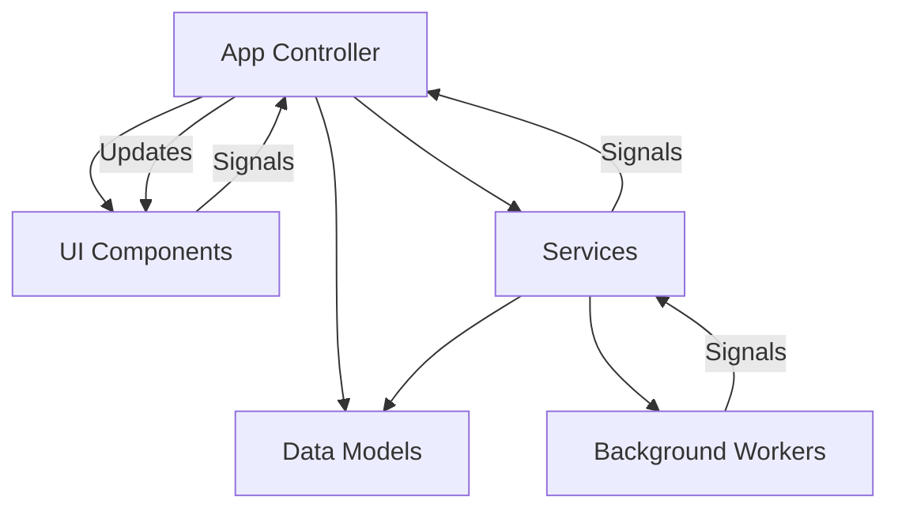
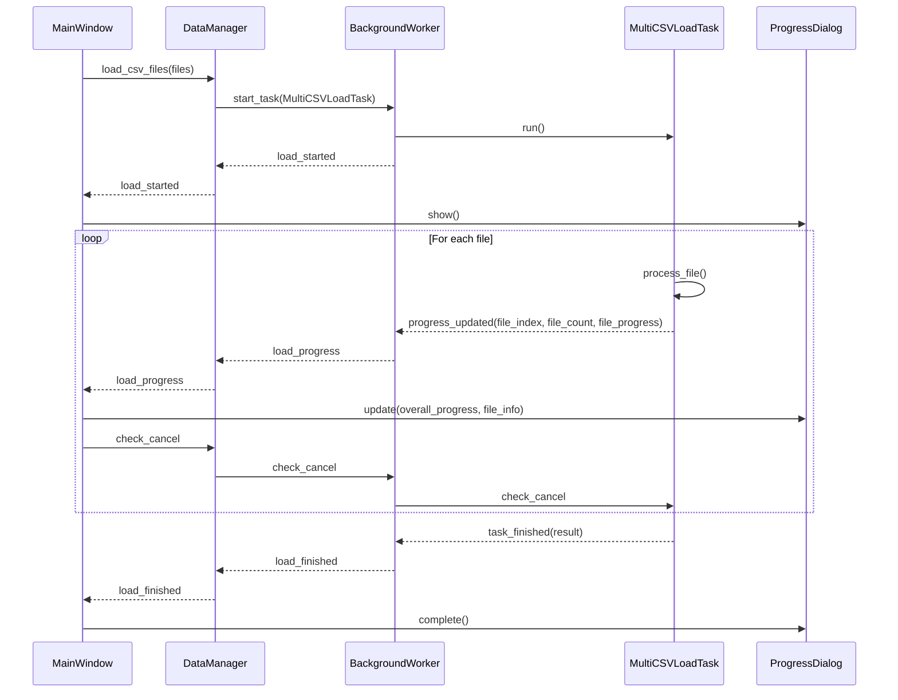
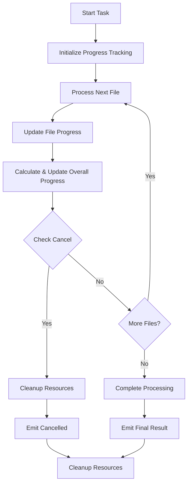
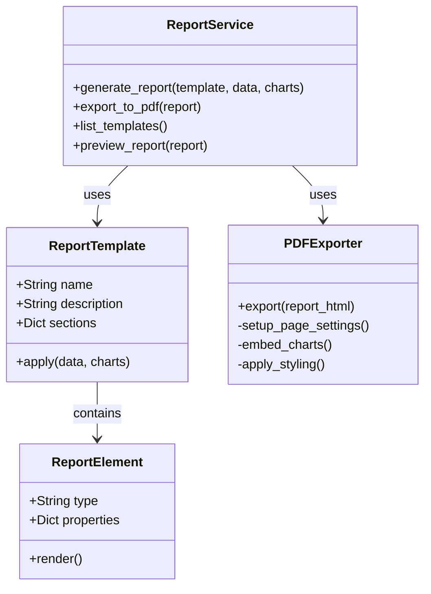
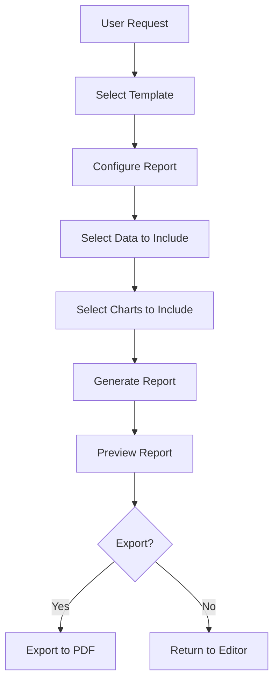
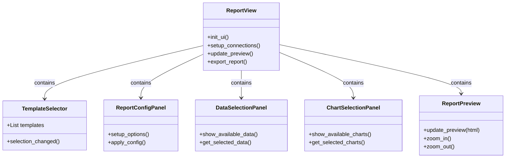
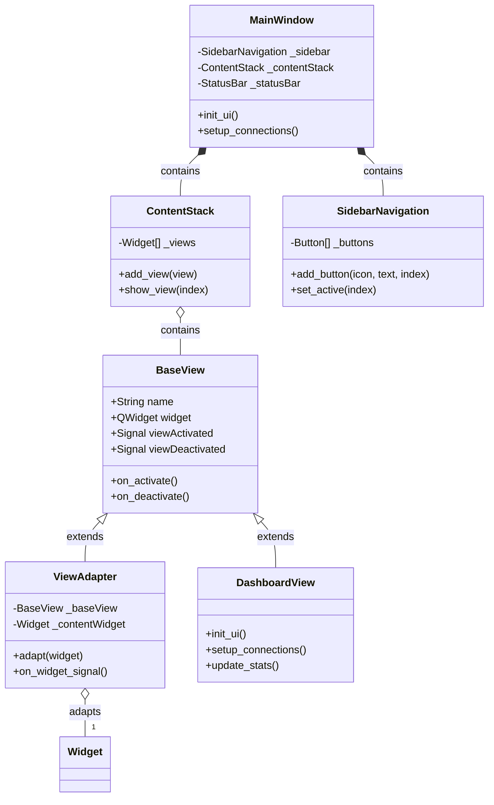

# System Patterns

This document outlines the key architectural patterns and design decisions for the ChestBuddy application.

## Application Architecture

ChestBuddy follows a modular, service-oriented architecture with clear separation of concerns:



## Key Design Patterns

### 1. Model-View-Controller (MVC)

The application follows an MVC pattern:
- **Models**: Responsible for data structure and business logic
- **Views**: UI components for data display and user interaction
- **Controllers**: Coordinate between models and views

### 2. Service Layer

Services encapsulate specific functionality and are injected where needed:
- `CSVService`: Handles CSV file operations
- `ValidationService`: Validates data against rules
- `CorrectionService`: Applies corrections to data
- `ConfigService`: Manages application configuration
- `ChartService`: Generates data visualizations
- *Planned* `ReportService`: Will handle report generation

### 3. Dependency Injection

Dependencies are injected through constructors rather than created internally:
```python
def __init__(self, config_service: ConfigService, csv_service: CSVService):
    self._config_service = config_service
    self._csv_service = csv_service
```

### 4. Event-Driven Communication

Components communicate through Qt signals and slots:
```python
# Signal definition
data_loaded = Signal(pd.DataFrame)

# Connection
self._data_service.data_loaded.connect(self._on_data_loaded)

# Slot implementation
@Slot(pd.DataFrame)
def _on_data_loaded(self, df: pd.DataFrame) -> None:
    # Handle loaded data
```

### 5. Background Processing

Long-running operations are executed in background threads:
```python
# Running a task in background
self._worker.run_task(
    self._csv_service.load_csv, 
    file_path, 
    on_success=self._on_load_success,
    on_error=self._on_load_error
)
```

### 6. UI Component Composition

UI is built through composition of smaller components:
```python
# Main view composed of header and content
self._header = ViewHeader("Dashboard")
self._content = QWidget()
self._content_layout = QVBoxLayout(self._content)

# Add components to layout
self._content_layout.addWidget(self._chart_view)
self._content_layout.addWidget(self._stats_panel)
```

### 7. UI Widget Pattern

Custom widgets are created for reusable UI elements with consistent behavior and styling. Each widget follows patterns:

1. **Base Widget Class**: Define custom widget inheriting from Qt class with controlled API
2. **State Management**: Internal state tracking with signals for state changes
3. **Styling**: Use Colors and stylesheet constants for consistent appearance
4. **Custom Painting**: Override paintEvent for custom appearance when needed

Examples:
```python
# Signal definitions
valueChanged = Signal(int)
stateChanged = Signal(int)

# Property definition with getter/setter
@Property(int, value, setValue)
def progress(self):
    return self._value

# Custom painting
def paintEvent(self, event):
    painter = QPainter(self)
    painter.setRenderHint(QPainter.Antialiasing)
    # Custom drawing code
```

Key UI widgets:
- `ProgressBar`: Custom progress bar with state-based styling (normal, success, error)
- `ProgressDialog`: Dialog wrapping ProgressBar with enhanced functionality
- `StatusBar`: Custom status bar with multiple information sections
- `ViewHeader`: Standardized header for application views

### 8. Adapter Pattern for Views

View adapters connect the UI components to the application logic:
```python
class DataViewAdapter:
    def __init__(self, data_view: DataView, data_model: DataModel):
        self._data_view = data_view
        self._data_model = data_model
        
        # Connect signals
        self._data_model.data_changed.connect(self._update_view)
```

### 9. Resource Management

Resources like icons and styles are centrally managed:
```python
# Resource loading
icon = self._resource_manager.get_icon("open_file")
```

### 10. Configuration Management

Application settings are managed through a dedicated service:
```python
# Getting configuration
auto_save = self._config.get_bool("Autosave", "enabled", default=True)

# Setting configuration
self._config.set_value("Autosave", "interval", 5)
```

## Error Handling Strategy

1. **Service Level**: Catch and log specific errors, translate to appropriate signals
2. **Controller Level**: Connect error signals to UI updates
3. **UI Level**: Display error messages to users, recover gracefully
4. **Background Tasks**: Catch and report errors without crashing the application

Example error handling flow:
```python
try:
    # Operation that might fail
    result = potentially_failing_operation()
except SpecificError as e:
    logger.error(f"Operation failed: {e}")
    self.operation_failed.emit(str(e))
    return False
```

## Progress Reporting Pattern

Progress reporting follows a standardized pattern:

1. **Signal Definition**: Services define progress signals
   ```python
   load_started = Signal()
   load_progress = Signal(str, int, int)  # file_path, current, total
   load_finished = Signal(str)  # message
   ```

2. **Progress Dialog**: UI shows a custom ProgressDialog when operations start
   ```python
   # Create progress dialog
   self._progress_dialog = ProgressDialog(
       "Loading data...", 
       "Cancel", 
       0, 
       100, 
       self
   )
   self._progress_dialog.canceled.connect(self._cancel_operation)
   ```

3. **Progress Updates**: Operations emit progress updates
   ```python
   # Emit progress
   self.load_progress.emit(file_path, current_row, total_rows)
   ```

4. **State Management**: ProgressBar displays different states
   ```python
   # Set state based on result
   if success:
       self._progress_dialog.setState(ProgressBar.State.SUCCESS)
   else:
       self._progress_dialog.setState(ProgressBar.State.ERROR)
   ```

5. **Completion Handling**: Services emit finished signal
   ```python
   # Operation completed
   self.load_finished.emit("Data loaded successfully")
   ```

## File Structure 

The application follows a modular file structure:

```
chestbuddy/
├── app.py                  # Application entry point
├── config.py               # Configuration management
├── core/                   # Core functionality
│   ├── models/             # Data models
│   └── services/           # Business logic services
├── ui/                     # User interface components
│   ├── widgets/            # Reusable UI widgets
│   │   ├── progress_bar.py # Custom progress bar
│   │   └── progress_dialog.py # Custom progress dialog
│   ├── views/              # Main application views
│   ├── adapters/           # View adapters
│   └── resources/          # UI resources (icons, styles)
└── utils/                  # Utility functions and classes
    └── background_processing.py  # Background task handling
```

## Integration Points

1. **Data Loading → Validation**: Loaded data is passed to validation service
2. **Validation → Correction**: Validation results guide correction process
3. **Data → Charts**: Chart service uses data model for visualization
4. **Charts → Reports**: Chart outputs will be embedded in reports
5. **Configuration → All Components**: Configuration service informs component behavior

## Architecture Overview

The Chest Buddy application follows a Model-View-Controller (MVC) architecture with clear separation of concerns:

```
┌────────────────┐     ┌────────────────┐     ┌────────────────┐
│     Models     │◄────┤  Controllers   │◄────┤     Views      │
│  (Data Logic)  │     │ (App Logic)    │     │  (UI Elements) │
└───────┬────────┘     └────────────────┘     └────────────────┘
        │                                             ▲
        │                                             │
        ▼                                             │
┌────────────────┐                           ┌────────────────┐
│   Services     │                           │    Config      │
│  (Utilities)   │                           │   Management   │
└───────┬────────┘                           └────────────────┘
        │
        ▼
┌────────────────┐
│  Background    │
│   Processing   │
└────────────────┘
```

## Core Components

### 1. Data Model Layer
- **ChestDataModel**: Represents the core chest data structure
- **ValidationModel**: Manages validation lists and rules
- **CorrectionModel**: Manages correction rules and transformations

### 2. Controller Layer
- **ImportController**: Handles CSV import and initial processing
- **ValidationController**: Manages validation processes
- **CorrectionController**: Applies correction rules
- **AnalysisController**: Performs data analysis operations
- **ReportController**: Manages report generation

### 3. View Layer
- **MainWindow**: Primary application interface
- **DataTableView**: Displays and highlights data
- **ChartView**: Renders visualizations
- **ValidationView**: Interface for validation management
- **CorrectionView**: Interface for correction rules
- **ReportBuilderView**: Interface for report creation

### 4. Service Layer
- **CSVService**: Handles CSV file operations
- **CharsetService**: Manages character encoding detection and correction
- **AnalysisService**: Provides data analysis functions
- **ChartService**: Generates chart visualizations
- **ReportService**: Generates HTML reports
- **DataManager**: Handles high-level data operations including loading, saving, and column mapping

### 5. Background Processing Layer
- **BackgroundWorker**: Manages execution of tasks in separate threads
- **BackgroundTask**: Base class for defining asynchronous operations
- **CSVReadTask**: Specific implementation for CSV reading operations
- **MultiCSVLoadTask**: Handles loading of multiple CSV files with progress tracking

### 6. Configuration Layer
- **ConfigManager**: Manages application settings and user preferences
- **ValidationConfig**: Manages validation list configuration
- **CorrectionConfig**: Manages correction rule configuration

### 7. Testing Layer
- **Unit Tests**: Tests for individual components and functions
- **UI Component Tests**: Tests for UI components and interactions
- **Integration Tests**: Tests for cross-component workflows
- **Workflow Tests**: End-to-end tests for complete user scenarios
- **Performance Tests**: Tests for measuring performance metrics

## Key Design Patterns

### 1. Observer Pattern
Used for updating views when data models change:
- Data models emit signals when modified
- Views subscribe to relevant signals
- Ensures UI stays synchronized with data state

### 2. Strategy Pattern
Used for validation and correction operations:
- Common interface for different validation strategies
- Different correction approaches can be swapped
- Allows for flexible rule application

### 3. Factory Pattern
Used for creating visualization components:
- ChartFactory creates different chart types based on user selection
- ReportElementFactory creates different report elements

### 4. Singleton Pattern
Used for configuration and service instances:
- ConfigManager as a singleton
- Ensures consistent access to configuration

### 5. Command Pattern
Used for validation and correction operations:
- Each operation is encapsulated as a command
- Allows for undo/redo functionality
- Maintains operation history

### 6. Worker Pattern
Used for background processing:
- BackgroundWorker manages thread lifecycle
- Tasks implement a common interface (BackgroundTask)
- Signal-based communication between threads
- Ensures UI responsiveness during heavy operations

### 7. Fixture Pattern
Used for testing:
- Common test fixtures for reusable test setup
- Data fixtures for consistent test data
- Component fixtures for UI testing
- Ensures consistent test environments

## Test Architecture

The test architecture follows a layered approach to verify application functionality at multiple levels:

```
┌────────────────┐
│  Workflow      │
│    Tests       │ End-to-end user workflow tests
└───────┬────────┘
        │
        ▼
┌────────────────┐
│  Integration   │
│    Tests       │ Cross-component interaction tests
└───────┬────────┘
        │
        ▼
┌────────────────┐     ┌────────────────┐
│  UI Component  │     │  Background    │
│    Tests       │     │ Process Tests  │
└───────┬────────┘     └───────┬────────┘
        │                      │
        ▼                      ▼
┌────────────────┐     ┌────────────────┐
│  Unit Tests    │     │ Performance    │
│                │     │    Tests       │
└────────────────┘     └────────────────┘
```

## Data Flow

1. **Import Flow**:
   - CSV file → CSVService → ChestDataModel → DataTableView
   - Optional automatic validation and correction

2. **Background Import Flow**:
   - CSV file → CSVService → CSVReadTask → BackgroundWorker → ChestDataModel → DataTableView
   - Progress reporting during import
   - Non-blocking UI during processing

3. **Validation Flow**:
   - ChestDataModel → ValidationController → ValidationModel → ChestDataModel (updated)
   - UI feedback on validation errors

4. **Correction Flow**:
   - ChestDataModel → CorrectionController → CorrectionModel → ChestDataModel (corrected)
   - UI updates to show corrections

5. **Analysis Flow**:
   - ChestDataModel → AnalysisController → AnalysisService → ChartView
   - User-selected data dimensions determine visualization

6. **Report Flow**:
   - ChestDataModel + Charts → ReportController → ReportService → HTML Output
   - User-customized report elements

7. **Test Flow**:
   - Test Case → Test Fixtures → Component Under Test → Assertions → Test Results
   - Mock external dependencies where necessary
   - Use realistic data for integration and workflow tests

## Module Organization

```
chestbuddy/
├── core/
│   ├── models/
│   ├── controllers/
│   └── services/
├── ui/
│   ├── views/
│   ├── widgets/
│   └── resources/
├── utils/
│   ├── config/
│   ├── validation/
│   ├── correction/
│   └── background_processing.py
├── data/
│   ├── validators/
│   ├── correction_rules/
│   └── templates/
└── tests/
    ├── unit/
    ├── integration/
    ├── test_background_worker.py
    ├── test_csv_background_tasks.py
    ├── test_main_window.py (planned)
    ├── test_integration.py (planned)
    ├── test_workflows.py (planned)
    └── resources/
```

## Error Handling Strategy

- Comprehensive try-except blocks for all file operations
- Signal-based error reporting to the UI
- Status bar and dialog-based error notifications
- Logging of errors with sufficient context for debugging
- User-friendly error messages with suggested actions

## Testing Strategy

- Unit tests for individual components to ensure correct behavior
- UI component tests to verify proper UI initialization and interaction
- Integration tests to verify correct interaction between components
- Workflow tests to validate end-to-end user scenarios
- Performance tests to measure and ensure efficiency with large datasets
- Use of fixtures for consistent test setup and teardown
- QtBot for simulating user interactions with UI components
- Mocking external dependencies for isolation and reproducibility
- Test data generators for various test scenarios
- Cleanup mechanisms to ensure test isolation

## Background Processing Strategy

- Worker-based threading model for all long-running operations
- Clear separation between UI thread and worker threads
- Signal-based communication for progress updates and results
- Cancellation support for long-running operations
- Resource cleanup on task completion or cancellation
- Chunked processing for memory-intensive operations
- Improved thread management with graceful cleanup during application shutdown
- Two-level progress reporting for multi-file operations (overall progress and per-file progress)
- Consistent progress reporting on a 0-100 scale for all background tasks
- Callbacks for detailed progress reporting during complex operations

### Progress Dialog Architecture

The progress dialog system implements a comprehensive approach to providing feedback during long-running operations:



The progress reporting follows a consistent pattern:
1. Task initialization triggers load_started signal
2. Regular progress updates during processing with contextual information
3. Completion triggers load_finished signal with results
4. Cancellation can be checked and applied at any point in the process

### Multi-File Processing Pattern

For operations involving multiple files:



## Planned Report Generation Architecture

For the upcoming Report Generation phase, we're planning to implement the following architecture:

### 1. Report Service Components



### 2. Report Generation Flow



### 3. Report View Architecture



This architecture will allow for flexible, customizable report generation with a focus on user experience and high-quality output. The components are designed to be modular and extensible, enabling easy addition of new report templates and export formats in the future.

## UI Architecture

The UI architecture of ChestBuddy follows a component-based design with clear separation of concerns and standardized patterns for consistency.

### UI Component Hierarchy



### UI Design Principles

1. **Consistency**: Standardized color scheme, button sizes, and spacing
2. **Modularity**: Views encapsulated in self-contained components
3. **Responsiveness**: All operations provide appropriate feedback
4. **Accessibility**: Clear contrast and sufficient text size
5. **Visual Hierarchy**: Important elements have greater visual weight
6. **Error Prevention**: Validation and confirmation before destructive actions
7. **User Feedback**: Loading indicators and progress reporting for all operations
8. **State Clarity**: Current application state is always visible

### UI Color Scheme

```
Primary: #1a3055 (Dark Blue)
Secondary: #ffc107 (Gold)
Background: #f8f9fa (Light Gray)
Text: #212529 (Dark Gray)
Accent: #0d6efd (Bright Blue)
Warning: #dc3545 (Red)
Success: #28a745 (Green)
```

### Validation Color Mapping

```
Valid: #28a745 (Green)
Warning: #ffc107 (Gold)
Error: #dc3545 (Red)
Fixed: #0d6efd (Bright Blue)
```

### UI Layout Structure

- Consistent margins: 16px
- Padding: 8px
- Button height: 36px
- Icon size: 24px
- Sidebar width: 200px
- Dialog minimum width: 420px

### Responsive Design Approach

1. **Layout Adaptability**: Fluid layouts that adjust to window size
2. **Content Scaling**: Tables and charts scale with available space
3. **Priority Elements**: Critical UI elements always visible
4. **Scroll Areas**: Content areas scroll when needed
5. **Responsive Dialogs**: Dialog sizing based on content and screen size
6. **Minimum Dimensions**: Application enforces minimum window size
7. **Table Column Resizing**: Table columns adjust to available space

### UI Pattern Consistency

- All dialog buttons follow same order: Primary action → Secondary action → Cancel
- All tables follow the same styling and selection behavior
- All charts have consistent typography and color schemes
- All forms follow the same layout patterns and validation style
- All error messages follow the same notification pattern and style

## Logging Strategy

The application uses a hierarchical logging system with the following levels:

- **DEBUG**: Detailed information for diagnosing problems
- **INFO**: General application flow information
- **WARNING**: Unexpected but non-critical issues
- **ERROR**: Errors that prevent specific operations but allow continued execution
- **CRITICAL**: Severe errors that may prevent the application from continuing

Logs are stored in a dedicated logs directory with the following organization:

```
chestbuddy/logs/
├── chestbuddy.log       # Current log file
└── chestbuddy.log.N     # Rotated log files (N = 1,2,3,...)
```

Logs include the following information:
- Timestamp with millisecond precision
- Log level
- Source module/component
- Thread ID
- Message
- Optional exception traceback

Key logging events include:
- Application startup and shutdown
- File operations (load, save)
- Background task start/completion/error
- User-initiated actions
- Validation and correction operations
- Critical errors and exceptions