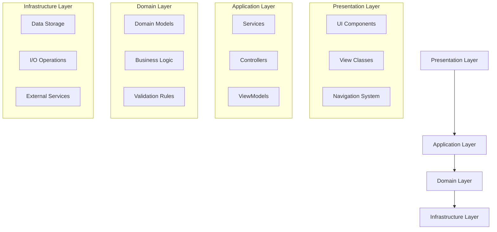
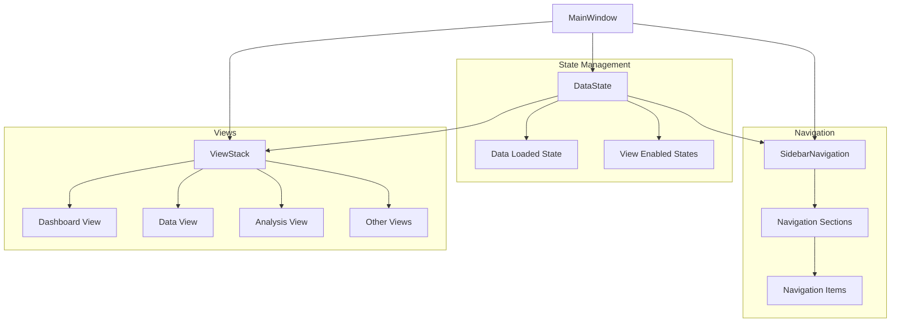
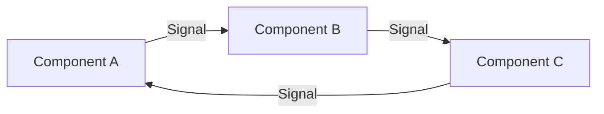
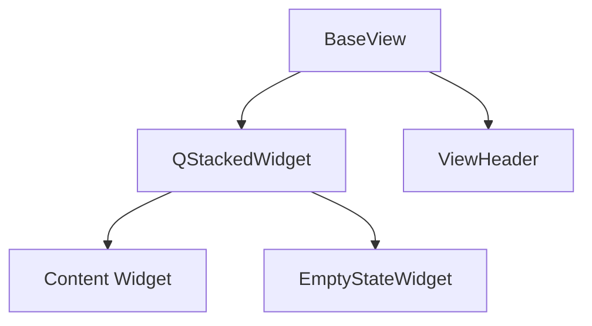
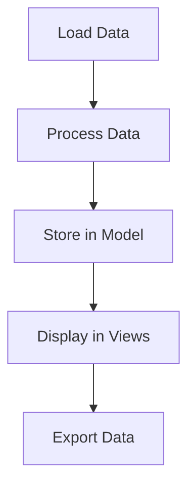
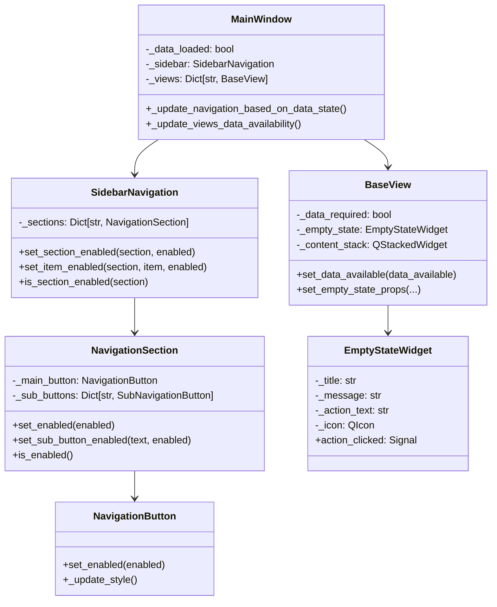

# System Patterns

*Last Updated: 2023-10-18*

## Application Architecture

### 1. Layered Architecture

The application follows a layered architecture pattern:


```mermaid
graph TD
    PL[Presentation Layer] --> AL[Application Layer]
    AL --> DL[Domain Layer]
    DL --> IL[Infrastructure Layer]
    
    subgraph "Presentation Layer"
        UI[UI Components]
        Views[View Classes]
        Navigation[Navigation System]
    end
    
    subgraph "Application Layer"
        Services[Services]
        Controllers[Controllers]
        ViewModels[ViewModels]
    end
    
    subgraph "Domain Layer"
        Models[Domain Models]
        Business[Business Logic]
        Validation[Validation Rules]
    end
    
    subgraph "Infrastructure Layer"
        Storage[Data Storage]
        IO[I/O Operations]
        External[External Services]
    end
```

- **Presentation Layer**: UI components built with PySide6
- **Application Layer**: Services that coordinate application functionality
- **Domain Layer**: Models and business logic
- **Infrastructure Layer**: Data persistence and external services

### 2. UI Component Library

The application uses a custom UI component library with reusable elements:

#### ActionButton
- Purpose: Consistent button styling with icons and text
- Features: 
  - Icon positioning (left/right)
  - Different button styles (primary, secondary, danger)
  - Customizable size and appearance

#### ActionToolbar
- Purpose: Organize action buttons in a toolbar
- Features:
  - Horizontal or vertical orientation
  - Spacing control
  - Uniform button sizing

#### EmptyStateWidget
- Purpose: Display information when no data is available
- Features:
  - Title and message customization
  - Optional action button
  - Custom icon support

#### FilterBar
- Purpose: Provide search and filtering capabilities
- Features:
  - Text search with signals
  - Filter button for advanced filtering
  - Clear button to reset

### 3. Navigation and State Management

The application uses a sidebar navigation system with state management:


```mermaid
graph TD
    MW[MainWindow] --> SN[SidebarNavigation]
    MW --> DS[DataState]
    MW --> VS[ViewStack]
    DS --> SN
    DS --> VS
    
    subgraph "Navigation"
        SN --> Sections[Navigation Sections]
        Sections --> Items[Navigation Items]
    end
    
    subgraph "State Management"
        DS --> DataLoaded[Data Loaded State]
        DS --> ViewEnabledState[View Enabled States]
    end
    
    subgraph "Views"
        VS --> View1[Dashboard View]
        VS --> View2[Data View]
        VS --> View3[Analysis View]
        VS --> ViewN[Other Views]
    end
```

- **State-Dependent Navigation**: Navigation items can be enabled/disabled based on application state
- **Data Dependency Tracking**: Views can declare if they require data
- **Empty State Handling**: Automatic display of empty state widgets for views requiring data

## Design Principles

### 1. Signal-Based Communication

Components communicate through Qt's signal-slot mechanism:


```mermaid
graph LR
    A[Component A] -- Signal --> B[Component B]
    B -- Signal --> C[Component C]
    C -- Signal --> A
```

- Signals are emitted when state changes or user actions occur
- Slots handle these signals to perform operations
- Facilitates loose coupling between components

### 2. Consistent Styling

UI components follow consistent styling rules:

- Common color palette defined in `Colors` class
- Standardized button styles across components
- Consistent spacing and layout guidelines

### 3. Property-Based Configuration

Components use property accessors for configuration:

```python
# Example pattern:
component.set_property(value)  # Setter
value = component.property()   # Getter
```

- Properties with getters/setters instead of direct attribute access
- Changes to properties can trigger UI updates automatically
- Consistent property naming conventions

### 4. Composition Over Inheritance

UI components are built using composition rather than deep inheritance hierarchies:


```mermaid
graph TD
    BaseView --> ContentStack[QStackedWidget]
    ContentStack --> Content[Content Widget]
    ContentStack --> EmptyState[EmptyStateWidget]
    BaseView --> Header[ViewHeader]
```

- BaseView contains components rather than inheriting from them
- Promotes flexibility and reusability
- Simplifies testing and maintenance

### 5. Test-Driven Development

UI components are developed with comprehensive tests:

- Unit tests for all component properties and methods
- Signal testing to verify correct emissions
- Visual testing for UI appearance
- Integration tests for component interactions

## Data Management

### 1. Data Flow Patterns


```mermaid
graph TD
    Load[Load Data] --> Process[Process Data]
    Process --> Store[Store in Model]
    Store --> Display[Display in Views]
    Display --> Export[Export Data]
```

#### Loading
- CSV files are loaded through the CSV service
- Progress reporting during loading
- Background processing for large files

#### Processing
- Data validation against business rules
- Data correction based on validation results
- Data transformation for analysis

#### Exporting
- Export to CSV with customizable options
- Chart generation for visual reporting
- Report creation from templates

### 2. State Management

The application manages several types of state:

#### Application State
- Whether data is loaded (`_data_loaded`)
- Current active view
- Navigation selection state

#### Component State
- View-specific state (filter settings, selections)
- UI component state (button enabled/disabled)
- Transient UI state (dialog visibility)

## Testing Strategy

### 1. Component Testing

- Unit tests for UI components
- Property testing for correct get/set behavior
- Signal testing for correct emissions
- Visual testing for appearance

### 2. Integration Testing

- Navigation flow testing
- View interaction testing
- Service integration testing

### 3. End-to-End Testing

- Complete workflows (load → validate → correct → analyze)
- Error handling and edge cases
- Performance under load

## Extension and Plugin Architecture

### 1. Defined Interfaces for Plugins

- Rule plugins for custom validation rules
- Chart plugins for custom visualizations
- Report templates for custom reporting

### 2. Future Architectural Considerations

- Multi-user support
- Cloud integration
- Mobile compatibility
- External API integration

## Navigation Enhancement Architecture

The navigation enhancement implements state-aware UI navigation with these patterns:


```mermaid
classDiagram
    class MainWindow {
        -_data_loaded: bool
        -_sidebar: SidebarNavigation
        -_views: Dict[str, BaseView]
        +_update_navigation_based_on_data_state()
        +_update_views_data_availability()
    }
    
    class SidebarNavigation {
        -_sections: Dict[str, NavigationSection]
        +set_section_enabled(section, enabled)
        +set_item_enabled(section, item, enabled)
        +is_section_enabled(section)
    }
    
    class NavigationSection {
        -_main_button: NavigationButton
        -_sub_buttons: Dict[str, SubNavigationButton]
        +set_enabled(enabled)
        +set_sub_button_enabled(text, enabled)
        +is_enabled()
    }
    
    class NavigationButton {
        +set_enabled(enabled)
        +_update_style()
    }
    
    class BaseView {
        -_data_required: bool
        -_empty_state: EmptyStateWidget
        -_content_stack: QStackedWidget
        +set_data_available(data_available)
        +set_empty_state_props(...)
    }
    
    class EmptyStateWidget {
        -_title: str
        -_message: str
        -_action_text: str
        -_icon: QIcon
        +action_clicked: Signal
    }
    
    MainWindow --> SidebarNavigation
    MainWindow --> BaseView
    SidebarNavigation --> NavigationSection
    NavigationSection --> NavigationButton
    BaseView --> EmptyStateWidget
```

Key architectural patterns:

1. **State Propagation**: Main window tracks data state and propagates to navigation and views
2. **Composition**: Views contain empty state widgets rather than inheriting behavior
3. **Signal-Based Communication**: Views request data through signals, not direct calls
4. **Consistent Feedback**: Standardized empty state display across views
5. **User-Centric Navigation**: Prevents navigation to views that can't function