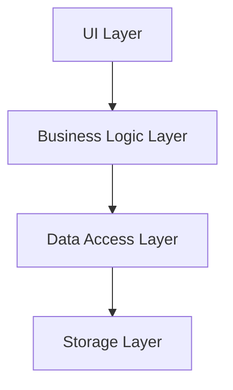
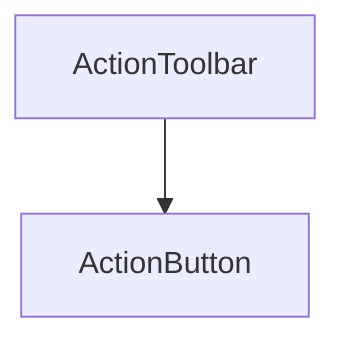
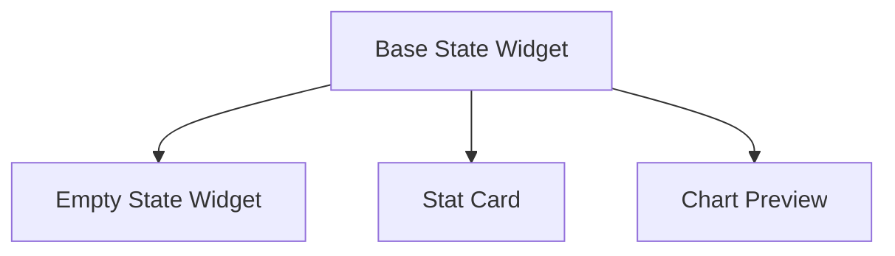
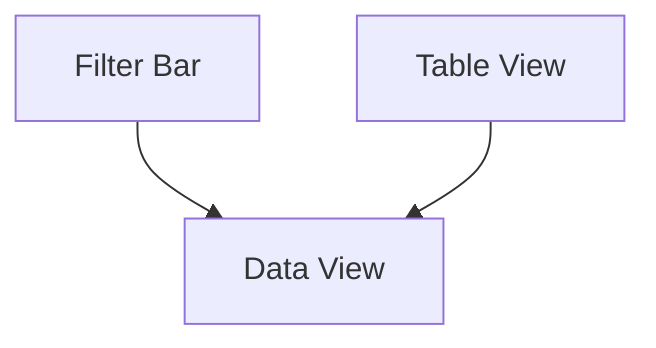
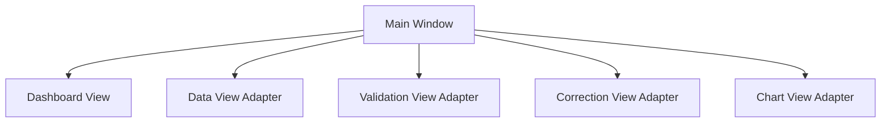
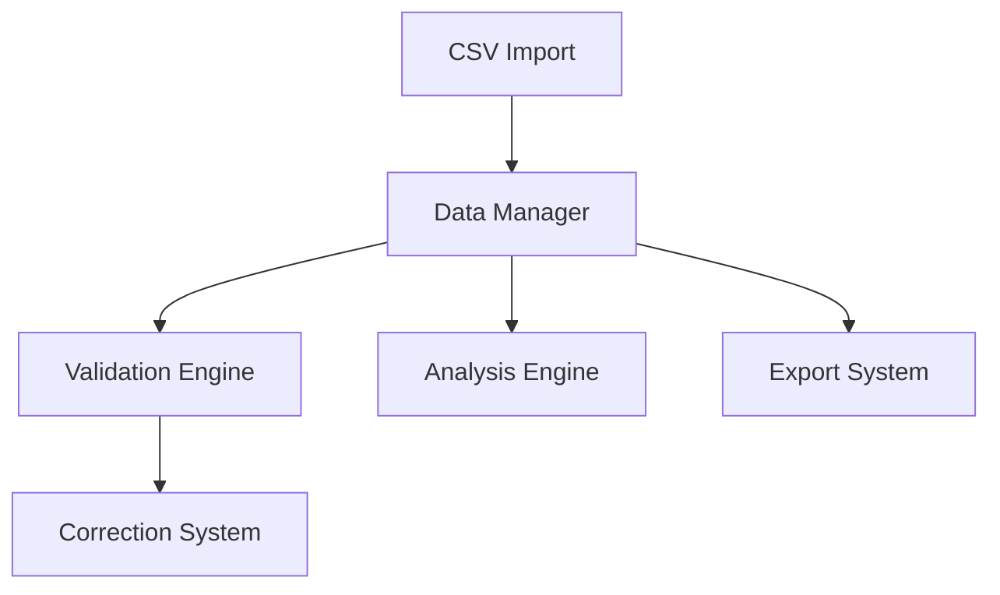
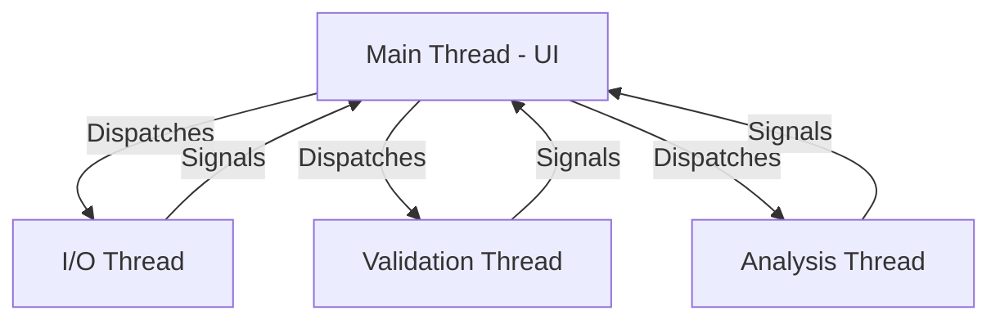

# System Patterns

This document outlines the key system patterns, architecture decisions, and component relationships in the ChestBuddy application.

## Application Architecture

ChestBuddy follows a layered architecture with clear separation of concerns:

```mermaid
graph TD
    UI[UI Layer] --> Business[Business Logic Layer]
    Business --> Data[Data Access Layer]
    Data --> Storage[Storage Layer]
```

### UI Layer
- Responsible for user interaction and display
- Follows a component-based architecture
- Implements the Model-View pattern

### Business Logic Layer
- Handles data processing, validation, and business rules
- Implements services for different aspects of the application
- Coordinates between UI and data access

### Data Access Layer
- Manages data retrieval and persistence
- Handles CSV importing and exporting
- Provides data manipulation capabilities

### Storage Layer
- Manages file operations and data persistence
- Handles caching and temporary storage

## UI Component System

The UI is built using a component-based architecture with several reusable patterns:

### Reusable UI Components

#### Button Components
- **ActionButton**: Base button class with consistent styling, iconography, and interaction patterns
- **ActionToolbar**: Container for organizing ActionButtons with consistent spacing and layout

```mermaid
graph TD
    ActionButton[ActionButton]
    ActionToolbar[ActionToolbar]
    ActionToolbar --> ActionButton
```

Implementation key points:
- ActionButton supports text, icon, tooltips, compact mode, and primary styling
- ActionToolbar supports horizontal/vertical layout, button groups, and spacers
- Consistent signaling mechanism with button name identification
- Thorough testing coverage

#### State Display Components
- **EmptyStateWidget**: Displays content when no data is available with action suggestions
- **StatCard**: Displays metric with title, value, trend, and optional icon
- **ChartPreview**: Displays chart preview with title and thumbnail

```mermaid
graph TD
    BaseStateWidget[Base State Widget]
    EmptyStateWidget[Empty State Widget]
    StatCard[Stat Card]
    ChartPreview[Chart Preview]
    
    BaseStateWidget --> EmptyStateWidget
    BaseStateWidget --> StatCard
    BaseStateWidget --> ChartPreview
```

Implementation key points:
- Consistent display pattern for various data states
- Action capabilities with signal handling
- Customizable content with standardized styling
- Full test coverage for each state

#### Data Interaction Components
- **FilterBar**: Handles search and filtering with expandable panel
- **TableView**: Displays data in tabular format with sorting and selection

```mermaid
graph TD
    FilterBar[Filter Bar]
    TableView[Table View]
    DataView[Data View]
    
    FilterBar --> DataView
    TableView --> DataView
```

Implementation key points:
- Consistent UI for data filtering and search
- Expandable panels for advanced options
- Signal-based communication with parent components
- Memory-efficient data handling

## View Management

The application uses a view management system with a main window and multiple specialized views:

```mermaid
graph TD
    MainWindow[Main Window]
    DashboardView[Dashboard View]
    DataViewAdapter[Data View Adapter]
    ValidationViewAdapter[Validation View Adapter]
    CorrectionViewAdapter[Correction View Adapter]
    ChartViewAdapter[Chart View Adapter]
    
    MainWindow --> DashboardView
    MainWindow --> DataViewAdapter
    MainWindow --> ValidationViewAdapter
    MainWindow --> CorrectionViewAdapter
    MainWindow --> ChartViewAdapter
```

Key patterns:
- BaseView abstract class for common view functionality
- View adapter pattern for specialized data representation
- Data state propagation across views
- Empty state handling for views with data dependencies

## Data Management

Data flows through the application following these patterns:

```mermaid
graph TD
    CSVImport[CSV Import]
    DataManager[Data Manager]
    ValidationEngine[Validation Engine]
    CorrectionSystem[Correction System]
    AnalysisEngine[Analysis Engine]
    ExportSystem[Export System]
    
    CSVImport --> DataManager
    DataManager --> ValidationEngine
    ValidationEngine --> CorrectionSystem
    DataManager --> AnalysisEngine
    DataManager --> ExportSystem
```

Key patterns:
- Observer pattern for data change notifications
- Strategy pattern for validation rules
- Factory pattern for creating data models
- Builder pattern for report generation

## Threading Model

The application uses a background thread model for long-running operations:

```mermaid
graph TD
    MainThread[Main Thread - UI]
    IOThread[I/O Thread]
    ValidationThread[Validation Thread]
    AnalysisThread[Analysis Thread]
    
    MainThread -- Dispatches --> IOThread
    MainThread -- Dispatches --> ValidationThread
    MainThread -- Dispatches --> AnalysisThread
    
    IOThread -- Signals --> MainThread
    ValidationThread -- Signals --> MainThread
    AnalysisThread -- Signals --> MainThread
```

Key patterns:
- Worker thread pattern for background processing
- Signal-slot mechanism for thread communication
- Progress reporting from background threads
- Thread-safe data handling

## Design Principles

The application follows these key design principles:

1. **Separation of Concerns**: Each component has a single responsibility
2. **DRY (Don't Repeat Yourself)**: Common functionality is extracted into reusable components
3. **KISS (Keep It Simple, Stupid)**: Simple solutions are preferred over complex ones
4. **Composition Over Inheritance**: Components are composed rather than extended
5. **Defensive Programming**: Input validation and error handling at all levels

These principles guide all development decisions and code organization.