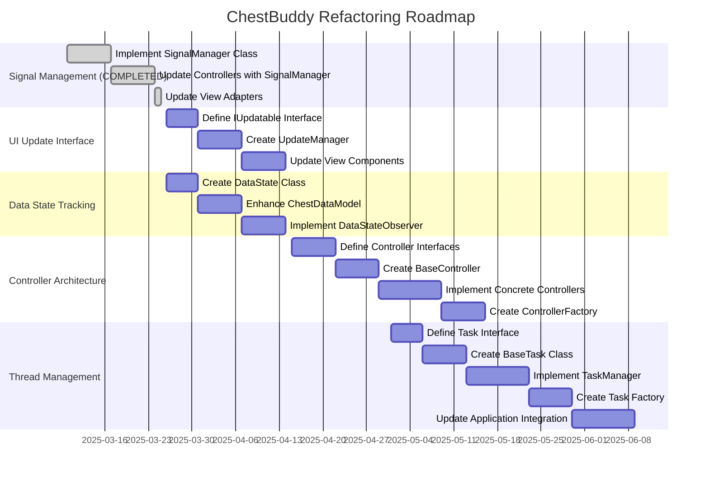

# Implementation Roadmap

This document outlines the recommended sequence for implementing the improvements identified in the code redundancy analysis. It considers dependencies between different improvements and prioritizes changes that have the highest impact with the lowest risk.

## Phase Overview

## Implementation Phases

### Initial Parallel Development (Week 1-2)

#### Phase 1: Signal Management Foundation
* Implement `SignalManager` class
* Create unit tests for signal tracking and management
* Apply to a non-critical component as proof of concept

#### Phase 2: UI Update Interface Foundation 
* Define `IUpdatable` interface
* Create `UpdatableComponent` base class
* Develop unit tests for interface compliance

#### Phase 3: Data State Foundation
* Create `DataState` class for representing and comparing data states
* Implement efficient state comparison methods
* Develop unit tests for state tracking

#### Phase 4: Controller Interface Foundation
* Define interfaces for all controller types
* Document interface requirements
* Create mock implementations for testing

### Core Implementation (Week 3-4)

#### Phase 5: Signal Management Integration
* Update controllers to use `SignalManager`
* Implement signal connection standards
* Add signal safety enhancements

#### Phase 6: Update Manager Implementation
* Create `UpdateManager` for centralized update handling
* Implement debouncing logic
* Add update dependency tracking

#### Phase 7: Data Model Enhancement
* Update `ChestDataModel` to use `DataState`
* Implement optimized state tracking
* Add context manager for signal handling

#### Phase 8: Base Controller Implementation
* Create `BaseController` with common functionality
* Implement dependency tracking
* Add initialization and cleanup standards

### Component Updates (Week 5-6)

#### Phase 9: View Adapter Signal Enhancements
* Update view adapters to use `SignalManager`
* Standardize signal connection methods
* Implement clean disconnection

#### Phase 10: Updatable Component Integration
* Update view components to implement `IUpdatable`
* Integrate with `UpdateManager`
* Standardize update methods

#### Phase 11: State Observer Implementation
* Implement `DataStateObserver` for components
* Update view components to use observers
* Add efficient state change detection

#### Phase 12: Concrete Controller Implementation
* Implement concrete controller classes based on interfaces
* Add controller-specific functionality
* Implement proper dependency management

### Architecture Integration (Week 7-8)

#### Phase 13: Controller Factory Implementation
* Create `ControllerFactory` for centralized controller creation
* Implement controller type registration
* Add controller instance management

#### Phase 14: Task Interface Definition
* Define `ITask` interface for background tasks
* Document task lifecycle requirements
* Create test harness for task testing

#### Phase 15: Base Task Implementation
* Create `BaseTask` class with common functionality
* Implement standardized progress reporting
* Add cancellation support

#### Phase 16: Task Manager Implementation
* Create `TaskManager` for thread pool management
* Implement task tracking and coordination
* Add unified error handling

### Final Integration (Week 9-10)

#### Phase 17: Task Factory Creation
* Implement `TaskFactory` for task creation
* Add task type registration
* Create convenience methods for common tasks

#### Phase 18: Application Integration
* Update `ChestBuddyApp` to use all new components
* Integrate controllers and task management
* Implement comprehensive error handling

## Dependencies and Critical Path

The critical path for implementation is:

1. Controller Interfaces → BaseController → Concrete Controllers → ControllerFactory
2. Task Interface → BaseTask → TaskManager → TaskFactory
3. Application Integration (depends on both paths above)

Other improvements can be developed in parallel:

- SignalManager can be implemented independently
- IUpdatable and UpdateManager can be developed separately
- DataState and state tracking can be implemented without blocking other work

## Incremental Testing Strategy

Each phase should include:

1. **Unit Tests**: Testing individual components in isolation
2. **Integration Tests**: Testing interactions between components
3. **Regression Tests**: Ensuring existing functionality works correctly
4. **Performance Tests**: Verifying performance is maintained or improved

## Risk Management

### High-Risk Areas
1. **Controller Architecture Refactoring**: Affects core application structure
   - Mitigation: Implement incrementally with thorough testing after each step
   - Fallback: Can maintain hybrid approach if issues arise

2. **Thread Management Improvements**: Critical for application stability
   - Mitigation: Extensive testing with various task types and cancellation scenarios
   - Fallback: Maintain old BackgroundWorker alongside new TaskManager temporarily

### Medium-Risk Areas
1. **Signal Connection Management**: COMPLETED
   - Implemented SignalManager utility for centralized connection management
   - Added throttling capabilities with throttle and debounce modes
   - Added prioritized connections for controlling execution order
   - Implemented type checking for signal-slot compatibility
   - Added utilities for connection tracking

2. **Data State Tracking**: Affects data change detection
   - Mitigation: Dual tracking during transition
   - Fallback: Can keep old hash-based system if issues arise

### Low-Risk Areas
1. **UI Update Interface**: Less critical for core functionality
   - Mitigation: Implement gradually, one component at a time
   - Fallback: Can maintain direct update calls if needed

## Success Metrics

### Code Quality Metrics
- Reduced code complexity (measured by cyclomatic complexity)
- Increased test coverage
- Reduced duplication (measured by code clone analysis)
- Improved maintainability index

### Performance Metrics
- Equivalent or improved CPU usage
- Reduced memory usage
- Equivalent or improved UI responsiveness
- Faster background task execution

### Developer Experience Metrics
- Reduced time to implement new features
- Fewer bugs in new implementations
- Clearer component relationships
- Better developer onboarding time

## Post-Implementation Review

After implementing all improvements, conduct a review to:
1. Evaluate success against metrics
2. Identify any remaining redundancies
3. Document lessons learned
4. Plan for further optimizations 

## Current Focus

We're currently working on the UI Update Interface Standardization, implementing Phase 2 (UpdateManager Utility).

## Completed Phases

### Core Functionality ✅ COMPLETED
- Core data model with pandas DataFrames
- Services for CSV operations, validation, and correction
- Basic UI with tabs for different functionality
- End-to-end workflows for data processing
- Background processing for long-running operations
- Configuration management system

### Validation Service Improvements ✅ COMPLETED
- Fixed date parsing warnings in the ValidationService
- Added specific date format to `pd.to_datetime` calls
- Improved validation with configurable strictness levels
- Enhanced validation visualization in the UI

### Chart Integration ✅ COMPLETED
- Implemented ChartService for various chart types
- Fixed compatibility issues with PySide6 6.8.2.1
- Added chart customization options
- Integrated charts into the UI with proper data binding

### CSV Loading and Progress Reporting ✅ COMPLETED
- Implemented MultiCSVLoadTask for handling multiple files
- Added chunked reading for better memory efficiency
- Created comprehensive progress reporting system
- Enhanced error handling during file loading
- Implemented cancellation support for long operations

### UI Enhancement ✅ COMPLETED
- Created reusable UI components
- Enhanced sidebar navigation with data-dependent state handling
- Improved dashboard with empty state support
- Implemented progress dialog with visual feedback states
- Added consistent styling across all components

### UI Refactoring ✅ COMPLETED
- Implemented controller architecture for separation of concerns
- Created controller set (FileOperations, Progress, ErrorHandling, ViewState, DataView, UIState)
- Standardized progress reporting and error handling through controllers
- Reduced UI code duplication and improved maintainability
- Removed UI-specific logic from DataManager
- Refactored MainWindow to delegate responsibilities to controllers

### UI Component Adaptation ✅ COMPLETED
- Adapted UI components to use controllers
- Refactored view adapters to use appropriate controllers
- Created comprehensive tests for controller interactions
- Updated main application to integrate all controllers

### Signal Connection Management ✅ COMPLETED
- **Phase 1 (SignalManager Implementation)** ✅
  - Implemented SignalManager utility for centralized signal connection tracking
  - Created comprehensive test suite for SignalManager functionality
  - Added connection tracking and duplicate prevention
  - Added proper signal disconnection during application cleanup
  - Implemented debugging tools for signal connection tracking

- **Phase 2 (Signal Connection Standards)** ✅
  - Created signal_standards.py with naming conventions
  - Updated BaseView with standardized signal management
  - Refactored DataViewAdapter to use standardized patterns
  - Created unit tests for signal standards implementation
  - Added documentation for signal connection patterns

- **Phase 3 (View Adapter Enhancement)** ✅
  - Updated view adapters to use SignalManager
  - Implemented consistent signal connection patterns
  - Added signal disconnection during cleanup
  - Enhanced error handling for signal failures

- **Phase 4 (Integration with Controllers)** ✅
  - Created BaseController for standardized signal management
  - Updated all controllers to inherit from BaseController
  - Added connection tracking for all controller signals
  - Implemented automatic disconnection on controller deletion
  - Ensured consistent error handling for connection failures
  - Fixed bug in ViewStateController related to is_empty property

- **Phase 5 (Signal Throttling Implementation)** ✅
  - Implemented throttling for signals to improve UI performance
  - Added both throttle and debounce modes
  - Created comprehensive unit tests for all throttling functionality
  - Enhanced connection tracking to include throttled connections
  - Improved error handling for disconnection operations
  - Integrated throttled connections with existing management features
  - Added throttling information to the connection debugging tools

- **Phase 6 (Connection Safety Enhancements)** ✅
  - Implemented connection priority management
  - Created stronger typechecking for signal connections
  - Added utility methods for connection tracking
  - Enhanced parameter counting logic for better compatibility detection
  - Improved error handling for compatibility issues
  - Implemented safe_connect method for reliable signal connections
  - Added blocked_signals context manager for temporary signal blocking

## In Progress

### UI Update Interface Implementation 🔄
- **Phase 1 (Interface Definition)** ✅
  - Defined the `IUpdatable` interface and `UpdatableComponent` base class
  - Set up test framework for updatable components
  - Created mock updatable components for testing

- **Phase 2 (UpdateManager Utility)** 🔄 (80% complete)
  - Implemented `UpdateManager` class for centralized update scheduling ✅
  - Created comprehensive test suite for UpdateManager ✅
  - Fixed compatibility issues with test mocks ✅
  - Fixed errors in UpdateManager's cleanup code ✅
  - Implemented ServiceLocator pattern for accessing UpdateManager ✅
  - Created utility function for getting the application-wide UpdateManager ✅
  - Added tests for ServiceLocator and UpdateManager integration ✅
  - ⏳ Transition views to use UpdateManager through ServiceLocator

- **Phase 3 (View Integration)** 📅
  - Define `UpdatableView` base class for QWidget-based views
  - Update main view components to implement `IUpdatable`
  - Integrate UpdateManager into the main application
  - Update controllers to use UpdateManager for triggering UI updates

- **Phase 4 (Data State Tracking)** 📅
  - Extend DataManager to track changes in data state
  - Create a mechanism for auto-triggering updates based on state
  - Define dependencies between components for cascading updates
  - Optimize update frequency for performance

## Recent Progress (March 26, 2025)

### ServiceLocator Implementation for Update Manager
1. **ServiceLocator Implementation**
   - Created ServiceLocator class for centralized service access
   - Implemented support for direct service registration
   - Added support for factory functions for lazy initialization
   - Provided type-safe service access with get_typed method
   - Created comprehensive tests for all ServiceLocator functionality

2. **UpdateManager Integration with ServiceLocator**
   - Updated ChestBuddyApp to register UpdateManager with ServiceLocator
   - Created helper function get_update_manager for easy access
   - Added proper cleanup of services during application shutdown
   - Fixed thread cleanup issues in UpdateManager's __del__ method
   - Created tests for UpdateManager and ServiceLocator integration

3. **Bug Fixes and Improvements**
   - Fixed issue with QTimer objects being deleted during cleanup
   - Enhanced error handling in UpdateManager.cancel_updates method
   - Made the ServiceLocator robust against cleanup-time errors
   - Added logging to the ServiceLocator for better debugging

## Next Steps

### Phase 2 Completion Tasks
1. Transition existing views to use UpdateManager via ServiceLocator
2. Add direct integration with the controllers for UI updates
3. Ensure proper cleanup during application shutdown
4. Add comprehensive documentation for using UpdateManager

### Phase 3 Planning
1. Design the UpdatableView base class for QWidget-based views
2. Plan the integration strategy for main view components
3. Establish update dependency relationships between components
4. Create update scheduling rules for different UI scenarios

## Long-Term Roadmap

### Enhanced Debugging Tools
- Create visual signal flow diagrams
- Add detailed signal path tracing
- Implement timing analysis for signal propagation
- Create a debugging UI for signal inspection

### Performance Optimization
- Batch UI updates for better performance
- Optimize memory usage for large datasets
- Improve CSV loading for extremely large files

### UI Enhancements
- Add data filtering improvements
- Enhance chart customization options
- Improve validation visualization
- Add more interactive data exploration tools

## Project Status

| Component | Status | Progress |
|-----------|--------|----------|
| Core Functionality | Complete | 100% |
| Validation Service | Complete | 100% |
| Chart Integration | Complete | 100% |
| CSV Loading | Complete | 100% |
| UI Enhancement | Complete | 100% |
| UI Refactoring | Complete | 100% |
| UI Component Adaptation | Complete | 100% |
| Signal Connection Management | Complete | 100% |
| UI Update Interface | In Progress | 50% |

Overall project completion: ~98% 