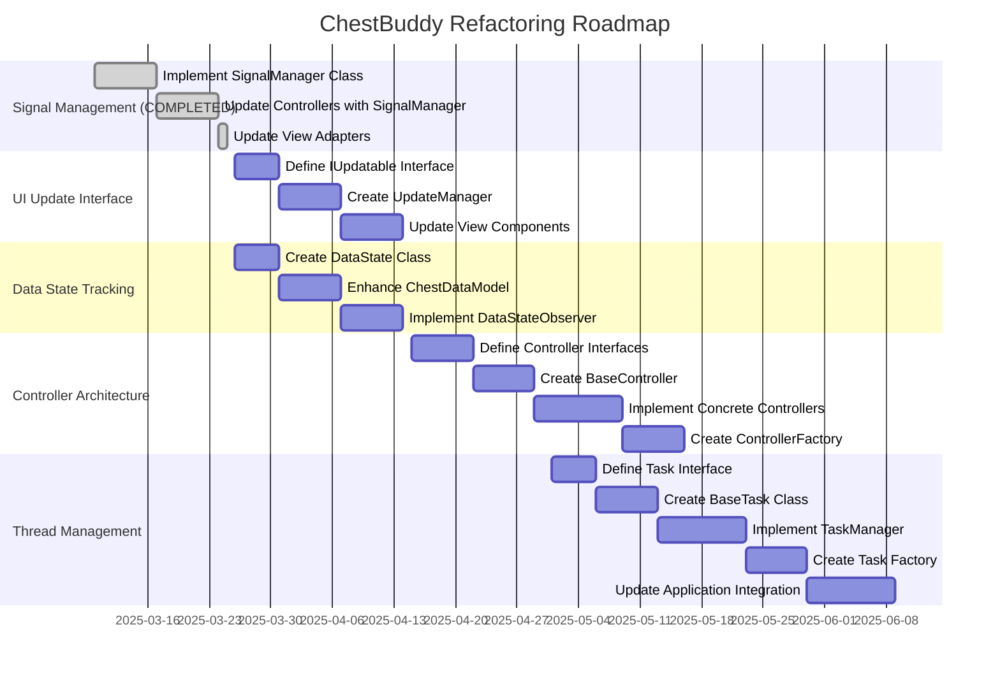

# Implementation Roadmap

This document outlines the recommended sequence for implementing the improvements identified in the code redundancy analysis. It considers dependencies between different improvements and prioritizes changes that have the highest impact with the lowest risk.

## Phase Overview

## Implementation Phases

### Initial Parallel Development (Week 1-2)

#### Phase 1: Signal Management Foundation
* Implement `SignalManager` class
* Create unit tests for signal tracking and management
* Apply to a non-critical component as proof of concept

#### Phase 2: UI Update Interface Foundation 
* Define `IUpdatable` interface
* Create `UpdatableComponent` base class
* Develop unit tests for interface compliance

#### Phase 3: Data State Foundation
* Create `DataState` class for representing and comparing data states
* Implement efficient state comparison methods
* Develop unit tests for state tracking

#### Phase 4: Controller Interface Foundation
* Define interfaces for all controller types
* Document interface requirements
* Create mock implementations for testing

### Core Implementation (Week 3-4)

#### Phase 5: Signal Management Integration
* Update controllers to use `SignalManager`
* Implement signal connection standards
* Add signal safety enhancements

#### Phase 6: Update Manager Implementation
* Create `UpdateManager` for centralized update handling
* Implement debouncing logic
* Add update dependency tracking

#### Phase 7: Data Model Enhancement
* Update `ChestDataModel` to use `DataState`
* Implement optimized state tracking
* Add context manager for signal handling

#### Phase 8: Base Controller Implementation
* Create `BaseController` with common functionality
* Implement dependency tracking
* Add initialization and cleanup standards

### Component Updates (Week 5-6)

#### Phase 9: View Adapter Signal Enhancements
* Update view adapters to use `SignalManager`
* Standardize signal connection methods
* Implement clean disconnection

#### Phase 10: Updatable Component Integration
* Update view components to implement `IUpdatable`
* Integrate with `UpdateManager`
* Standardize update methods

#### Phase 11: State Observer Implementation
* Implement `DataStateObserver` for components
* Update view components to use observers
* Add efficient state change detection

#### Phase 12: Concrete Controller Implementation
* Implement concrete controller classes based on interfaces
* Add controller-specific functionality
* Implement proper dependency management

### Architecture Integration (Week 7-8)

#### Phase 13: Controller Factory Implementation
* Create `ControllerFactory` for centralized controller creation
* Implement controller type registration
* Add controller instance management

#### Phase 14: Task Interface Definition
* Define `ITask` interface for background tasks
* Document task lifecycle requirements
* Create test harness for task testing

#### Phase 15: Base Task Implementation
* Create `BaseTask` class with common functionality
* Implement standardized progress reporting
* Add cancellation support

#### Phase 16: Task Manager Implementation
* Create `TaskManager` for thread pool management
* Implement task tracking and coordination
* Add unified error handling

### Final Integration (Week 9-10)

#### Phase 17: Task Factory Creation
* Implement `TaskFactory` for task creation
* Add task type registration
* Create convenience methods for common tasks

#### Phase 18: Application Integration
* Update `ChestBuddyApp` to use all new components
* Integrate controllers and task management
* Implement comprehensive error handling

## Dependencies and Critical Path

The critical path for implementation is:

1. Controller Interfaces → BaseController → Concrete Controllers → ControllerFactory
2. Task Interface → BaseTask → TaskManager → TaskFactory
3. Application Integration (depends on both paths above)

Other improvements can be developed in parallel:

- SignalManager can be implemented independently
- IUpdatable and UpdateManager can be developed separately
- DataState and state tracking can be implemented without blocking other work

## Incremental Testing Strategy

Each phase should include:

1. **Unit Tests**: Testing individual components in isolation
2. **Integration Tests**: Testing interactions between components
3. **Regression Tests**: Ensuring existing functionality works correctly
4. **Performance Tests**: Verifying performance is maintained or improved

## Risk Management

### High-Risk Areas
1. **Controller Architecture Refactoring**: Affects core application structure
   - Mitigation: Implement incrementally with thorough testing after each step
   - Fallback: Can maintain hybrid approach if issues arise

2. **Thread Management Improvements**: Critical for application stability
   - Mitigation: Extensive testing with various task types and cancellation scenarios
   - Fallback: Maintain old BackgroundWorker alongside new TaskManager temporarily

### Medium-Risk Areas
1. **Signal Connection Management**: COMPLETED
   - Implemented SignalManager utility for centralized connection management
   - Added throttling capabilities with throttle and debounce modes
   - Added prioritized connections for controlling execution order
   - Implemented type checking for signal-slot compatibility
   - Added utilities for connection tracking

2. **Data State Tracking**: Affects data change detection
   - Mitigation: Dual tracking during transition
   - Fallback: Can keep old hash-based system if issues arise

### Low-Risk Areas
1. **UI Update Interface**: Less critical for core functionality
   - Mitigation: Implement gradually, one component at a time
   - Fallback: Can maintain direct update calls if needed

## Success Metrics

### Code Quality Metrics
- Reduced code complexity (measured by cyclomatic complexity)
- Increased test coverage
- Reduced duplication (measured by code clone analysis)
- Improved maintainability index

### Performance Metrics
- Equivalent or improved CPU usage
- Reduced memory usage
- Equivalent or improved UI responsiveness
- Faster background task execution

### Developer Experience Metrics
- Reduced time to implement new features
- Fewer bugs in new implementations
- Clearer component relationships
- Better developer onboarding time

## Post-Implementation Review

After implementing all improvements, conduct a review to:
1. Evaluate success against metrics
2. Identify any remaining redundancies
3. Document lessons learned
4. Plan for further optimizations 